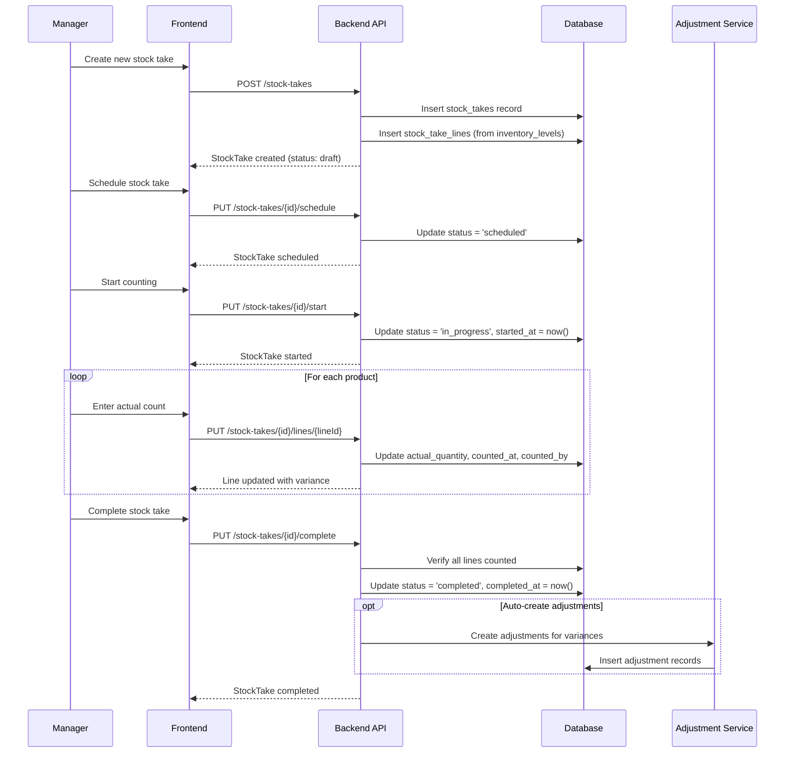
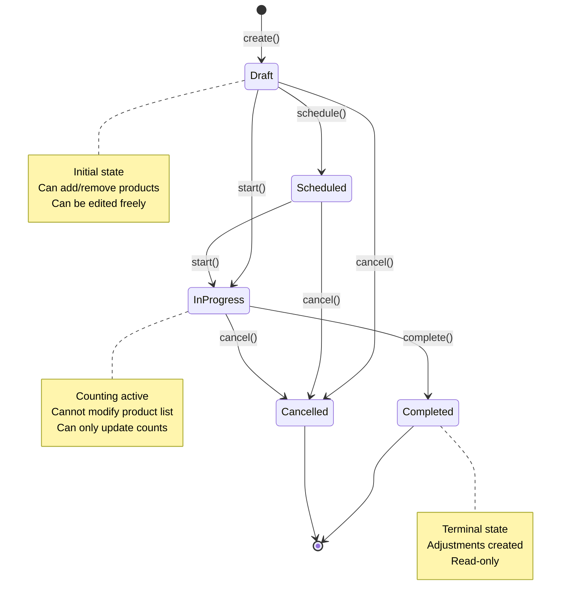

# Stock Take - Mini PRD

**Module:** 8.10_Inventory_UI
**Sub-Module ID:** 8.10.5
**Status:** Done
**Last Updated:** 2026-01-29

## 1. Overview

### Purpose
Stock Take (Physical Inventory Count) allows users to conduct periodic physical inventory counts to verify actual stock levels against system records. When discrepancies are found, the system can automatically generate Stock Adjustments to reconcile the differences.

### Business Value
- Ensures inventory accuracy
- Identifies shrinkage, damage, or data entry errors
- Meets audit and compliance requirements
- Supports cycle counting for continuous accuracy improvement

### Actors
| Actor | Role |
|-------|------|
| Warehouse Staff | Performs physical counting |
| Warehouse Manager | Creates, schedules, and reviews stock takes |
| Admin | Full access including deletion |

## 2. Event Storming

### 2.1 Event Flow (Big Picture)

```
Timeline →

👤 Manager       🟦 CreateStockTake    🟨 StockTake       🟧 StockTakeCreated
    │                   │                   │                   │
    └───────────────────┴───────────────────┴───────────────────┘
                                                                │
👤 Manager       🟦 ScheduleStockTake  🟨 StockTake       🟧 StockTakeScheduled
    │                   │                   │                   │
    └───────────────────┴───────────────────┴───────────────────┘
                                                                │
👤 Staff         🟦 StartCounting      🟨 StockTake       🟧 StockTakeStarted
    │                   │                   │                   │
    └───────────────────┴───────────────────┴───────────────────┘
                                                                │
👤 Staff         🟦 RecordCount        🟨 StockTakeLine   🟧 LineCountRecorded
    │                   │                   │                   │
    └───────────────────┴───────────────────┴───────────────────┘
                                                                │
👤 Manager       🟦 CompleteStockTake  🟨 StockTake       🟧 StockTakeCompleted
    │                   │                   │                   │
    └───────────────────┴───────────────────┴───────────────────┘
                                                                │
                                            🟪 Policy: CreateAdjustmentsFromVariances
                                                                │
                                                        🟧 AdjustmentsCreated
```

### 2.2 Cross-Module Events

| Source Module | Event | Target Module | Reaction (Policy) |
|---------------|-------|---------------|-------------------|
| Stock Take | `inventory.stock_take.completed` | Adjustments | Auto-create adjustments for variances |
| Adjustments | `inventory.adjustment.created` | Stock Levels | Update inventory levels |

### 2.3 Design Decisions (Hotspots Resolved)

| Hotspot | Question | Decision | Rationale |
|---------|----------|----------|-----------|
| Auto-adjust | Should completing a stock take auto-create adjustments? | Optional (user choice) | Users may want to review variances first |
| Blind count | Should system quantities be hidden during count? | Optional (configurable) | Reduces bias but may slow down counting |
| Partial complete | Can a stock take be completed with uncounted items? | No | All items must be counted for data integrity |

## 3. Sequence Diagram

### 3.1 Happy Path - Complete Stock Take Flow



## 4. State Machine (MANDATORY for ERP)

### 4.1 State Diagram



### 4.2 State Transition Table

| Current State | Action | Next State | Side Effects | Conditions |
|---------------|--------|------------|--------------|------------|
| Draft | schedule() | Scheduled | Set scheduled_date | scheduled_date required |
| Draft | start() | InProgress | Set started_at | At least 1 product |
| Draft | cancel() | Cancelled | - | - |
| Scheduled | start() | InProgress | Set started_at | - |
| Scheduled | cancel() | Cancelled | - | - |
| InProgress | complete() | Completed | Set completed_at, optionally create adjustments | All lines counted |
| InProgress | cancel() | Cancelled | - | - |

### 4.3 State Rules
- **Editable states**: Draft (can modify product list and details)
- **Terminal states**: Completed, Cancelled
- **Count editable states**: InProgress (can only update actual quantities)

## 5. Domain Events

### 5.1 Events Emitted

| Event Name | Emitted By | Key Payload Fields | Consumers |
|------------|------------|-------------------|-----------|
| `inventory.stock_take.created` | Stock Take | stockTakeId, warehouseId, productCount | Analytics |
| `inventory.stock_take.started` | Stock Take | stockTakeId, startedAt | Notifications |
| `inventory.stock_take.completed` | Stock Take | stockTakeId, totalVariance, lineCount | Adjustments |
| `inventory.stock_take.cancelled` | Stock Take | stockTakeId, reason | Analytics |

### 5.2 Events Consumed

| Event | Consumer | Policy Name | Action |
|-------|----------|-------------|--------|
| `inventory.stock_take.completed` | Adjustment Module | CreateVarianceAdjustments | Auto-create adjustments for non-zero variances |

## 6. Business Rules

### 6.1 Validation Rules

| Rule ID | Rule Description | When Applied | Error Code | Error Message |
|---------|------------------|--------------|------------|---------------|
| BR-ST-001 | Warehouse is required | Create | WAREHOUSE_REQUIRED | A warehouse must be selected |
| BR-ST-002 | At least one product required to start | Start transition | NO_PRODUCTS | Add at least one product before starting |
| BR-ST-003 | All lines must be counted to complete | Complete transition | UNCOUNTED_LINES | All products must be counted before completing |
| BR-ST-004 | Actual quantity cannot be negative | Update line | INVALID_QUANTITY | Quantity cannot be negative |
| BR-ST-005 | Cannot modify completed stock take | Any update | ALREADY_COMPLETED | This stock take has been completed |

### 6.2 Computation Rules

| Rule ID | Description | Formula/Logic |
|---------|-------------|---------------|
| CR-ST-001 | Variance calculation | `difference_quantity = actual_quantity - expected_quantity` |
| CR-ST-002 | Variance percentage | `variance_pct = (difference_quantity / expected_quantity) * 100` |
| CR-ST-003 | Count progress | `progress = counted_lines / total_lines * 100` |

### 6.3 Authorization Rules

| Action | Required Permission | Additional Conditions |
|--------|---------------------|----------------------|
| List stock takes | Read | - |
| Create stock take | Write | - |
| Start counting | Write | User assigned to stock take OR manager |
| Update counts | Write | Stock take in InProgress state |
| Complete stock take | Write (Manager+) | All lines must be counted |
| Cancel stock take | Write (Manager+) | Not in Completed state |
| Delete stock take | Admin | Only Draft or Cancelled |

## 7. Error Scenarios

### 7.1 Expected Errors (Client Errors)

| Error Code | Scenario | HTTP Status | User Message | Recovery Action |
|------------|----------|-------------|--------------|-----------------|
| WAREHOUSE_REQUIRED | No warehouse selected | 400 | Please select a warehouse | Select warehouse |
| NO_PRODUCTS | Start with empty product list | 400 | Add products before starting | Add products |
| UNCOUNTED_LINES | Complete with uncounted items | 400 | X items not yet counted | Count remaining items |
| INVALID_QUANTITY | Negative count entered | 400 | Quantity cannot be negative | Enter valid number |
| ALREADY_COMPLETED | Edit completed stock take | 409 | This stock take is already completed | View only |
| INVALID_STATE_TRANSITION | Invalid status change | 409 | Cannot transition from X to Y | Check state machine |

### 7.2 System Errors

| Error Code | Scenario | Impact | Mitigation |
|------------|----------|--------|------------|
| CONCURRENT_UPDATE | Two users update same line | Data conflict | Optimistic locking with version field |
| INVENTORY_LEVEL_CHANGED | Stock changed during count | Stale expected qty | Warn user, offer refresh |

## 8. Data Model

### 8.1 Database Schema (from ERD)

```sql
Table stock_takes {
  stock_take_id UUID [pk]
  tenant_id UUID [not null]
  stock_take_number VARCHAR(50) [not null, note: 'Auto: STK-YYYY-XXXXX']
  reference_number VARCHAR(100)
  warehouse_id UUID [not null]
  status VARCHAR(20) [not null, default: 'draft']
  scheduled_date TIMESTAMPTZ
  started_at TIMESTAMPTZ
  completed_at TIMESTAMPTZ
  created_by UUID [not null]
  assigned_to UUID
  notes TEXT
  reason TEXT
  created_at TIMESTAMPTZ
  updated_at TIMESTAMPTZ
  deleted_at TIMESTAMPTZ
}

Table stock_take_lines {
  line_id UUID [pk]
  tenant_id UUID [not null]
  stock_take_id UUID [not null]
  product_id UUID [not null]
  expected_quantity BIGINT [not null, default: 0]
  actual_quantity BIGINT [null, note: 'NULL if not counted']
  difference_quantity BIGINT [note: 'GENERATED: actual - expected']
  counted_by UUID
  counted_at TIMESTAMPTZ
  notes TEXT
  created_at TIMESTAMPTZ
  updated_at TIMESTAMPTZ
  deleted_at TIMESTAMPTZ
}
```

### 8.2 API Endpoints

| Method | Endpoint | Description |
|--------|----------|-------------|
| GET | /api/v1/inventory/stock-takes | List stock takes |
| POST | /api/v1/inventory/stock-takes | Create stock take |
| GET | /api/v1/inventory/stock-takes/{id} | Get stock take details |
| PUT | /api/v1/inventory/stock-takes/{id} | Update stock take |
| DELETE | /api/v1/inventory/stock-takes/{id} | Delete stock take |
| PUT | /api/v1/inventory/stock-takes/{id}/schedule | Schedule stock take |
| PUT | /api/v1/inventory/stock-takes/{id}/start | Start counting |
| PUT | /api/v1/inventory/stock-takes/{id}/complete | Complete stock take |
| PUT | /api/v1/inventory/stock-takes/{id}/cancel | Cancel stock take |
| GET | /api/v1/inventory/stock-takes/{id}/lines | Get stock take lines |
| PUT | /api/v1/inventory/stock-takes/{id}/lines/{lineId} | Update line count |
| POST | /api/v1/inventory/stock-takes/{id}/lines | Add product to stock take |

### 8.3 TypeScript Types

```typescript
export type StockTakeStatus = 'draft' | 'scheduled' | 'in_progress' | 'completed' | 'cancelled';

export interface StockTake {
  stockTakeId: string;
  tenantId: string;
  stockTakeNumber: string;
  referenceNumber?: string;
  warehouseId: string;
  status: StockTakeStatus;
  scheduledDate?: string;
  startedAt?: string;
  completedAt?: string;
  createdBy: string;
  assignedTo?: string;
  notes?: string;
  reason?: string;
  createdAt: string;
  updatedAt: string;
  // Computed/joined fields
  warehouse?: Warehouse;
  lines?: StockTakeLine[];
  lineCount?: number;
  countedLineCount?: number;
  totalVariance?: number;
}

export interface StockTakeLine {
  lineId: string;
  stockTakeId: string;
  productId: string;
  expectedQuantity: number;
  actualQuantity: number | null;
  differenceQuantity: number | null;
  countedBy?: string;
  countedAt?: string;
  notes?: string;
  // Joined fields
  product?: Product;
}

export interface CreateStockTakeRequest {
  warehouseId: string;
  referenceNumber?: string;
  scheduledDate?: string;
  assignedTo?: string;
  notes?: string;
  reason?: string;
  productIds?: string[]; // Optional: pre-select products
}

export interface UpdateStockTakeLineRequest {
  actualQuantity: number;
  notes?: string;
}
```

## 9. UI Specifications

### 9.1 Routes

| Route | Page | Description |
|-------|------|-------------|
| /inventory/stock-takes | List | List all stock takes with filters |
| /inventory/stock-takes/new | Create | Create new stock take form |
| /inventory/stock-takes/[id] | Detail/Count | View details and perform counting |
| /inventory/stock-takes/[id]/edit | Edit | Edit draft stock take |

### 9.2 Page Layouts

#### List Page (`/inventory/stock-takes`)
- Stats cards: Total, In Progress, Completed this month
- Filter bar: Status, Warehouse, Date range, Search
- Table: Number, Warehouse, Status, Progress, Created, Actions
- Actions: View, Edit (if draft), Delete (if draft)

#### Create/Edit Page (`/inventory/stock-takes/new`)
- Form fields: Warehouse (required), Reference, Scheduled Date, Assigned To, Notes
- Product selection: Either "All products in warehouse" or "Select specific products"
- Save as Draft button

#### Detail/Count Page (`/inventory/stock-takes/[id]`)
- Header: Stock take number, status badge, warehouse info
- Progress bar: X of Y items counted (Z%)
- Action buttons based on state:
  - Draft: Edit, Start, Cancel
  - Scheduled: Start, Cancel
  - InProgress: Complete, Cancel
  - Completed: View adjustments (if created)
- Count table:
  - Product (SKU, Name)
  - Expected Qty (can hide in blind mode)
  - Actual Qty (input field if InProgress)
  - Variance (auto-calculated, color-coded)
  - Counted By, Counted At
  - Notes

### 9.3 Components

| Component | Description |
|-----------|-------------|
| StockTakeStatusBadge | Color-coded status display |
| CountProgressBar | Shows counting progress |
| VarianceIndicator | Color-coded variance display (+/-) |
| CountInputField | Number input for actual quantity |
| ProductSelector | Multi-select for adding products |

### 9.4 User Interactions

1. **Create Flow**: Select warehouse → (Optionally select products) → Save draft
2. **Schedule Flow**: Open draft → Set scheduled date → Save
3. **Count Flow**: Start → For each line: enter count → Complete
4. **Complete Flow**: Verify all counted → Confirm → Optionally create adjustments

## 10. Non-Functional Requirements

### Performance
- List page loads in < 500ms
- Line updates in < 200ms
- Support 1000+ lines per stock take

### Security
- Tenant isolation for all queries
- Role-based access control via Casbin
- Audit trail for all state changes

### Accessibility
- Keyboard navigation for count entry
- Screen reader support for variance announcements

## 11. Dependencies

### Required Modules
- Warehouses (for warehouse selection)
- Products (for product selection)
- Inventory Levels (for expected quantities)
- Adjustments (for variance reconciliation)

### External Services
- None

## 12. Out of Scope

- Barcode scanning (future)
- Offline mobile counting (future)
- Cycle count scheduling (separate module)
- Blind count mode toggle (future enhancement)
- Variance approval workflow (future)

## 13. Tasks Summary

| Task ID | Name | Status | Assignee |
|---------|------|--------|----------|
| 08.10.05.01 | Create Stock Take TypeScript types | ✅ Done | AI Agent |
| 08.10.05.02 | Create Stock Take API client | ✅ Done | AI Agent |
| 08.10.05.03 | Create Stock Take Svelte store | ✅ Done | AI Agent |
| 08.10.05.04 | Create Stock Take List page | ✅ Done | AI Agent |
| 08.10.05.05 | Create Stock Take Form (Create/Edit) | ✅ Done | AI Agent |
| 08.10.05.06 | Create Stock Take Detail/Count page | ✅ Done | AI Agent |
| 08.10.05.07 | Add navigation link to Stock Take | ✅ Done | AI Agent |

## 14. Implementation Checklist

### Backend (Existing from ERD)
- [x] Database tables exist (stock_takes, stock_take_lines)
- [ ] Verify API endpoints are implemented
- [ ] Verify Casbin policies exist

### Frontend Tasks
- [x] TypeScript types defined
- [x] API client functions implemented
- [x] Svelte store implemented
- [x] List page
- [x] Create/Edit form
- [x] Detail/Count page
- [x] Status transitions working
- [x] Navigation link added
- [x] TypeScript check: No errors in Stock Take files
- [x] ESLint check: No errors (fixed SvelteMap reactivity)
- [x] Build check: Success
