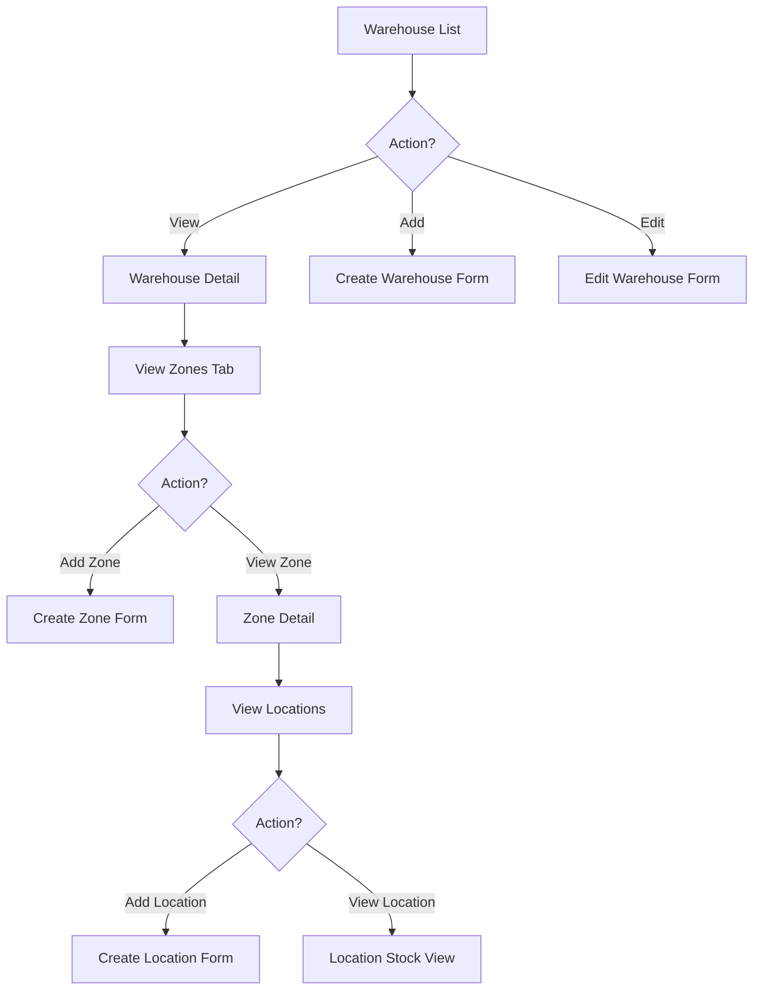

# Task: Create Warehouse Management UI

**Task ID:** V1_MVP/08_Frontend/8.10_Inventory_UI/task_08.10.02_create_warehouse_management_ui
**Version:** V1_MVP
**Phase:** 08_Frontend
**Module:** 8.10_Inventory_UI
**Priority:** High
**Status:** NeedsReview
**Assignee:** Claude
**Created Date:** 2026-01-23
**Last Updated:** 2026-01-27

## Detailed Description:
Create comprehensive warehouse management interface supporting hierarchical warehouse structure (Warehouse > Zone > Location), CRUD operations, and visualization of warehouse layout.

## UI/UX Specifications:

### Page Layout:
```
+------------------------------------------+
|  Warehouses     [+ Add Warehouse]        |
+------------------------------------------+
|  [Search] [Filter: Status] [View: Grid]  |
+------------------------------------------+
|  Warehouse Cards/List                    |
|  +------------------+ +-----------------+|
|  | Main Warehouse   | | Satellite WH    ||
|  | 3 Zones, 45 Locs | | 2 Zones, 20 Loc ||
|  | [Active]         | | [Active]        ||
|  +------------------+ +-----------------+|
+------------------------------------------+
```

### Warehouse Detail Modal/Page:
```
+------------------------------------------+
|  Main Warehouse                   [Edit] |
+------------------------------------------+
|  [Info] [Zones] [Locations] [Stock]      |
+------------------------------------------+
|  Zone Tree View:                         |
|  + Zone A - Receiving                    |
|    |- Location A-01-01                   |
|    |- Location A-01-02                   |
|  + Zone B - Storage                      |
|    |- Location B-01-01                   |
+------------------------------------------+
```

### Visual Hierarchy:
- Warehouse: Card with icon, name, stats
- Zone: Expandable tree node with zone type indicator
- Location: Leaf node with stock indicator

## Interaction Flow:



## Specific Sub-tasks:
- [x] 1. Create warehouse list page at `/inventory/warehouses`
- [x] 2. Implement warehouse card component with stats
- [x] 3. Create warehouse detail page with tabs
- [x] 4. Implement zone management (CRUD) within warehouse
- [x] 5. Create location management (CRUD) within zones
- [x] 6. Build hierarchical tree view component for zones/locations
- [x] 7. Implement warehouse/zone/location forms with validation
- [x] 8. Add stock summary view per location
- [x] 9. Create search and filter functionality
- [ ] 10. Implement responsive grid/list view toggle

## Acceptance Criteria:
- [x] Warehouse list displays all warehouses with accurate stats
- [x] CRUD operations work for warehouses, zones, locations
- [x] Hierarchical tree correctly represents warehouse structure
- [x] Forms validate all required fields before submission
- [x] Stock levels visible at location level
- [x] Search filters work across name, code fields
- [ ] View toggle between grid and list works
- [x] Delete operations show confirmation dialogs
- [x] Nested entities (zones in warehouse) can be managed inline

## Non-Functional Requirements:
- **Performance**: Tree should handle 100+ locations smoothly
- **UX**: Drag-and-drop for location reordering (future)
- **Accessibility**: Keyboard navigation for tree view

## Dependencies:
- V1_MVP/08_Frontend/8.10_Inventory_UI/task_08.10.01_create_inventory_dashboard.md
- V1_MVP/04_Inventory_Service/4.2_Warehouse_Management/task_04.02.01_design_warehouse_location_hierarchy.md

## Related Documents:
- `frontend/src/routes/(protected)/inventory/warehouses/+page.svelte`
- `frontend/src/routes/(protected)/inventory/warehouses/[id]/+page.svelte`
- `frontend/src/lib/components/inventory/WarehouseCard.svelte`
- `frontend/src/lib/components/inventory/ZoneTreeView.svelte`
- `frontend/src/lib/components/inventory/LocationForm.svelte`

## Notes / Discussion:
---
* Consider warehouse floor plan visualization in future iteration
* Location barcode generation might be needed
* Zone types: Receiving, Storage, Shipping, Quarantine, Returns

## API Endpoints Used:
- `GET /api/v1/inventory/warehouses` - List warehouses
- `POST /api/v1/inventory/warehouses` - Create warehouse
- `GET /api/v1/inventory/warehouses/{id}` - Get warehouse detail
- `PUT /api/v1/inventory/warehouses/{id}` - Update warehouse
- `DELETE /api/v1/inventory/warehouses/{id}` - Delete warehouse
- `GET /api/v1/inventory/warehouses/{id}/zones` - List zones
- `POST /api/v1/inventory/warehouses/{id}/zones` - Create zone
- `GET /api/v1/inventory/warehouses/{id}/locations` - List locations

## AI Agent Log:
---
### 2026-01-23 21:15 - Claude
- **Action**: Started task implementation
- **Details**: Beginning warehouse management UI development
  - warehouseApi client already exists at `$lib/api/inventory/warehouses.ts`
  - warehouseStore already exists in `$lib/stores/inventory.svelte.ts`
  - Types already defined in `$lib/types/inventory.ts`
- **Files to create**:
  - `/inventory/warehouses/+page.svelte` - Warehouse list page
  - `WarehouseCard.svelte` - Card component with stats
  - `WarehouseForm.svelte` - Create/Edit form
  - `ZoneTreeView.svelte` - Hierarchical zone/location tree

### 2026-01-27 05:50 - Claude
- **Action**: Task verified and updated status
- **Details**: Verified implementation is complete
  - Routes implemented:
    - `/inventory/warehouses/+page.svelte` - Warehouse list page
    - `/inventory/warehouses/[id]/+page.svelte` - Warehouse detail page
  - Components implemented:
    - `WarehouseCard.svelte` - Card component with stats
    - `WarehouseForm.svelte` - Create/Edit form with validation
    - `WarehouseTreeView.svelte` - Hierarchical zone/location tree
    - `LocationStockSummary.svelte` - Stock summary by location
  - 9/10 sub-tasks complete (grid/list toggle pending)
  - Status changed to NeedsReview
