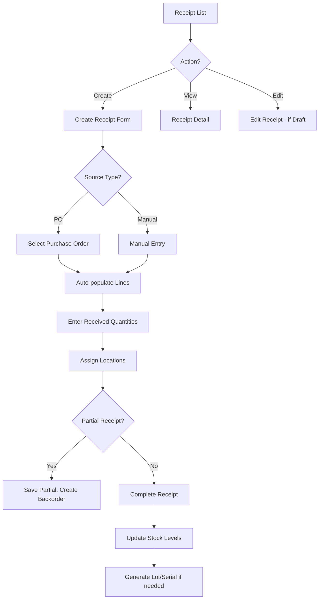

# Task: Create Goods Receipt Note (GRN) UI

**Task ID:** V1_MVP/08_Frontend/8.10_Inventory_UI/task_08.10.03_create_goods_receipt_ui
**Version:** V1_MVP
**Phase:** 08_Frontend
**Module:** 8.10_Inventory_UI
**Priority:** High
**Status:** Todo
**Assignee:** Unassigned
**Created Date:** 2026-01-23
**Last Updated:** 2026-01-23

## Detailed Description:
Create comprehensive Goods Receipt Note (GRN) interface for receiving inventory into warehouses. Supports creating receipts from purchase orders, manual receipts, partial receipts, and quality inspection workflow.

## UI/UX Specifications:

### Receipt List Page:
```
+--------------------------------------------------+
|  Goods Receipts            [+ Create Receipt]    |
+--------------------------------------------------+
|  [Search] [Status Filter] [Date Range] [Export]  |
+--------------------------------------------------+
|  Status Tabs: [All] [Draft] [Pending] [Received] |
+--------------------------------------------------+
|  Receipt Table:                                  |
|  | GRN#    | Supplier  | Date   | Items | Status||
|  | GRN-001 | Supplier A| Jan 20 | 5     | Recv  ||
|  | GRN-002 | Supplier B| Jan 21 | 3     | Pend  ||
+--------------------------------------------------+
```

### Create/Edit Receipt Form:
```
+--------------------------------------------------+
|  Create Goods Receipt                            |
+--------------------------------------------------+
|  Source: [Purchase Order ▼] [Manual Entry]       |
|  PO Reference: [Select PO...           ]         |
|  Warehouse: [Main Warehouse    ▼]                |
|  Expected Date: [____/____/____]                 |
+--------------------------------------------------+
|  Line Items:                                     |
|  | Product      | Expected | Received | Location||
|  | Product A    | 100      | [100   ] | [Loc ▼]||
|  | Product B    | 50       | [48    ] | [Loc ▼]||
|  [+ Add Line]                                    |
+--------------------------------------------------+
|  Notes: [                                      ] |
+--------------------------------------------------+
|  [Save Draft]  [Cancel]  [Receive & Complete]    |
+--------------------------------------------------+
```

### Receipt Workflow States:
```
Draft → Pending Approval → Approved → Receiving → Received
                ↓
             Rejected
```

## Interaction Flow:



## Specific Sub-tasks:
- [ ] 1. Create receipt list page at `/inventory/receipts`
- [ ] 2. Implement receipt status tabs and filtering
- [ ] 3. Create receipt form component with line items
- [ ] 4. Build PO selection modal with search
- [ ] 5. Implement product search with barcode support
- [ ] 6. Create location assignment dropdown per line
- [ ] 7. Build lot/serial number entry for tracked items
- [ ] 8. Implement partial receipt handling
- [ ] 9. Add receipt confirmation dialog with summary
- [ ] 10. Create receipt detail view with print option
- [ ] 11. Implement receipt reversal/cancellation flow

## Acceptance Criteria:
- [ ] Receipt list shows all GRNs with correct status
- [ ] Can create receipt from PO or manually
- [ ] Line items auto-populate from PO selection
- [ ] Can enter different received qty than expected
- [ ] Location assignment required before completion
- [ ] Lot/Serial entry works for tracked products
- [ ] Partial receipts create backorder automatically
- [ ] Stock levels update after receipt completion
- [ ] Receipt can be printed as PDF
- [ ] Draft receipts can be edited, completed cannot

## Non-Functional Requirements:
- **Performance**: Support 50+ line items without lag
- **Validation**: Real-time validation on quantity inputs
- **Offline**: Consider offline receipt entry for warehouses
- **Barcode**: Support barcode scanner for product entry

## Dependencies:
- V1_MVP/08_Frontend/8.10_Inventory_UI/task_08.10.02_create_warehouse_management_ui.md
- V1_MVP/04_Inventory_Service/4.3_Stock_Operations/task_04.03.01_implement_goods_receipt.md

## Related Documents:
- `frontend/src/routes/(protected)/inventory/receipts/+page.svelte`
- `frontend/src/routes/(protected)/inventory/receipts/new/+page.svelte`
- `frontend/src/routes/(protected)/inventory/receipts/[id]/+page.svelte`
- `frontend/src/lib/components/inventory/ReceiptForm.svelte`
- `frontend/src/lib/components/inventory/ReceiptLineItem.svelte`

## API Endpoints Used:
- `GET /api/v1/inventory/receipts` - List receipts
- `POST /api/v1/inventory/receipts` - Create receipt
- `GET /api/v1/inventory/receipts/{id}` - Get receipt detail
- `PUT /api/v1/inventory/receipts/{id}` - Update receipt
- `POST /api/v1/inventory/receipts/{id}/receive` - Complete receipt
- `POST /api/v1/inventory/receipts/{id}/cancel` - Cancel receipt

## Notes / Discussion:
---
* Consider quality inspection integration
* Barcode scanning for faster entry
* Print labels for received items

## AI Agent Log:
---
