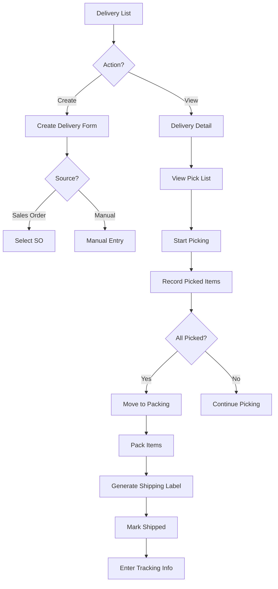

# Task: Create Delivery Order UI

**Task ID:** V1_MVP/08_Frontend/8.10_Inventory_UI/task_08.10.04_create_delivery_order_ui
**Version:** V1_MVP
**Phase:** 08_Frontend
**Module:** 8.10_Inventory_UI
**Priority:** High
**Status:** Todo
**Assignee:** Unassigned
**Created Date:** 2026-01-23
**Last Updated:** 2026-01-23

## Detailed Description:
Create delivery order management interface for outbound shipments. Supports creating deliveries from sales orders, pick list generation, packing slips, and shipment tracking.

## UI/UX Specifications:

### Delivery List Page:
```
+--------------------------------------------------+
|  Delivery Orders           [+ Create Delivery]   |
+--------------------------------------------------+
|  [Search] [Status] [Warehouse] [Date] [Export]   |
+--------------------------------------------------+
|  Status Tabs: [All] [Draft] [Picking] [Packed]   |
|               [Shipped] [Delivered]              |
+--------------------------------------------------+
|  Delivery Table:                                 |
|  | DO#     | Customer | Ship Date| Items |Status||
|  | DO-001  | Cust A   | Jan 22   | 3     | Pick ||
|  | DO-002  | Cust B   | Jan 23   | 5     | Ship ||
+--------------------------------------------------+
```

### Delivery Detail with Picking:
```
+--------------------------------------------------+
|  DO-001 - Customer A                [Print] [Act]|
+--------------------------------------------------+
|  [Details] [Pick List] [Packing] [Tracking]      |
+--------------------------------------------------+
|  Pick List:                                      |
|  | Product    | Qty | Location   | Picked | ✓   ||
|  | Product A  | 10  | A-01-01    | [   ]  | [ ] ||
|  | Product B  | 5   | B-02-03    | [   ]  | [ ] ||
+--------------------------------------------------+
|  [Start Picking] [Complete Picking] [Print List] |
+--------------------------------------------------+
```

## Interaction Flow:



## Specific Sub-tasks:
- [ ] 1. Create delivery list page at `/inventory/deliveries`
- [ ] 2. Implement delivery status workflow tabs
- [ ] 3. Create delivery form with SO integration
- [ ] 4. Build pick list component with location guide
- [ ] 5. Implement picking workflow with quantity entry
- [ ] 6. Create packing slip component
- [ ] 7. Build shipping label generation
- [ ] 8. Implement tracking number entry
- [ ] 9. Create delivery status timeline
- [ ] 10. Add batch picking for multiple orders
- [ ] 11. Implement partial shipment handling

## Acceptance Criteria:
- [ ] Delivery list shows all DOs with correct status
- [ ] Can create delivery from SO or manually
- [ ] Pick list shows optimal picking route
- [ ] Picked quantities update in real-time
- [ ] Packing slip can be printed
- [ ] Shipping labels generate correctly
- [ ] Tracking info updates delivery status
- [ ] Partial shipments create backorder
- [ ] Status timeline shows full history

## Non-Functional Requirements:
- **Performance**: Pick list optimized for warehouse path
- **Mobile**: Mobile-friendly picking interface
- **Printing**: Print pick lists, packing slips, labels
- **Integration**: Support carrier API integration

## Dependencies:
- V1_MVP/08_Frontend/8.10_Inventory_UI/task_08.10.03_create_goods_receipt_ui.md
- V1_MVP/04_Inventory_Service/4.3_Stock_Operations/task_04.03.02_implement_goods_issue.md

## Related Documents:
- `frontend/src/routes/(protected)/inventory/deliveries/+page.svelte`
- `frontend/src/routes/(protected)/inventory/deliveries/[id]/+page.svelte`
- `frontend/src/lib/components/inventory/DeliveryForm.svelte`
- `frontend/src/lib/components/inventory/PickList.svelte`
- `frontend/src/lib/components/inventory/PackingSlip.svelte`

## API Endpoints Used:
- `GET /api/v1/inventory/deliveries` - List deliveries
- `POST /api/v1/inventory/deliveries` - Create delivery
- `GET /api/v1/inventory/deliveries/{id}` - Get detail
- `POST /api/v1/inventory/deliveries/{id}/pick` - Start picking
- `POST /api/v1/inventory/deliveries/{id}/pack` - Complete packing
- `POST /api/v1/inventory/deliveries/{id}/ship` - Mark shipped

## Notes / Discussion:
---
* Wave picking for high-volume warehouses
* Integration with shipping carriers (UPS, FedEx)
* Consider mobile picking app

## AI Agent Log:
---
