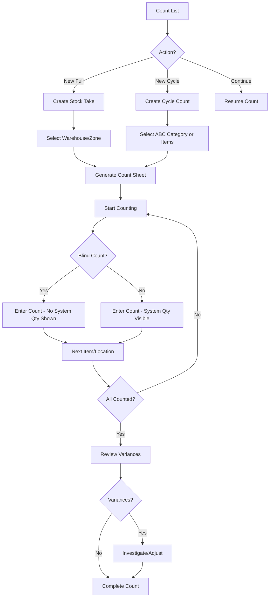

# Task: Create Stock Take & Cycle Count UI

**Task ID:** V1_MVP/08_Frontend/8.10_Inventory_UI/task_08.10.06_create_stock_take_ui
**Version:** V1_MVP
**Phase:** 08_Frontend
**Module:** 8.10_Inventory_UI
**Priority:** High
**Status:** Todo
**Assignee:** Unassigned
**Created Date:** 2026-01-23
**Last Updated:** 2026-01-23

## Detailed Description:
Create comprehensive stock take and cycle count interface for physical inventory verification. Supports full inventory counts, ABC cycle counting, blind counts, and variance reconciliation.

## UI/UX Specifications:

### Stock Take List Page:
```
+--------------------------------------------------+
|  Inventory Counts          [+ New Stock Take]    |
|                            [+ New Cycle Count]   |
+--------------------------------------------------+
|  [Search] [Type] [Status] [Warehouse] [Date]     |
+--------------------------------------------------+
|  Type Tabs: [All] [Full Count] [Cycle Count]     |
+--------------------------------------------------+
|  Count Table:                                    |
|  | Count#  | Type   | WH      | Progress| Status||
|  | ST-001  | Full   | Main    | 85%     | Active||
|  | CC-002  | Cycle  | Main    | 100%    | Done  ||
+--------------------------------------------------+
```

### Count Entry Interface:
```
+--------------------------------------------------+
|  Stock Take ST-001 - Main Warehouse              |
+--------------------------------------------------+
|  Progress: [████████░░] 85% (170/200 items)      |
+--------------------------------------------------+
|  [Blind Count Mode: ON]  [Scan Mode: Barcode]    |
+--------------------------------------------------+
|  Location: A-01-01                               |
|  +----------------------------------------------+|
|  | Product    | System | Counted | Variance     ||
|  | Product A  | ***    | [45   ] | Pending      ||
|  | Product B  | ***    | [12   ] | Pending      ||
|  +----------------------------------------------+|
|  [Next Location] [Flag for Review] [Save & Exit] |
+--------------------------------------------------+
```

### Variance Review:
```
+--------------------------------------------------+
|  Variance Review - ST-001                        |
+--------------------------------------------------+
|  Summary: 15 variances found                     |
+--------------------------------------------------+
|  | Product   | Location| System| Counted| Diff  ||
|  | Product A | A-01-01 | 50    | 45     | -5    ||
|  | Product B | B-02-03 | 10    | 12     | +2    ||
+--------------------------------------------------+
|  Actions per variance:                           |
|  [Recount] [Adjust Stock] [Write Off] [Dismiss]  |
+--------------------------------------------------+
|  [Approve All Adjustments] [Complete Stock Take] |
+--------------------------------------------------+
```

## Interaction Flow:



## Specific Sub-tasks:
- [ ] 1. Create stock take list page at `/inventory/stock-takes`
- [ ] 2. Implement stock take creation wizard
- [ ] 3. Create cycle count scheduler with ABC analysis
- [ ] 4. Build count entry interface with blind count toggle
- [ ] 5. Implement barcode/QR scanning for item identification
- [ ] 6. Create progress tracking with location navigation
- [ ] 7. Build variance calculation and display
- [ ] 8. Implement variance resolution workflow
- [ ] 9. Create adjustment approval process
- [ ] 10. Add count history and audit trail
- [ ] 11. Build print count sheets functionality

## Acceptance Criteria:
- [ ] Can create full stock take and cycle count
- [ ] Count sheet generates for selected scope
- [ ] Blind count hides system quantities
- [ ] Barcode scanning identifies products
- [ ] Progress saves automatically (offline support)
- [ ] Variances calculated after counting
- [ ] Can recount individual items
- [ ] Adjustments require approval
- [ ] Stock levels update after approval
- [ ] Full audit trail maintained

## Non-Functional Requirements:
- **Offline**: Count entry works offline, syncs when online
- **Mobile**: Mobile-first design for warehouse tablets
- **Performance**: Handle 1000+ items per count
- **Accuracy**: Double-entry option for critical items

## Dependencies:
- V1_MVP/08_Frontend/8.10_Inventory_UI/task_08.10.02_create_warehouse_management_ui.md
- V1_MVP/04_Inventory_Service/4.4_Inventory_Counting/task_04.04.01_implement_physical_inventory.md

## Related Documents:
- `frontend/src/routes/(protected)/inventory/stock-takes/+page.svelte`
- `frontend/src/routes/(protected)/inventory/stock-takes/[id]/+page.svelte`
- `frontend/src/routes/(protected)/inventory/stock-takes/[id]/count/+page.svelte`
- `frontend/src/lib/components/inventory/CountEntry.svelte`
- `frontend/src/lib/components/inventory/VarianceReview.svelte`

## API Endpoints Used:
- `GET /api/v1/inventory/stock-takes` - List stock takes
- `POST /api/v1/inventory/stock-takes` - Create stock take
- `GET /api/v1/inventory/stock-takes/{id}` - Get detail
- `POST /api/v1/inventory/stock-takes/{id}/counts` - Submit counts
- `GET /api/v1/inventory/stock-takes/{id}/variances` - Get variances
- `POST /api/v1/inventory/stock-takes/{id}/adjustments` - Apply adjustments
- `GET /api/v1/inventory/cycle-counts` - List cycle counts
- `POST /api/v1/inventory/cycle-counts` - Create cycle count

## Notes / Discussion:
---
* Consider freeze inventory during full count
* ABC analysis for cycle count frequency
* Integration with mobile counting app

## AI Agent Log:
---
