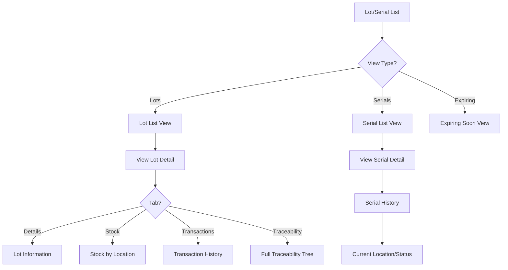

# Task: Create Lot/Serial Tracking UI

**Task ID:** V1_MVP/08_Frontend/8.10_Inventory_UI/task_08.10.07_create_lot_serial_tracking_ui
**Version:** V1_MVP
**Phase:** 08_Frontend
**Module:** 8.10_Inventory_UI
**Priority:** Medium
**Status:** Todo
**Assignee:** Unassigned
**Created Date:** 2026-01-23
**Last Updated:** 2026-01-23

## Detailed Description:
Create lot and serial number tracking interface for traceability of inventory items. Supports lot creation, serial number assignment, expiry tracking, and full traceability from receipt to delivery.

## UI/UX Specifications:

### Lot/Serial List Page:
```
+--------------------------------------------------+
|  Lot & Serial Tracking     [+ Create Lot]        |
+--------------------------------------------------+
|  [Search by Lot#/Serial#] [Product] [Status]     |
+--------------------------------------------------+
|  View Tabs: [Lots] [Serials] [Expiring Soon]     |
+--------------------------------------------------+
|  Lot Table:                                      |
|  | Lot#    | Product  | Qty  | Expiry    |Status||
|  | LOT-001 | Prod A   | 100  | 2026-06-15| Active|
|  | LOT-002 | Prod B   | 50   | 2026-03-01| Expir||
+--------------------------------------------------+
```

### Lot Detail View:
```
+--------------------------------------------------+
|  LOT-001 - Product A                             |
+--------------------------------------------------+
|  [Details] [Stock] [Transactions] [Traceability] |
+--------------------------------------------------+
|  Lot Information:                                |
|  Lot Number: LOT-001                             |
|  Product: Product A (SKU-001)                    |
|  Manufactured: 2025-12-15                        |
|  Expiry: 2026-06-15 (175 days remaining)         |
|  Supplier Lot: SUP-LOT-123                       |
+--------------------------------------------------+
|  Stock by Location:                              |
|  | Location   | Quantity | Reserved | Available ||
|  | A-01-01    | 60       | 10       | 50        ||
|  | B-02-03    | 40       | 0        | 40        ||
+--------------------------------------------------+
```

### Traceability View:
```
+--------------------------------------------------+
|  Traceability - LOT-001                          |
+--------------------------------------------------+
|  Timeline:                                       |
|  ●─── GRN-001 Received 100 units (2025-12-20)    |
|  │    └── From Supplier A, PO-001                |
|  ●─── TR-005 Transferred 40 to Zone B (2025-12-25)|
|  ●─── DO-010 Shipped 20 to Customer X (2026-01-10)|
|  ●─── Current: 80 units remaining                |
+--------------------------------------------------+
```

## Interaction Flow:



## Specific Sub-tasks:
- [ ] 1. Create lot/serial list page at `/inventory/lots`
- [ ] 2. Implement lot creation form with auto-generation
- [ ] 3. Build lot detail view with tabs
- [ ] 4. Create serial number assignment interface
- [ ] 5. Implement expiry tracking with alerts
- [ ] 6. Build traceability timeline component
- [ ] 7. Create stock-by-location view for lots
- [ ] 8. Implement lot merge and split operations
- [ ] 9. Add FEFO/FIFO picking suggestion
- [ ] 10. Create expiring inventory dashboard widget

## Acceptance Criteria:
- [ ] Lot list shows all lots with status
- [ ] Can create lots with auto-generated numbers
- [ ] Serial numbers trackable individually
- [ ] Expiry dates highlighted with color coding
- [ ] Traceability shows full movement history
- [ ] Stock levels accurate per lot per location
- [ ] FEFO suggestions work for picking
- [ ] Expiring soon alerts configurable
- [ ] Can merge/split lots with audit trail

## Non-Functional Requirements:
- **Traceability**: Full chain of custody
- **Performance**: Handle 10,000+ lots efficiently
- **Compliance**: Support regulatory requirements
- **Alerts**: Configurable expiry notifications

## Dependencies:
- V1_MVP/08_Frontend/8.10_Inventory_UI/task_08.10.03_create_goods_receipt_ui.md
- V1_MVP/04_Inventory_Service/4.5_Lot_Serial_Tracking/task_04.05.01_implement_lot_tracking.md

## Related Documents:
- `frontend/src/routes/(protected)/inventory/lots/+page.svelte`
- `frontend/src/routes/(protected)/inventory/lots/[id]/+page.svelte`
- `frontend/src/lib/components/inventory/LotDetail.svelte`
- `frontend/src/lib/components/inventory/TraceabilityTimeline.svelte`
- `frontend/src/lib/components/inventory/ExpiryAlert.svelte`

## API Endpoints Used:
- `GET /api/v1/inventory/lots` - List lots
- `POST /api/v1/inventory/lots` - Create lot
- `GET /api/v1/inventory/lots/{id}` - Get lot detail
- `GET /api/v1/inventory/lots/{id}/traceability` - Get traceability
- `GET /api/v1/inventory/lots/{id}/stock` - Get stock by location
- `GET /api/v1/inventory/serials` - List serials
- `GET /api/v1/inventory/serials/{id}` - Get serial detail

## Notes / Discussion:
---
* Barcode/QR generation for lots
* Consider batch printing labels
* FDA/compliance reporting integration

## AI Agent Log:
---
