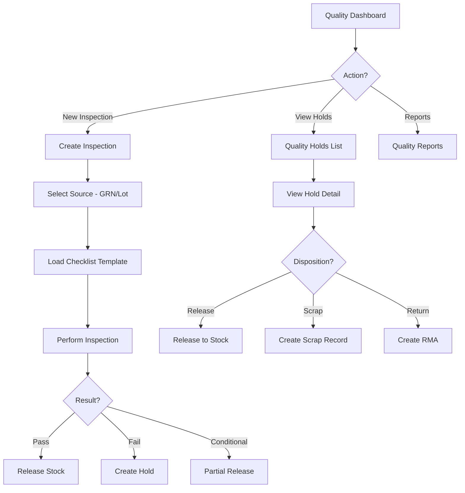

# Task: Create Quality Management UI

**Task ID:** V1_MVP/08_Frontend/8.10_Inventory_UI/task_08.10.08_create_quality_management_ui
**Version:** V1_MVP
**Phase:** 08_Frontend
**Module:** 8.10_Inventory_UI
**Priority:** Medium
**Status:** Todo
**Assignee:** Unassigned
**Created Date:** 2026-01-23
**Last Updated:** 2026-01-23

## Detailed Description:
Create quality control and inspection interface for inventory items. Supports inspection during receipt, in-process checks, and quality holds with disposition workflow.

## UI/UX Specifications:

### Quality Dashboard:
```
+--------------------------------------------------+
|  Quality Control                                 |
+--------------------------------------------------+
|  [Pending Inspections: 12] [On Hold: 5] [Passed:98%]|
+--------------------------------------------------+
|  Quick Actions:                                  |
|  [New Inspection] [View Holds] [Quality Reports] |
+--------------------------------------------------+
```

### Inspection List:
```
+--------------------------------------------------+
|  Inspections               [+ New Inspection]    |
+--------------------------------------------------+
|  [Search] [Status] [Type] [Date Range]           |
+--------------------------------------------------+
|  Status Tabs: [Pending] [In Progress] [Completed]|
+--------------------------------------------------+
|  | Insp#   | Type    | Product  | Status | Result|
|  | QC-001  | Receipt | Prod A   | Done   | Pass  |
|  | QC-002  | Receipt | Prod B   | Pend   | -     |
+--------------------------------------------------+
```

### Inspection Form:
```
+--------------------------------------------------+
|  Quality Inspection - QC-002                     |
+--------------------------------------------------+
|  Product: Product B (LOT-002)                    |
|  Source: GRN-005                                 |
|  Sample Size: 10 of 100 units                    |
+--------------------------------------------------+
|  Inspection Checklist:                           |
|  [ ] Visual inspection - no defects              |
|  [ ] Dimensions within spec                      |
|  [ ] Packaging intact                            |
|  [ ] Documentation complete                      |
+--------------------------------------------------+
|  Measurements:                                   |
|  | Parameter  | Spec      | Actual  | Pass/Fail ||
|  | Weight     | 100±5g    | [102  ] | [✓]       ||
|  | Length     | 50±2mm    | [51   ] | [✓]       ||
+--------------------------------------------------+
|  Result: ( ) Pass  ( ) Fail  ( ) Conditional     |
|  Notes: [                                      ] |
+--------------------------------------------------+
|  [Save Draft]  [Reject & Hold]  [Approve]        |
+--------------------------------------------------+
```

### Quality Hold Management:
```
+--------------------------------------------------+
|  Quality Holds                                   |
+--------------------------------------------------+
|  | Hold#   | Product | Qty  | Reason     | Days ||
|  | QH-001  | Prod C  | 50   | Failed QC  | 5    ||
|  | QH-002  | Prod D  | 25   | Damage     | 2    ||
+--------------------------------------------------+
|  Actions: [Release] [Scrap] [Return to Supplier] |
+--------------------------------------------------+
```

## Interaction Flow:



## Specific Sub-tasks:
- [ ] 1. Create quality dashboard at `/inventory/quality`
- [ ] 2. Implement inspection list with filtering
- [ ] 3. Build inspection form with checklist template
- [ ] 4. Create measurement entry with spec validation
- [ ] 5. Implement pass/fail/conditional workflow
- [ ] 6. Build quality hold management
- [ ] 7. Create hold disposition workflow
- [ ] 8. Implement RMA creation from failed QC
- [ ] 9. Add quality metrics and reports
- [ ] 10. Create inspection template builder

## Acceptance Criteria:
- [ ] Inspections triggered from GRN or manually
- [ ] Checklist templates configurable
- [ ] Measurements validate against specs
- [ ] Failed items automatically held
- [ ] Hold disposition options work correctly
- [ ] RMA can be created from failed QC
- [ ] Scrap records created for disposed items
- [ ] Quality metrics dashboard accurate
- [ ] Full audit trail maintained

## Non-Functional Requirements:
- **Compliance**: Support ISO 9001 requirements
- **Templates**: Customizable inspection templates
- **Reporting**: Quality trend analysis
- **Integration**: Connect with RMA and Scrap modules

## Dependencies:
- V1_MVP/08_Frontend/8.10_Inventory_UI/task_08.10.03_create_goods_receipt_ui.md
- V1_MVP/04_Inventory_Service/4.8_Quality_Control/task_04.08.01_implement_quality_inspection.md

## Related Documents:
- `frontend/src/routes/(protected)/inventory/quality/+page.svelte`
- `frontend/src/routes/(protected)/inventory/quality/inspections/+page.svelte`
- `frontend/src/routes/(protected)/inventory/quality/holds/+page.svelte`
- `frontend/src/lib/components/inventory/InspectionForm.svelte`
- `frontend/src/lib/components/inventory/QualityHoldCard.svelte`

## API Endpoints Used:
- `GET /api/v1/inventory/quality/inspections` - List inspections
- `POST /api/v1/inventory/quality/inspections` - Create inspection
- `GET /api/v1/inventory/quality/inspections/{id}` - Get detail
- `POST /api/v1/inventory/quality/inspections/{id}/complete` - Complete
- `GET /api/v1/inventory/quality/holds` - List holds
- `POST /api/v1/inventory/quality/holds/{id}/release` - Release hold
- `POST /api/v1/inventory/quality/holds/{id}/scrap` - Scrap items

## Notes / Discussion:
---
* Photo attachment for defect documentation
* Statistical process control (SPC) charts
* Supplier quality scoring

## AI Agent Log:
---
