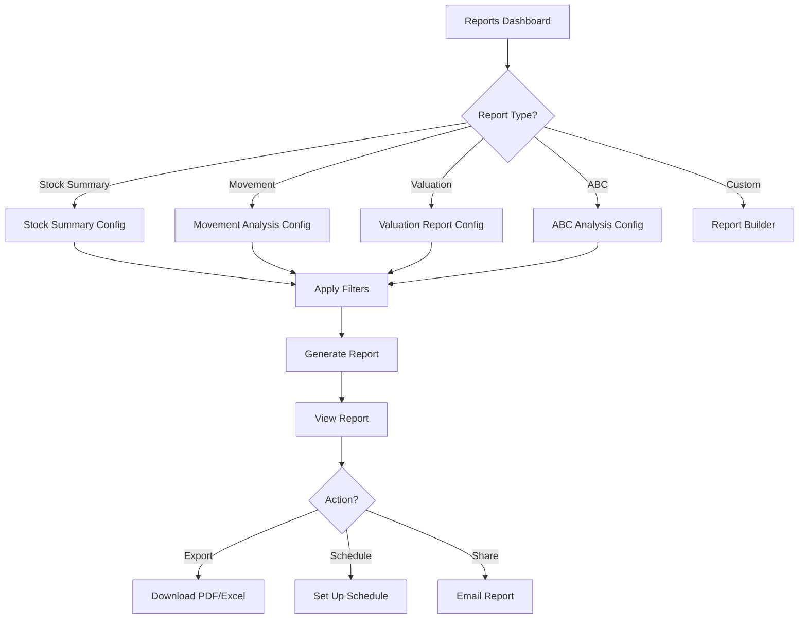

# Task: Create Inventory Reports & Analytics UI

**Task ID:** V1_MVP/08_Frontend/8.10_Inventory_UI/task_08.10.09_create_inventory_reports_ui
**Version:** V1_MVP
**Phase:** 08_Frontend
**Module:** 8.10_Inventory_UI
**Priority:** Medium
**Status:** Todo
**Assignee:** Unassigned
**Created Date:** 2026-01-23
**Last Updated:** 2026-01-23

## Detailed Description:
Create comprehensive inventory reporting and analytics interface. Includes stock reports, movement analysis, valuation reports, ABC analysis, and custom report builder.

## UI/UX Specifications:

### Reports Dashboard:
```
+--------------------------------------------------+
|  Inventory Reports & Analytics                   |
+--------------------------------------------------+
|  Quick Reports:                                  |
|  [Stock Summary] [Movement] [Valuation] [ABC]    |
+--------------------------------------------------+
|  Recent Reports:                                 |
|  | Report Name        | Generated  | [Download] ||
|  | Stock Summary Jan  | 2026-01-20 | [PDF][XLS] ||
|  | ABC Analysis Q4    | 2026-01-15 | [PDF][XLS] ||
+--------------------------------------------------+
|  Scheduled Reports:                              |
|  | Name              | Frequency | Next Run     ||
|  | Weekly Stock      | Weekly    | 2026-01-27   ||
+--------------------------------------------------+
```

### Stock Summary Report:
```
+--------------------------------------------------+
|  Stock Summary Report                            |
+--------------------------------------------------+
|  Filters:                                        |
|  Warehouse: [All ▼] Category: [All ▼]            |
|  As of Date: [2026-01-23]  [Generate Report]     |
+--------------------------------------------------+
|  Summary Cards:                                  |
|  [Total SKUs: 1,250] [Total Value: $2.5M]        |
|  [In Stock: 1,180] [Out of Stock: 70]            |
+--------------------------------------------------+
|  Stock by Category Chart                         |
|  [Pie Chart showing category breakdown]          |
+--------------------------------------------------+
|  Detail Table:                                   |
|  | SKU     | Product  | Qty  | Value   | Status ||
|  | SKU-001 | Prod A   | 100  | $5,000  | OK     ||
|  | SKU-002 | Prod B   | 5    | $250    | Low    ||
+--------------------------------------------------+
|  [Export PDF] [Export Excel] [Schedule Report]   |
+--------------------------------------------------+
```

### Movement Analysis:
```
+--------------------------------------------------+
|  Stock Movement Analysis                         |
+--------------------------------------------------+
|  Period: [Last 30 Days ▼]  Warehouse: [All ▼]    |
+--------------------------------------------------+
|  Movement Summary:                               |
|  [Received: 5,000] [Issued: 4,500] [Net: +500]   |
+--------------------------------------------------+
|  Movement Trend Chart (Line/Bar)                 |
|  [Chart showing daily in/out movements]          |
+--------------------------------------------------+
|  Top Movers:                                     |
|  | Product  | In    | Out   | Turnover | Trend  ||
|  | Prod A   | 500   | 450   | 4.5x     | ↑      ||
|  | Prod B   | 300   | 320   | 3.2x     | ↓      ||
+--------------------------------------------------+
```

### ABC Analysis:
```
+--------------------------------------------------+
|  ABC Analysis                                    |
+--------------------------------------------------+
|  Analysis Criteria: [Value ▼]  Period: [YTD ▼]   |
+--------------------------------------------------+
|  Classification Summary:                         |
|  | Class | SKUs | % SKUs | Value    | % Value   ||
|  | A     | 125  | 10%    | $1.5M    | 60%       ||
|  | B     | 375  | 30%    | $750K    | 30%       ||
|  | C     | 750  | 60%    | $250K    | 10%       ||
+--------------------------------------------------+
|  [Pareto Chart showing 80/20 distribution]       |
+--------------------------------------------------+
|  Recommendations:                                |
|  • Class A: Increase safety stock, frequent count|
|  • Class B: Standard controls                    |
|  • Class C: Reduce inventory, consider dropship  |
+--------------------------------------------------+
```

## Interaction Flow:



## Specific Sub-tasks:
- [ ] 1. Create reports dashboard at `/inventory/reports`
- [ ] 2. Implement stock summary report with filters
- [ ] 3. Build movement analysis with trend charts
- [ ] 4. Create inventory valuation report (FIFO/LIFO/Avg)
- [ ] 5. Implement ABC/XYZ analysis with recommendations
- [ ] 6. Build aging analysis for slow-moving items
- [ ] 7. Create expiry report for perishables
- [ ] 8. Implement PDF/Excel export functionality
- [ ] 9. Build report scheduler for automated reports
- [ ] 10. Create custom report builder (basic)

## Acceptance Criteria:
- [ ] Stock summary shows accurate current state
- [ ] Movement analysis covers configurable periods
- [ ] Valuation supports multiple costing methods
- [ ] ABC analysis classifies inventory correctly
- [ ] Charts are interactive with drill-down
- [ ] PDF export generates professional reports
- [ ] Excel export includes all data
- [ ] Scheduled reports run automatically
- [ ] Reports load within 5 seconds

## Non-Functional Requirements:
- **Performance**: Large reports generated < 10s
- **Export**: Professional PDF formatting
- **Scheduling**: Reliable cron-based scheduling
- **Caching**: Cache heavy reports

## Dependencies:
- V1_MVP/08_Frontend/8.10_Inventory_UI/task_08.10.01_create_inventory_dashboard.md
- V1_MVP/04_Inventory_Service/4.10_Reports/task_04.10.01_implement_stock_reports.md

## Related Documents:
- `frontend/src/routes/(protected)/inventory/reports/+page.svelte`
- `frontend/src/routes/(protected)/inventory/reports/stock/+page.svelte`
- `frontend/src/routes/(protected)/inventory/reports/movement/+page.svelte`
- `frontend/src/routes/(protected)/inventory/reports/abc/+page.svelte`
- `frontend/src/lib/components/inventory/ReportChart.svelte`
- `frontend/src/lib/components/inventory/ReportExport.svelte`

## API Endpoints Used:
- `GET /api/v1/inventory/reports/stock-summary` - Stock summary
- `GET /api/v1/inventory/reports/movement` - Movement report
- `GET /api/v1/inventory/reports/valuation` - Valuation report
- `GET /api/v1/inventory/reports/abc-analysis` - ABC analysis
- `GET /api/v1/inventory/reports/aging` - Aging report
- `POST /api/v1/inventory/reports/schedule` - Schedule report
- `GET /api/v1/inventory/reports/export/{format}` - Export

## Notes / Discussion:
---
* Consider report templates for common use cases
* Add drill-down from charts to detail views
* Implement report sharing via email

## AI Agent Log:
---
