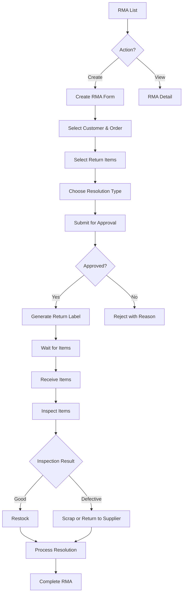

# Task: Create RMA (Return Merchandise Authorization) UI

**Task ID:** V1_MVP/08_Frontend/8.10_Inventory_UI/task_08.10.12_create_rma_ui
**Version:** V1_MVP
**Phase:** 08_Frontend
**Module:** 8.10_Inventory_UI
**Priority:** Medium
**Status:** Todo
**Assignee:** Unassigned
**Created Date:** 2026-01-23
**Last Updated:** 2026-01-23

## Detailed Description:
Create Return Merchandise Authorization interface for managing customer returns. Supports return request creation, inspection workflow, refund/replacement processing, and restocking.

## UI/UX Specifications:

### RMA List Page:
```
+--------------------------------------------------+
|  Returns (RMA)                  [+ Create RMA]   |
+--------------------------------------------------+
|  [Search] [Status] [Reason] [Date Range]         |
+--------------------------------------------------+
|  Status Tabs: [All] [Pending] [Approved] [Recv]  |
|               [Inspecting] [Resolved]            |
+--------------------------------------------------+
|  RMA Table:                                      |
|  | RMA#    | Customer | Order#  | Items | Status||
|  | RMA-001 | Cust A   | ORD-100 | 2     | Recv  ||
|  | RMA-002 | Cust B   | ORD-105 | 1     | Pend  ||
+--------------------------------------------------+
```

### Create RMA Form:
```
+--------------------------------------------------+
|  Create Return Authorization                     |
+--------------------------------------------------+
|  Customer: [Search Customer...         ]         |
|  Original Order: [Search Order...      ]         |
+--------------------------------------------------+
|  Return Items:                                   |
|  | Product    | Ordered | Returning | Reason    ||
|  | Product A  | 5       | [2      ] | [Defect ▼]||
|  | Product B  | 3       | [1      ] | [Wrong ▼] ||
+--------------------------------------------------+
|  Return Reason: [                              ] |
|  Customer Notes: [                             ] |
+--------------------------------------------------+
|  Resolution: ( ) Refund  ( ) Replacement ( ) Credit|
|  Return Shipping: ( ) Customer Pays ( ) We Pay   |
+--------------------------------------------------+
|  [Cancel]  [Save Draft]  [Approve & Send Label]  |
+--------------------------------------------------+
```

### RMA Processing View:
```
+--------------------------------------------------+
|  RMA-001 - Customer A                            |
+--------------------------------------------------+
|  [Details] [Items] [Inspection] [Resolution]     |
+--------------------------------------------------+
|  Status Timeline:                                |
|  ●─── Created (Jan 20)                           |
|  ●─── Approved (Jan 20)                          |
|  ●─── Items Received (Jan 23)                    |
|  ○─── Inspection (Pending)                       |
|  ○─── Resolution                                 |
+--------------------------------------------------+
|  Inspection Results:                             |
|  | Product   | Condition    | Disposition       ||
|  | Product A | [Defective ▼]| [Scrap ▼]         ||
|  | Product B | [Good ▼]     | [Restock ▼]       ||
+--------------------------------------------------+
|  [Complete Inspection]  [Process Resolution]     |
+--------------------------------------------------+
```

## Interaction Flow:



## Specific Sub-tasks:
- [ ] 1. Create RMA list page at `/inventory/rma`
- [ ] 2. Implement RMA creation from order lookup
- [ ] 3. Build return item selection with quantities
- [ ] 4. Create return reason dropdown with custom option
- [ ] 5. Implement approval workflow
- [ ] 6. Build return label generation
- [ ] 7. Create receiving interface for returned items
- [ ] 8. Implement inspection form with disposition
- [ ] 9. Build resolution processing (refund/replace/credit)
- [ ] 10. Add restocking workflow for good items
- [ ] 11. Create RMA analytics dashboard

## Acceptance Criteria:
- [ ] RMA can be created from original order
- [ ] Return quantities validated against order
- [ ] Return reasons captured with details
- [ ] Approval workflow enforced
- [ ] Return labels generate correctly
- [ ] Items can be received and inspected
- [ ] Disposition options work (restock/scrap/return)
- [ ] Resolution processed correctly
- [ ] Stock levels update based on disposition
- [ ] Full timeline visible for tracking

## Non-Functional Requirements:
- **Integration**: Connect with order and inventory systems
- **Notifications**: Email customer at each stage
- **Labels**: Generate printable return labels
- **Reporting**: RMA reasons analysis

## Dependencies:
- V1_MVP/08_Frontend/8.10_Inventory_UI/task_08.10.08_create_quality_management_ui.md
- V1_MVP/04_Inventory_Service/4.7_RMA/task_04.07.01_implement_rma.md

## Related Documents:
- `frontend/src/routes/(protected)/inventory/rma/+page.svelte`
- `frontend/src/routes/(protected)/inventory/rma/new/+page.svelte`
- `frontend/src/routes/(protected)/inventory/rma/[id]/+page.svelte`
- `frontend/src/lib/components/inventory/RMAForm.svelte`
- `frontend/src/lib/components/inventory/RMAInspection.svelte`

## API Endpoints Used:
- `GET /api/v1/inventory/rma` - List RMAs
- `POST /api/v1/inventory/rma` - Create RMA
- `GET /api/v1/inventory/rma/{id}` - Get detail
- `POST /api/v1/inventory/rma/{id}/approve` - Approve
- `POST /api/v1/inventory/rma/{id}/receive` - Receive items
- `POST /api/v1/inventory/rma/{id}/inspect` - Submit inspection
- `POST /api/v1/inventory/rma/{id}/resolve` - Process resolution

## Notes / Discussion:
---
* Integration with shipping carriers for labels
* Customer portal for RMA status tracking
* Return shipping cost tracking

## AI Agent Log:
---
