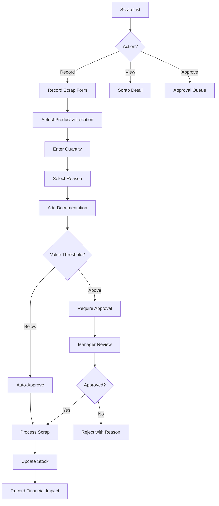

# Task: Create Scrap Management UI

**Task ID:** V1_MVP/08_Frontend/8.10_Inventory_UI/task_08.10.13_create_scrap_management_ui
**Version:** V1_MVP
**Phase:** 08_Frontend
**Module:** 8.10_Inventory_UI
**Priority:** Low
**Status:** Todo
**Assignee:** Unassigned
**Created Date:** 2026-01-23
**Last Updated:** 2026-01-23

## Detailed Description:
Create scrap management interface for recording and tracking inventory write-offs, damages, and disposals with proper approval workflow and financial impact tracking.

## UI/UX Specifications:

### Scrap List Page:
```
+--------------------------------------------------+
|  Scrap Management              [+ Record Scrap]  |
+--------------------------------------------------+
|  [Search] [Status] [Reason] [Date Range]         |
+--------------------------------------------------+
|  Summary Cards:                                  |
|  [This Month: 15 items] [Value: $2,500] [Pending: 3]|
+--------------------------------------------------+
|  Scrap Table:                                    |
|  | Scrap#  | Product  | Qty | Value  | Reason   ||
|  | SC-001  | Prod A   | 10  | $500   | Expired  ||
|  | SC-002  | Prod B   | 5   | $250   | Damaged  ||
+--------------------------------------------------+
```

### Record Scrap Form:
```
+--------------------------------------------------+
|  Record Scrap                                    |
+--------------------------------------------------+
|  Product: [Search Product...           ]         |
|  Lot/Serial: [Select Lot...            ]         |
|  Location: [A-01-01 ▼]                           |
|  Quantity: [     ] / Available: 50               |
+--------------------------------------------------+
|  Scrap Reason: [Expired ▼]                       |
|  ○ Expired       ○ Damaged                       |
|  ○ Quality Fail  ○ Obsolete                      |
|  ○ Other: [                          ]           |
+--------------------------------------------------+
|  Value Impact:                                   |
|  Unit Cost: $50.00                               |
|  Total Value: $500.00                            |
+--------------------------------------------------+
|  Documentation:                                  |
|  Notes: [                                      ] |
|  Attachments: [+ Add Photo/Document]             |
+--------------------------------------------------+
|  [Cancel]  [Save Draft]  [Submit for Approval]   |
+--------------------------------------------------+
```

## Interaction Flow:



## Specific Sub-tasks:
- [ ] 1. Create scrap list page at `/inventory/scrap`
- [ ] 2. Implement scrap recording form
- [ ] 3. Build product/lot selection with availability
- [ ] 4. Create scrap reason categories
- [ ] 5. Implement photo/document attachments
- [ ] 6. Build approval workflow with thresholds
- [ ] 7. Create scrap value calculation
- [ ] 8. Implement stock adjustment on approval
- [ ] 9. Add scrap analytics dashboard
- [ ] 10. Create scrap reports by reason/period

## Acceptance Criteria:
- [ ] Scrap can be recorded with full details
- [ ] Cannot scrap more than available
- [ ] Scrap reasons properly categorized
- [ ] Photos can be attached as evidence
- [ ] Approval required above value threshold
- [ ] Stock levels update on approval
- [ ] Financial impact tracked accurately
- [ ] Scrap reports generated correctly

## Non-Functional Requirements:
- **Audit**: Full audit trail required
- **Approval**: Configurable approval thresholds
- **Reporting**: Integration with accounting

## Dependencies:
- V1_MVP/08_Frontend/8.10_Inventory_UI/task_08.10.08_create_quality_management_ui.md
- V1_MVP/04_Inventory_Service/4.9_Scrap/task_04.09.01_implement_scrap.md

## Related Documents:
- `frontend/src/routes/(protected)/inventory/scrap/+page.svelte`
- `frontend/src/routes/(protected)/inventory/scrap/new/+page.svelte`
- `frontend/src/lib/components/inventory/ScrapForm.svelte`

## API Endpoints Used:
- `GET /api/v1/inventory/scrap` - List scrap records
- `POST /api/v1/inventory/scrap` - Create scrap
- `GET /api/v1/inventory/scrap/{id}` - Get detail
- `POST /api/v1/inventory/scrap/{id}/approve` - Approve
- `POST /api/v1/inventory/scrap/{id}/reject` - Reject

## Notes / Discussion:
---
* Consider integration with disposal vendors
* Track environmental compliance for certain items
* Scrap recovery value tracking

## AI Agent Log:
---
