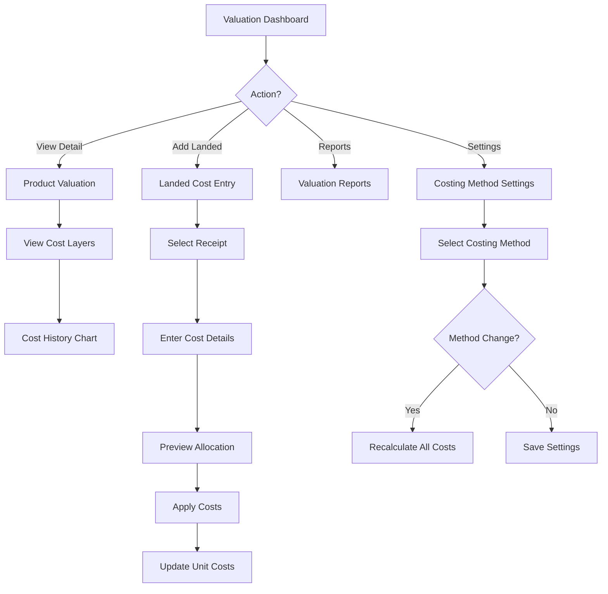

# Task: Create Inventory Valuation UI

**Task ID:** V1_MVP/08_Frontend/8.10_Inventory_UI/task_08.10.14_create_inventory_valuation_ui
**Version:** V1_MVP
**Phase:** 08_Frontend
**Module:** 8.10_Inventory_UI
**Priority:** Medium
**Status:** Todo
**Assignee:** Unassigned
**Created Date:** 2026-01-23
**Last Updated:** 2026-01-23

## Detailed Description:
Create inventory valuation interface showing current stock value, supporting multiple costing methods (FIFO, LIFO, Average, Standard), and landed cost tracking.

## UI/UX Specifications:

### Valuation Dashboard:
```
+--------------------------------------------------+
|  Inventory Valuation                             |
+--------------------------------------------------+
|  Total Value: $2,500,000                         |
|  Costing Method: Weighted Average                |
|  As of: 2026-01-23 14:30                         |
+--------------------------------------------------+
|  Value by Category:                              |
|  [Pie Chart showing category breakdown]          |
+--------------------------------------------------+
|  Value by Warehouse:                             |
|  | Warehouse    | Qty    | Value      | % Total ||
|  | Main WH      | 10,000 | $1,500,000 | 60%     ||
|  | Satellite    | 5,000  | $750,000   | 30%     ||
|  | Returns      | 1,000  | $250,000   | 10%     ||
+--------------------------------------------------+
```

### Product Valuation Detail:
```
+--------------------------------------------------+
|  Product Valuation - Product A                   |
+--------------------------------------------------+
|  Current Stock: 500 units                        |
|  Unit Cost: $50.00 (Weighted Average)            |
|  Total Value: $25,000                            |
+--------------------------------------------------+
|  Cost Layers (FIFO):                             |
|  | Receipt Date | Qty  | Unit Cost | Layer Value||
|  | 2026-01-15   | 200  | $48.00    | $9,600     ||
|  | 2026-01-10   | 300  | $51.33    | $15,400    ||
+--------------------------------------------------+
|  Cost History Chart                              |
|  [Line chart showing cost trend over time]       |
+--------------------------------------------------+
```

### Landed Cost Entry:
```
+--------------------------------------------------+
|  Add Landed Costs                                |
+--------------------------------------------------+
|  Receipt: [GRN-001 ▼]                            |
|  Cost Type: [Freight ▼]                          |
|  Amount: [$500.00    ]                           |
|  Allocation: ( ) By Value  (●) By Quantity       |
+--------------------------------------------------+
|  Allocation Preview:                             |
|  | Product   | Qty | Base Cost | Landed | Total ||
|  | Product A | 100 | $4,000    | $250   | $4,250||
|  | Product B | 100 | $6,000    | $250   | $6,250||
+--------------------------------------------------+
|  [Cancel]                  [Apply Landed Costs]  |
+--------------------------------------------------+
```

## Interaction Flow:



## Specific Sub-tasks:
- [ ] 1. Create valuation dashboard at `/inventory/valuation`
- [ ] 2. Implement value by category chart
- [ ] 3. Build value by warehouse breakdown
- [ ] 4. Create product valuation detail view
- [ ] 5. Implement cost layer visualization (FIFO/LIFO)
- [ ] 6. Build cost history trend chart
- [ ] 7. Create landed cost entry form
- [ ] 8. Implement cost allocation methods
- [ ] 9. Build valuation reports with filters
- [ ] 10. Add costing method configuration

## Acceptance Criteria:
- [ ] Total inventory value calculated correctly
- [ ] Multiple costing methods supported
- [ ] Cost layers visible for FIFO/LIFO
- [ ] Landed costs allocate correctly
- [ ] Value breakdown by category/warehouse
- [ ] Cost history shows trends
- [ ] Reports export to PDF/Excel
- [ ] Costing method changes recalculate

## Non-Functional Requirements:
- **Accuracy**: Penny-level precision
- **Performance**: Handle 10,000+ products
- **Audit**: Cost change audit trail
- **Integration**: Accounting system export

## Dependencies:
- V1_MVP/08_Frontend/8.10_Inventory_UI/task_08.10.03_create_goods_receipt_ui.md
- V1_MVP/04_Inventory_Service/4.6_Valuation/task_04.06.01_implement_valuation.md

## Related Documents:
- `frontend/src/routes/(protected)/inventory/valuation/+page.svelte`
- `frontend/src/routes/(protected)/inventory/valuation/[productId]/+page.svelte`
- `frontend/src/lib/components/inventory/ValuationChart.svelte`
- `frontend/src/lib/components/inventory/LandedCostForm.svelte`

## API Endpoints Used:
- `GET /api/v1/inventory/valuation` - Get valuation summary
- `GET /api/v1/inventory/valuation/by-category` - By category
- `GET /api/v1/inventory/valuation/by-warehouse` - By warehouse
- `GET /api/v1/inventory/valuation/products/{id}` - Product detail
- `POST /api/v1/inventory/landed-costs` - Add landed costs
- `GET /api/v1/inventory/valuation/reports` - Valuation report

## Notes / Discussion:
---
* Consider integration with accounting software
* Standard cost variance tracking
* Cost of goods sold calculation

## AI Agent Log:
---
