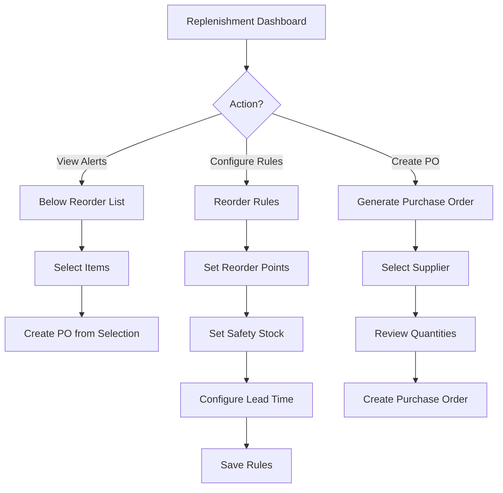

# Task: Create Replenishment & Reorder UI

**Task ID:** V1_MVP/08_Frontend/8.10_Inventory_UI/task_08.10.15_create_replenishment_ui
**Version:** V1_MVP
**Phase:** 08_Frontend
**Module:** 8.10_Inventory_UI
**Priority:** Medium
**Status:** Todo
**Assignee:** Unassigned
**Created Date:** 2026-01-23
**Last Updated:** 2026-01-23

## Detailed Description:
Create replenishment and reorder management interface for automated stock replenishment based on reorder points, safety stock levels, and demand forecasting.

## UI/UX Specifications:

### Replenishment Dashboard:
```
+--------------------------------------------------+
|  Replenishment                                   |
+--------------------------------------------------+
|  Alerts:                                         |
|  [🔴 12 Below Reorder] [🟡 8 Low Safety Stock]    |
+--------------------------------------------------+
|  Suggested Reorders:                             |
|  | Product   | Current | Reorder | Suggest | Act||
|  | Product A | 15      | 50      | 100     | [+]||
|  | Product B | 8       | 25      | 50      | [+]||
+--------------------------------------------------+
|  [Create PO from Selected] [Auto-Generate POs]   |
+--------------------------------------------------+
```

### Reorder Rules Configuration:
```
+--------------------------------------------------+
|  Reorder Rules                [+ Add Rule]       |
+--------------------------------------------------+
|  Product: [Product A               ]             |
|  Warehouse: [Main Warehouse ▼]                   |
+--------------------------------------------------+
|  Stock Levels:                                   |
|  Minimum Stock: [10     ]                        |
|  Reorder Point: [50     ]                        |
|  Maximum Stock: [200    ]                        |
|  Safety Stock:  [20     ]                        |
+--------------------------------------------------+
|  Reorder Settings:                               |
|  Reorder Quantity: [100    ] (EOQ: 95 suggested) |
|  Lead Time: [7    ] days                         |
|  Preferred Supplier: [Supplier A ▼]              |
+--------------------------------------------------+
|  [Cancel]                        [Save Rule]     |
+--------------------------------------------------+
```

## Interaction Flow:



## Specific Sub-tasks:
- [ ] 1. Create replenishment dashboard at `/inventory/replenishment`
- [ ] 2. Implement below-reorder-point alerts
- [ ] 3. Build reorder suggestion engine display
- [ ] 4. Create reorder rules configuration form
- [ ] 5. Implement EOQ (Economic Order Quantity) calculation
- [ ] 6. Build safety stock level management
- [ ] 7. Create purchase order generation from suggestions
- [ ] 8. Implement supplier selection for reorders
- [ ] 9. Add lead time tracking and alerts
- [ ] 10. Create replenishment history and analytics

## Acceptance Criteria:
- [ ] Below-reorder items highlighted correctly
- [ ] Reorder suggestions calculated accurately
- [ ] Rules can be configured per product/warehouse
- [ ] EOQ suggestions displayed
- [ ] POs can be created from suggestions
- [ ] Lead time factored into reorder timing
- [ ] Safety stock alerts work correctly
- [ ] Bulk reorder creation supported

## Non-Functional Requirements:
- **Automation**: Scheduled reorder checks
- **Optimization**: EOQ calculations
- **Integration**: PO creation workflow

## Dependencies:
- V1_MVP/08_Frontend/8.10_Inventory_UI/task_08.10.01_create_inventory_dashboard.md
- V1_MVP/04_Inventory_Service/4.11_Replenishment/task_04.11.01_implement_replenishment.md

## Related Documents:
- `frontend/src/routes/(protected)/inventory/replenishment/+page.svelte`
- `frontend/src/lib/components/inventory/ReorderRuleForm.svelte`
- `frontend/src/lib/components/inventory/ReplenishmentAlert.svelte`

## API Endpoints Used:
- `GET /api/v1/inventory/replenishment` - Get replenishment status
- `GET /api/v1/inventory/replenishment/suggestions` - Get suggestions
- `GET /api/v1/inventory/reorder-rules` - List rules
- `POST /api/v1/inventory/reorder-rules` - Create rule
- `PUT /api/v1/inventory/reorder-rules/{id}` - Update rule
- `POST /api/v1/inventory/replenishment/create-po` - Create PO

## Notes / Discussion:
---
* Consider demand forecasting integration
* Seasonal adjustment for reorder points
* Multi-supplier sourcing optimization

## AI Agent Log:
---
