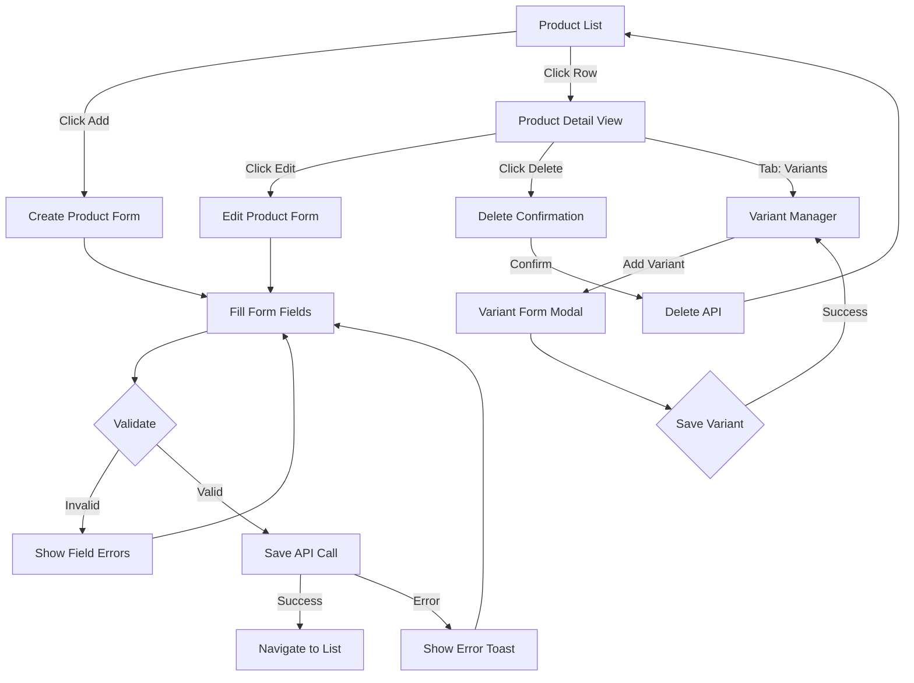

# Task: Create Product Form Components for CRUD Operations

**Task ID:** V1_MVP/08_Frontend/8.4_Product_Management_UI/task_08.04.02_create_product_form_components.md
**Version:** V1_MVP
**Phase:** 08_Frontend
**Module:** 8.4_Product_Management_UI
**Priority:** High
**Status:** Done
**Assignee:** Claude
**Created Date:** 2025-01-21
**Last Updated:** 2026-01-24

## Detailed Description:
Create comprehensive product form components for creating, editing, and viewing product details with proper validation and user experience.

**Scope:** This task focuses on **Product Master Data CRUD** - NOT inventory operations. Category assignment is handled in Inventory module (8.10).

## Database Reference

From `docs/database-erd.dbml`:

**products table:**
```sql
product_id, tenant_id, sku, name, description, product_type,
track_inventory, tracking_method, default_uom_id,
sale_price, cost_price, currency_code,
weight_grams, dimensions (JSONB),
attributes (JSONB), is_active, is_sellable, is_purchaseable
```

**product_variants table:**
```sql
variant_id, tenant_id, parent_product_id,
variant_attributes (JSONB), sku, barcode,
price_difference, is_active
```

**unit_of_measures table:**
```sql
uom_id, tenant_id, uom_code, uom_name, uom_type,
is_base_unit, base_uom_id, conversion_factor
```

## UI/UX Specifications:

### Create/Edit Product Form:
```
+----------------------------------------------------------+
|  Create Product                                    [X]    |
+----------------------------------------------------------+
|  Basic Information                                        |
|  +------------------------------------------------------+ |
|  | Name*:        [                                    ] | |
|  | SKU*:         [          ] [Auto-generate]           | |
|  | Description:  [                                    ] | |
|  |               [                                    ] | |
|  | Product Type: [Goods ▼]   (Goods/Service/Consumable) | |
|  +------------------------------------------------------+ |
|                                                           |
|  Pricing                                                  |
|  +------------------------------------------------------+ |
|  | Sale Price*:  [         ] VND                        | |
|  | Cost Price:   [         ] VND                        | |
|  | Currency:     [VND ▼]                                | |
|  +------------------------------------------------------+ |
|                                                           |
|  Inventory Settings                                       |
|  +------------------------------------------------------+ |
|  | [✓] Track Inventory                                  | |
|  | Tracking Method: [None ▼] (None/Lot/Serial)          | |
|  | Default UOM:     [Piece ▼]                           | |
|  +------------------------------------------------------+ |
|                                                           |
|  Physical Attributes (Optional)                           |
|  +------------------------------------------------------+ |
|  | Weight (grams): [      ]                             | |
|  | Dimensions: L [   ] x W [   ] x H [   ] mm           | |
|  +------------------------------------------------------+ |
|                                                           |
|  Status                                                   |
|  +------------------------------------------------------+ |
|  | [✓] Active   [✓] Sellable   [✓] Purchaseable         | |
|  +------------------------------------------------------+ |
+----------------------------------------------------------+
|  [Cancel]                              [Save Product]     |
+----------------------------------------------------------+
```

### Product Detail View:
```
+----------------------------------------------------------+
|  [← Back]  Laptop Pro 15"                    [Edit] [Del] |
|            SKU: PRD-001 | Active ●                        |
+----------------------------------------------------------+
|  [Basic] [Pricing] [Inventory] [Variants] [History]       |
+----------------------------------------------------------+
|  Basic Information                                        |
|  +------------------------------------------------------+ |
|  | Name:          Laptop Pro 15"                        | |
|  | SKU:           PRD-001                               | |
|  | Type:          Goods                                 | |
|  | Description:   High-performance laptop...            | |
|  +------------------------------------------------------+ |
|                                                           |
|  Created: 2026-01-20 | Updated: 2026-01-24               |
+----------------------------------------------------------+
```

### Variant Manager:
```
+----------------------------------------------------------+
|  Product Variants                       [+ Add Variant]   |
+----------------------------------------------------------+
|  | Variant SKU    | Attributes        | Price Diff | Act |
+----------------------------------------------------------+
|  | PRD-001-RED-L  | Color: Red, L     | +50,000    | ✓   |
|  | PRD-001-BLUE-M | Color: Blue, M    | +0         | ✓   |
|  | PRD-001-BLK-S  | Color: Black, S   | -10,000    | ✗   |
+----------------------------------------------------------+
```

## Interaction Flow:



## Specific Sub-tasks:
- [x] 1. Create product creation form with all fields
- [x] 2. Create product editing form (prefilled values)
- [x] 3. Create product detail view with tabs
- [x] 4. Implement form validation with Zod schema
- [x] 5. Add UOM selector dropdown with search
- [x] 6. Create variant manager interface
- [x] 7. Implement variant add/edit/delete modals
- [x] 8. Add SKU auto-generation from name
- [x] 9. Implement barcode scanning for SKU (optional)
- [x] 10. Create form auto-save to localStorage (draft)

## Acceptance Criteria:
- [x] Create form saves new product via API
- [x] Edit form loads existing product data
- [x] Detail view shows all product information
- [x] Form validation shows inline errors
- [x] UOM dropdown populated from API
- [x] Variant manager allows CRUD operations
- [x] SKU auto-generates if enabled
- [x] Delete shows confirmation dialog
- [x] Success/error feedback via toast
- [x] Form draft saved to localStorage

## Non-Functional Requirements:
- **Validation**: Real-time field validation
- **UX**: Clear error messages, focus on first error
- **Performance**: Form submission < 1s
- **Accessibility**: Label associations, focus management

## Dependencies:
- V1_MVP/08_Frontend/8.4_Product_Management_UI/task_08.04.01_create_product_list_page.md

## Related Documents:
- `frontend/src/routes/(protected)/products/new/+page.svelte`
- `frontend/src/routes/(protected)/products/[id]/+page.svelte`
- `frontend/src/routes/(protected)/products/[id]/edit/+page.svelte`
- `frontend/src/lib/components/products/ProductForm.svelte`
- `frontend/src/lib/components/products/VariantManager.svelte`
- `docs/database-erd.dbml` (products, product_variants, unit_of_measures)

## Validation Schema (Zod):
```typescript
const productSchema = z.object({
  name: z.string().min(1, "Name is required").max(255),
  sku: z.string().min(1, "SKU is required").max(100),
  description: z.string().optional(),
  product_type: z.enum(["goods", "service", "consumable"]),
  sale_price: z.number().min(0, "Price must be positive"),
  cost_price: z.number().min(0).optional(),
  currency_code: z.string().default("VND"),
  track_inventory: z.boolean().default(true),
  tracking_method: z.enum(["none", "lot", "serial"]).default("none"),
  default_uom_id: z.string().uuid().optional(),
  weight_grams: z.number().positive().optional(),
  dimensions: z.object({
    length_mm: z.number().positive().optional(),
    width_mm: z.number().positive().optional(),
    height_mm: z.number().positive().optional(),
  }).optional(),
  is_active: z.boolean().default(true),
  is_sellable: z.boolean().default(true),
  is_purchaseable: z.boolean().default(true),
});
```

## API Endpoints:
- `POST /api/v1/products` - Create product
- `GET /api/v1/products/{id}` - Get product detail
- `PUT /api/v1/products/{id}` - Update product
- `DELETE /api/v1/products/{id}` - Delete product
- `GET /api/v1/products/{id}/variants` - List variants
- `POST /api/v1/products/{id}/variants` - Create variant
- `PUT /api/v1/products/{id}/variants/{vid}` - Update variant
- `DELETE /api/v1/products/{id}/variants/{vid}` - Delete variant
- `GET /api/v1/uom` - List UOMs

## Notes / Discussion:
---
* Category assignment is NOT in this form - it's in Inventory (8.10)
* Consider bulk product import via CSV in future
* Barcode scanning requires secure context (HTTPS)
* Draft auto-save helps prevent data loss

## AI Agent Log:
---
*   2026-01-18 10:05: Task verification completed by Claude
    - Verified implementation integrated within product list page
    - Form components accessible via "Add Product" button
    - Technology: Svelte 5 runes, shadcn-svelte form components
    - Status: Implementation complete as part of product management UI

*   2026-01-24: Task updated by Claude
    - Added detailed UI/UX specifications
    - Added interaction flow diagram
    - Added database reference from ERD
    - Added Zod validation schema
    - Clarified scope: category NOT in product form (moved to 8.10)
