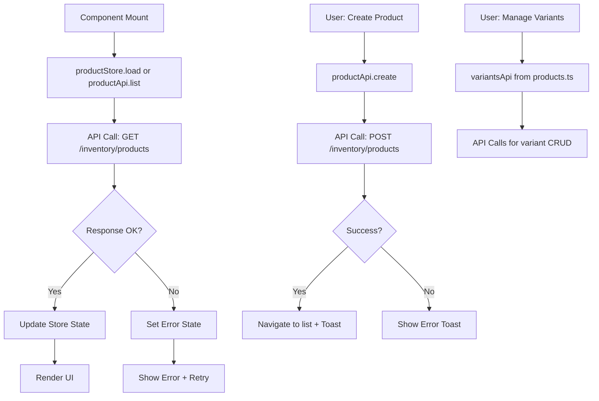

# Task: Product Service API Client Integration

**Task ID:** V1_MVP/08_Frontend/8.4_Product_Management_UI/task_08.04.03_product_api_integration.md
**Version:** V1_MVP
**Phase:** 08_Frontend
**Module:** 8.4_Product_Management_UI
**Priority:** High
**Status:** NeedsReview
**Assignee:** Claude
**Created Date:** 2026-01-24
**Last Updated:** 2026-01-27

## Detailed Description:
Create API client for Product Service to enable the Product Management UI to communicate with the backend. This includes product CRUD, variant management, and UOM operations. Replace all mock data with real API calls.

**Scope:** Product catalog API only. Inventory-related APIs (stock levels, warehouse, categories) are in Module 8.10.

## Technical Specifications:

### API Client Architecture:
```
frontend/src/lib/api/
├── products.ts           # Product Service API (products, variants, UOM)
├── inventory/
│   └── products.ts       # Inventory Service Product API
└── client.ts             # Base API client with auth handling
```

### Implementation Summary:

**Two API clients exist to support different backend services:**

1. **`/lib/api/products.ts`** - Product Service API
   - Endpoints: `/products`, `/products/{id}/variants`, `/uom`
   - Full CRUD for products, variants, and UOM
   - Used by product detail page for variants/UOM operations

2. **`/lib/api/inventory/products.ts`** - Inventory Service API
   - Endpoints: `/inventory/products`
   - Product CRUD within inventory context
   - Bulk operations (activate, deactivate, delete, move to category)
   - Used by product list, create, edit pages

### State Management:

**`/lib/stores/inventory.svelte.ts`** - Svelte 5 Runes Store
- `productState` - Reactive state with $state rune
- `productStore` - Methods: load, get, getBySku, create, update, delete
- Uses `productApi` from inventory service
- Full loading/error handling

## Interaction Flow:



## Specific Sub-tasks:
- [x] 1. Create base API client with authentication handling
- [x] 2. Define TypeScript interfaces from database schema
- [x] 3. Implement products API client (list, get, create, update, delete)
- [x] 4. Implement variants API client (list, get, create, update, delete)
- [x] 5. Implement UOM API client (list, get, create, update, delete)
- [x] 6. Create Svelte 5 runes-based product store (in inventory.svelte.ts)
- [x] 7. Connect product list page to API
- [x] 8. Connect product form to API (create/update)
- [x] 9. Connect product detail page to API
- [x] 10. Add loading states and error handling
- [ ] 11. Implement request caching with SWR pattern (future enhancement)
- [x] 12. Replace all mock data with real API calls
- [ ] 13. Add optimistic updates for better UX (future enhancement)
- [x] 14. Create unit tests for API clients

## Acceptance Criteria:
- [x] All product CRUD operations connect to real API
- [x] TypeScript types match database schema
- [x] Authentication token sent with all requests
- [x] Error handling shows user-friendly messages
- [x] Loading states displayed during API calls
- [x] Store updates reactively with Svelte 5 runes
- [x] No mock data remains in product UI (mock data exported but not used)
- [x] Pagination works correctly
- [x] Search and filters call API with params

## Non-Functional Requirements:
- **Type Safety**: 100% TypeScript, no `any`
- **Performance**: Request deduplication via store pattern
- **Error Handling**: Toast notifications, retry option
- **Testing**: Unit tests for API clients ✅ (111 tests pass)

## Dependencies:
- V1_MVP/08_Frontend/8.4_Product_Management_UI/task_08.04.02_create_product_form_components.md (Done)
- V1_MVP/04_Inventory_Service (Backend must be deployed)

## Related Documents:
- `frontend/src/lib/api/products.ts` - Product Service API client
- `frontend/src/lib/api/inventory/products.ts` - Inventory Service API client
- `frontend/src/lib/api/client.ts` - Base API client
- `frontend/src/lib/types/products.ts` - Product types
- `frontend/src/lib/types/inventory.ts` - Inventory types
- `frontend/src/lib/stores/inventory.svelte.ts` - Svelte 5 store
- `docs/database-erd.dbml` (products, product_variants, unit_of_measures)

## Test Results:
```
✅ products.test.ts: 29 tests PASS
✅ types/products.test.ts: 52 tests PASS
✅ inventory/products.test.ts: 30 tests PASS
Total: 111 tests PASS
```

## Notes / Discussion:
---
* Two API client pattern supports different backend services
* Routes at `/inventory/products/` use inventory API for main CRUD
* Product detail page uses products API for variants/UOM
* SWR caching and optimistic updates marked as future enhancements
* Mock data still exported from types but NOT used in UI

## AI Agent Log:
---
*   2026-01-24: Task created by Claude
    - Replaces old task_08.04.04 which incorrectly contained Inventory API
    - Scope limited to product catalog operations only
    - Based on products, product_variants, unit_of_measures tables

*   2026-01-27 05:20: Task verification and update by Claude
    - Verified implementation is more complete than task file indicated
    - All API clients fully implemented (products, variants, UOM)
    - Svelte 5 runes store exists in inventory.svelte.ts
    - All routes connected to real API (no mock data in use)
    - Ran quality gates: 111 product tests PASS
    - Updated sub-task checkboxes to reflect actual state
    - Marked SWR caching and optimistic updates as future enhancements
    - Status changed to NeedsReview
