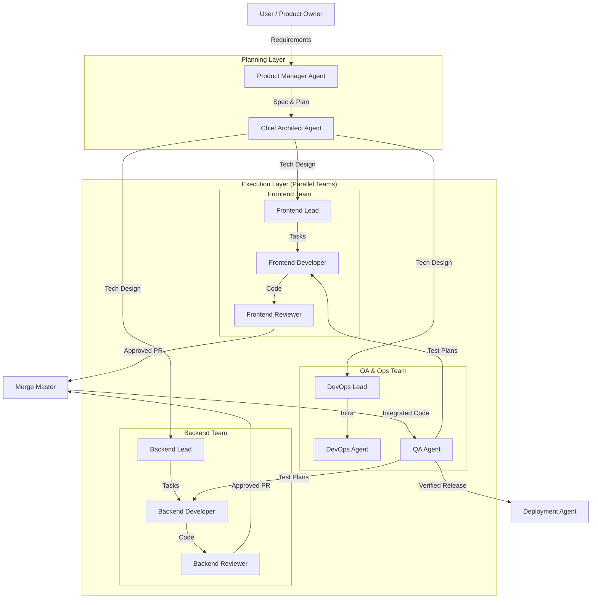

# AI Agent System + Folder Tasks Workflow (Combined Guide)

This document combines:

1. **AI Agent & Folder Tasks Integration Guide** — how agents must coordinate work using task files in this repo.
2. **AI Agent System for Complete Software Development** — a recommended multi-agent organizational model for shipping software end-to-end.

**Repo note:** This repository uses `PROJECT_TRACKING/TASKS_OVERVIEW.md` as the overview file.

**Self-contained note:** This guide defines AI agent roles inline.

---

## 0. Non-Negotiables (Multi-Agent Safety)

This repository runs **multiple agents in parallel**. Coordination happens **only** through task files.

### 0.1 Single Source of Truth

- Task files (`PROJECT_TRACKING/**/task_*.md`) are the only source of truth for work state.
- Agents MUST update the task file **before** any code work to avoid race conditions.

### 0.2 Strict Status Adherence (ONLY these 5 statuses are valid)

| Status | Meaning |
|---|---|
| `Todo` | Ready to be claimed |
| `InProgress_By_[AgentName]` | Claimed and actively being worked |
| `Blocked_By_[Reason]` | Cannot proceed; must include reason |
| `NeedsReview` | Work complete; awaiting review |
| `Done` | Reviewed and approved |

❌ Invalid examples (never use): `InProgress`, `InProgress_By` (missing agent name), `Completed`, `Pending`, `Waiting`, `Done_By_AI`, etc.

### 0.3 Quality Gates Before `NeedsReview`

If a task involves code changes, the agent MUST run and pass:

- Typecheck
- Lint
- Tests (unit/integration/E2E as applicable)

Frontend baseline: prefer `bun run ...` when available.

### 0.4 Ownership & No-Interference Rule

- If `Assignee` is not you, do not claim unless explicitly reassigned.
- If `Status` is `InProgress_By_Another_Agent`, do not edit the task or code for it.

---

## 1. Two Systems, One Workflow

### 1.0 AI Agent Roles (Defined Inline)

This section defines the standard roles used throughout this repo so the system works even if `AI_agents.md` is removed.

#### 1.0.1 Planning Layer

- **Product Manager Agent (PM)**
  - **Goal:** Turn a high-level request into a scoped, testable plan.
  - **Outputs:**
    - Phase definition in `PROJECT_TRACKING/TASKS_OVERVIEW.md`
    - Feature scope + acceptance criteria in `docs/` (when needed)
    - Clear non-goals and constraints
  - **Responsibilities:**
    - Clarify what is in/out of scope
    - Ensure success criteria are measurable
    - Ensure work can be decomposed into independent tasks

- **Chief Architect Agent**
  - **Goal:** Convert the plan into an implementable technical design and task structure.
  - **Outputs:**
    - Directory/task scaffolding under `PROJECT_TRACKING/**`
    - Architecture decisions in `ARCHITECTURE.md` / `STRUCTURE.md` / feature docs in `docs/`
    - Dependencies between tasks
  - **Responsibilities:**
    - Choose architecture patterns consistent with repo rules
    - Ensure tasks are sized and parallelizable
    - Define integration points (APIs, events, DB schema boundaries)

#### 1.0.2 Execution Layer

- **Frontend Lead**
  - **Goal:** Own frontend technical direction and task breakdown for UI work.
  - **Responsibilities:**
    - Define UI architecture, routing strategy, and client/server boundaries
    - Ensure accessibility and security requirements are met
    - Review/coordinate frontend developer work

- **Backend Lead**
  - **Goal:** Own backend technical direction and task breakdown for service/domain work.
  - **Responsibilities:**
    - Enforce service architecture (e.g., clean boundaries, multi-tenancy rules)
    - Ensure data integrity, error handling, and performance constraints
    - Review/coordinate backend developer work

- **DevOps Lead**
  - **Goal:** Own delivery pipeline, infrastructure requirements, and reliability constraints.
  - **Responsibilities:**
    - Define CI expectations (typecheck/lint/test), deployment strategy
    - Manage environments and operational guardrails
    - Review infrastructure-as-code and deployment tasks

- **Developer Agent (Frontend Developer / Backend Developer)**
  - **Goal:** Implement tasks exactly as specified, with tests and validation.
  - **Inputs:** A claimed `task_*.md` file (must be `InProgress_By_[AgentName]`).
  - **Outputs:**
    - Code changes + tests
    - Task file updates: checkboxes, logs, and status transition to `NeedsReview`
  - **Responsibilities:**
    - Follow ownership rules (no interference)
    - Keep commits small and tied to task IDs
    - Run quality gates before `NeedsReview`

- **Reviewer Agent (Frontend Reviewer / Backend Reviewer)**
  - **Goal:** Provide orthogonal checking to prevent defects and regressions.
  - **Outputs:**
    - Review comments (in PR or directly in task notes, depending on workflow)
    - Task status change to `Done` (or back to `InProgress_By_[AgentName]` with explicit ownership)
  - **Responsibilities:**
    - Verify acceptance criteria and quality gates evidence
    - Enforce repo conventions and security best practices
    - Reject unsafe/ambiguous changes

#### 1.0.3 Verification & Ops Layer

- **QA Agent**
  - **Goal:** Validate behavior end-to-end and prevent regressions after merge.
  - **Outputs:**
    - Test plans, test results, and defect reproduction steps in task logs
    - New tasks for regressions and follow-ups
  - **Responsibilities:**
    - Run integration/E2E verification where relevant
    - Ensure critical paths are tested (auth, permissions, data integrity)

- **Merge Master (Optional Role)**
  - **Goal:** Maintain integration stability of the main branch.
  - **Responsibilities:**
    - Ensure merges happen only when reviews/gates pass
    - Coordinate conflict resolution policy
    - Keep release notes / integration tracking consistent

- **Deployment Agent (Optional Role)**
  - **Goal:** Execute production/staging deployments safely.
  - **Responsibilities:**
    - Follow deployment runbooks
    - Ensure monitoring/rollback procedures exist
    - Record deployment outcomes in task logs

**Role naming convention:** When updating task files, use `InProgress_By_[AgentName]` with a stable agent name (e.g., `Backend_Agent_01`, `Frontend_Dev_Alpha`).

### 1.1 The "Who / What / How"

- **The "Who"**: the roles are defined in this document (see **1.0 AI Agent Roles**).
- **The "What"**: the folder-tasks system defines the work units (Task Files, Directory Structure).
- **The "How"**: agents communicate and coordinate *exclusively* through the state of these task files.

### 1.2 Why Combine Them?

The AI Agent System describes a high-level organizational structure (planning → execution → verification → deployment).  
The folder-tasks workflow is the operational mechanism that enforces:

- concurrency safety,
- clear ownership,
- auditable progress,
- and consistent quality gates.

---

## 2. Recommended Multi-Agent Principles (AI Agent System)

To build a robust system, move beyond single-model reliance and adopt multi-agent principles:

- **Specialization**: use specialized agents (e.g., "Frontend Expert", "Security Auditor") with distinct prompts, tools, and context.
- **Validation (Orthogonal Checking)**: implement critique-revision loops where one agent generates and another validates (e.g., "Test Writer" validates "Feature Developer").
- **Parallelism**: decompose large tasks into subtasks that run simultaneously (e.g., writing tests and documentation while code is being written).

---

## 3. Recommended Architecture: Hierarchical Hybrid

A **Hierarchical Hybrid** architecture is best suited for end-to-end software development. It mimics a human engineering organization, balancing high-level strategic direction with low-level tactical execution.

### 3.1 Architecture Diagram



---

## 4. Role-to-Task Mapping (Folder Tasks Responsibility)

| Agent Role | Folder-Tasks Responsibility | Key Actions |
| :--- | :--- | :--- |
| **Product Manager (PM)** | **Task Creator** (Phase 0/1) | Creates `PROJECT_TRACKING/TASKS_OVERVIEW.md`, defines Phases, writes high-level specs in `docs/`. |
| **Chief Architect** | **Structure Owner** | Creates directory structure (`V1/Phase_01/...`), creates `task_XX.md` files, defines Dependencies. |
| **Developer (Front/Back)** | **Task Executor** | Reads assigned `task_XX.md`, changes status to `InProgress_By_[AgentName]`, writes code, marks checkboxes `[x]`. |
| **Reviewer** | **Task Reviewer** | Monitors `NeedsReview` status, comments in "Notes" section, changes status to `Done` or back to `InProgress_By_[AgentName]` (with clear assignee) if changes are needed. |
| **QA Agent** | **Verifier** | Picks up `Done` tasks for integration testing, logs results in "AI Agent Log". |

---

## 5. Integrated Workflow: From Idea to Production (Using Folder Tasks)

This section merges the high-level AI system workflow with the repo’s task-file execution rules.

### 5.1 Step 1: Plan (PM & Architect)

1. **PM** refines requirements and updates `PROJECT_TRACKING/TASKS_OVERVIEW.md` with a new Phase.
2. **Architect** designs the technical approach and creates / updates architecture docs (e.g., `ARCHITECTURE.md`, `STRUCTURE.md`, and relevant feature docs in `docs/`).
3. **Architect** creates a feature folder (example: `PROJECT_TRACKING/V1_MVP/02_New_Feature/`).
4. **Architect** generates task files, e.g.:
   - `task_02.01_feature_setup.md`
   - `task_02.02_feature_impl.md`
5. Crucial:
   - Architect sets `Assignee: Frontend_Dev_Alpha` (or leaves it open).
   - Architect sets `Dependencies` in later tasks pointing to earlier tasks.

### 5.2 Step 2: Design (Architect → Leads)

- Architect/Leads turn the plan into concrete tasks with:
  - clear acceptance criteria,
  - explicit dependencies,
  - a definition of “done” tied to quality gates (typecheck/lint/tests).

### 5.3 Step 3: Build (Developers — Iterative Loop)

Developers must follow this checklist **in this order**:

1. Scan for tasks where:
   - `Status: Todo`
   - Dependencies are **all `Done`**
   - `Assignee` is empty OR `Assignee` is you
2. Claim the task by **atomic update in the task file first**:
   - Set `Status: InProgress_By_[AgentName]`
   - Set `Assignee: [AgentName]`
   - Update `Last Updated` to today
   - Add initial entry to `AI Agent Log` stating dependencies were checked
3. Work the task:
   - Read `Detailed Description`
   - Execute sub-tasks in order
   - Update checkboxes `[x]` immediately after each sub-task completes
   - Keep commits small and tied to the task ID
4. Mandatory quality gates (code tasks) before `NeedsReview`:
   - Run typecheck
   - Run lint
   - Run tests (at least unit tests; add E2E for critical flows when applicable)
5. Only after gates pass:
   - Set `Status: NeedsReview`
   - Ensure the task file documents what changed and how it was validated

### 5.4 Step 4: Review (Reviewer Agents)

1. Reviewer detects tasks with `Status: NeedsReview`.
2. Reviewer checks:
   - Task completion criteria
   - Code diff / PR
   - Evidence that quality gates were executed (or CI is green once enabled)
3. Reviewer updates file:
   - Pass → set `Status: Done`
   - Changes requested → set `Status: InProgress_By_[AgentName]` (explicit ownership) and add actionable feedback in `Notes`

### 5.5 Step 5: Verify (QA Agent)

- QA picks up `Done` tasks for integration testing.
- QA logs results in `AI Agent Log` and raises regressions as new tasks (or reopens as directed by workflow policy).

### 5.6 Step 6: Deploy (DevOps / Deployment Agent)

- Deployment is executed only after QA verification.
- Deployment tasks should follow the same task-file rules (ownership, quality gates, explicit logging).

---

## 6. Agent "Context Protocol" (Wake-Up Routine)

When an agent "wakes up", it should run this routine:

1. **Identify Self**: "I am a Backend Developer Agent."
2. **Locate Context**: Read `PROJECT_TRACKING/TASKS_OVERVIEW.md` to see the big picture.
3. **Find Work**:
   - Run `find` or `ls` in active Phase directories.
   - Grep for `Status: Todo` or `Status: InProgress_By_Me`.
4. **Update State**: NEVER work without updating the task file first. This prevents race conditions with other agents.

---

## 7. Task File Format Example (Architect)

The Architect Agent should generate files with this exact header to ensure parsability:

```markdown
# Task: Implement Login API

**Task ID:** `V1_MVP/02_Auth/task_02.01_login.md`
**Status:** Todo
**Assignee:** Backend_Agent_01
**Dependencies:**
- `V1_MVP/01_Database/task_01.01_users_table.md`
```

---

## 8. Handling Blockers

If an agent is stuck:

1. Do NOT just stop.
2. Update Task:
   - Set `Status: Blocked_By_[Reason]` (be specific, e.g. `Blocked_By_Merge_Conflict_in_src/routes/(app)/...`).
3. Log: Add an entry to `AI Agent Log` including:
   - what you attempted
   - why it failed/blocked (include key error text)
   - what is needed to unblock (decision, access, dependency, clarification)
4. Notify: Notify the orchestrator/user immediately and stop further work on this task.

### 8.1 Merge Conflicts

- If a `git pull` causes conflicts:
  - Attempt simple resolution only if it is clearly safe.
  - If not clearly resolvable:
    - set `Status: Blocked_By_Merge_Conflict_in_[FileName]`
    - log details
    - notify

### 8.2 Dependency Not Done

- If any dependency is not `Done`:
  - set `Status: Blocked_By_Dependency_[TaskID]`
  - log which dependency blocks progress
  - do not start implementation work

---

## 9. CI Alignment (GitHub Actions)

This project uses CI to enforce quality gates.

Minimum CI expectations for code tasks:

- install deps (prefer `bun install` for frontend)
- typecheck
- lint
- test

Agents should assume CI will be strict and must not set tasks to `NeedsReview` unless local checks pass.

---

## 10. Technology Stack & Implementation Notes (AI System)

### 10.1 Frameworks (Orchestration)

- **LangGraph**: recommended for stateful, complex workflows (e.g., review loops).
- **Agno/Mastra**: alternatives if performance or TypeScript-native environment is preferred.

### 10.2 Context Management (MCP)

Use Model Context Protocol (MCP) to give agents controlled access to:

- codebase (read/write files),
- docs/knowledge base,
- deterministic tools (git, linters, test runners, Docker, cloud providers).

---

## 11. Getting Started Checklist (AI System Rollout)

1. **Foundation**: build a simple "Coder + Reviewer" loop.
2. **Infrastructure**: add a "Planner" to break down tasks.
3. **Scale**: introduce specialized roles (QA, Security) and parallel execution.
4. **Observability**: monitor agent costs and failure rates to optimize.

---

## 12. Key Success Factors

- **Human-in-the-loop**: critical for Plan and Review phases. Agents should propose, humans should decide.
- **Defined interfaces**: clear contracts (specs, APIs) between agents to prevent context confusion.
- **Deterministic tools**: prefer linters/formatters/test runners rather than subjective “fix style” prompts.

---
