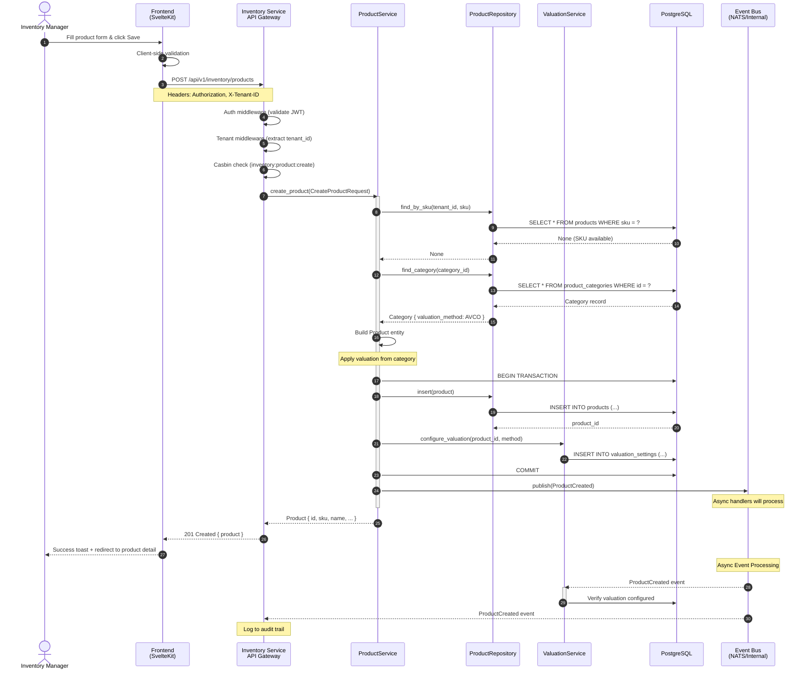
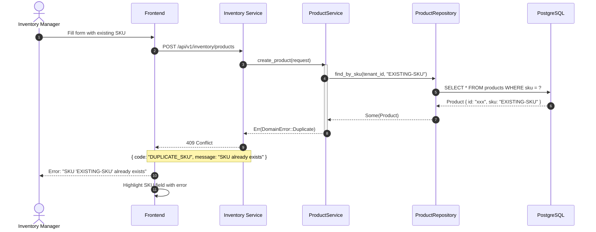
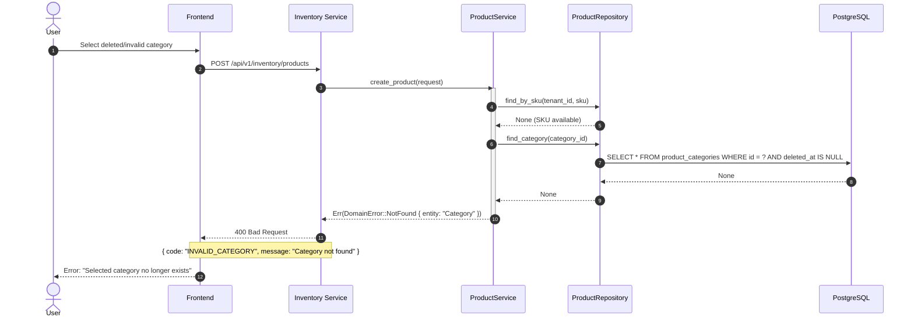
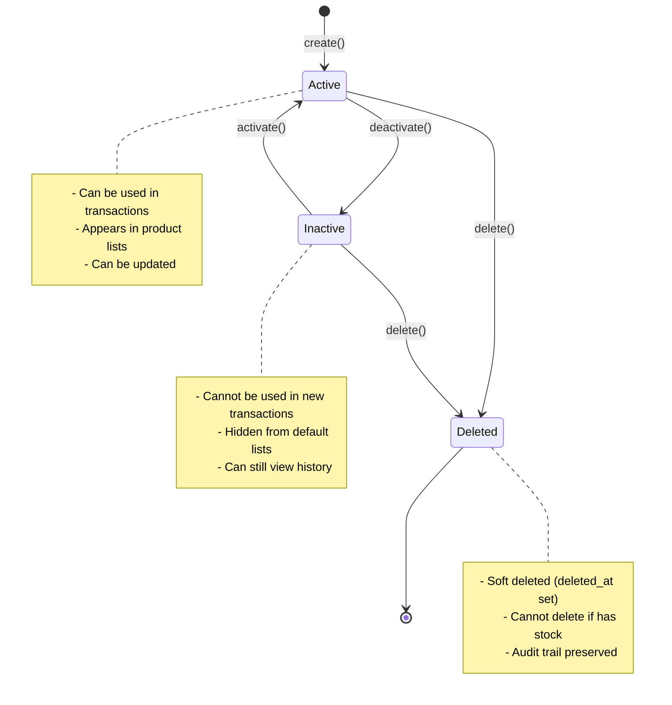

# Business Flow: Product Creation

> **Document Version:** 1.0  
> **Created:** 2026-01-27  
> **Status:** Draft  
> **Primary Module:** Inventory Service (Product Master)  
> **Related Modules:** Stock Levels, Valuation, Pricing (future)

## Table of Contents

1. [Overview](#1-overview)
2. [Event Storming](#2-event-storming)
3. [Sequence Diagram](#3-sequence-diagram)
4. [State Machine](#4-state-machine)
5. [Domain Events](#5-domain-events)
6. [Business Rules](#6-business-rules)
7. [Error Scenarios](#7-error-scenarios)
8. [Implementation Checklist](#8-implementation-checklist)

---

## 1. Overview

### 1.1 Purpose

Product Creation là flow cơ bản nhất trong hệ thống ERP Inventory. Khi tạo product mới, hệ thống cần:
- Validate thông tin sản phẩm (SKU unique, category valid, etc.)
- Thiết lập phương pháp định giá tồn kho (FIFO, AVCO, Standard)
- (Optional) Khởi tạo stock levels tại các warehouse
- (Future) Liên kết với Price Lists

### 1.2 Actors

| Actor | Role | Actions |
|-------|------|---------|
| Inventory Manager | Quản lý sản phẩm | Tạo, cập nhật, xóa sản phẩm |
| System | Automatic reactions | Khởi tạo valuation, stock levels |
| Warehouse Staff | Thao tác kho | Xem sản phẩm, không tạo mới |

### 1.3 Trigger

- User clicks "Create Product" button trên UI
- Bulk import từ file CSV/Excel
- API call từ external system

### 1.4 Preconditions

- User đã đăng nhập và có quyền `inventory:product:create`
- Tenant đã được setup với ít nhất 1 warehouse
- Category tồn tại (nếu có chọn)

### 1.5 Postconditions (Success)

- Product record được tạo trong database
- Valuation method được set (inherit từ category hoặc tenant default)
- `ProductCreated` event được publish
- UI hiển thị product mới tạo

---

## 2. Event Storming

### 2.1 Event Flow (Big Picture)

```
┌─────────────────────────────────────────────────────────────────────────────┐
│                    PRODUCT CREATION - EVENT STORMING                        │
├─────────────────────────────────────────────────────────────────────────────┤
│                                                                             │
│  Timeline →                                                                 │
│                                                                             │
│  ┌─────────┐     ┌─────────────────┐     ┌─────────────────────┐           │
│  │   👤    │     │  🟦 Command     │     │  🟧 Domain Event    │           │
│  │ Inv.Mgr │────▶│                 │────▶│                     │           │
│  └─────────┘     │ CreateProduct   │     │ ProductCreated      │           │
│                  │                 │     │                     │           │
│                  │ - sku           │     │ - productId         │           │
│                  │ - name          │     │ - sku               │           │
│                  │ - categoryId    │     │ - categoryId        │           │
│                  │ - costPrice     │     │ - valuationMethod   │           │
│                  │ - salePrice     │     │ - timestamp         │           │
│                  └─────────────────┘     └──────────┬──────────┘           │
│                                                     │                       │
│                    ┌────────────────────────────────┼───────────────┐       │
│                    │                                │               │       │
│                    ▼                                ▼               ▼       │
│  ┌─────────────────────────┐   ┌─────────────────────────┐   ┌───────────┐ │
│  │  🟪 Policy              │   │  🟪 Policy              │   │ 🟪 Policy │ │
│  │  SetValuationMethod     │   │  NotifyStockService     │   │ AuditLog  │ │
│  │                         │   │                         │   │           │ │
│  │  When ProductCreated,   │   │  When ProductCreated,   │   │ Log event │ │
│  │  inherit valuation from │   │  prepare for stock      │   │ to audit  │ │
│  │  category or use tenant │   │  initialization         │   │ trail     │ │
│  │  default                │   │                         │   │           │ │
│  └───────────┬─────────────┘   └───────────┬─────────────┘   └───────────┘ │
│              │                              │                               │
│              ▼                              ▼                               │
│  ┌─────────────────────────┐   ┌─────────────────────────┐                 │
│  │  🟧 ValuationConfigured │   │  🟧 StockReadyForInit   │                 │
│  │                         │   │  (Optional - on first   │                 │
│  │  - productId            │   │   GRN, not on create)   │                 │
│  │  - method: AVCO         │   │                         │                 │
│  └─────────────────────────┘   └─────────────────────────┘                 │
│                                                                             │
│  🔴 Hotspot: Có tạo stock_level record ngay khi tạo product không?         │
│     Decision: KHÔNG - stock_level được tạo khi có GRN đầu tiên             │
│                                                                             │
└─────────────────────────────────────────────────────────────────────────────┘
```

### 2.2 Detailed Event Map

```
┌─────────────────────────────────────────────────────────────────────────────┐
│  PHASE 1: Product Master Creation                                           │
├─────────────────────────────────────────────────────────────────────────────┤
│                                                                             │
│  👤 Inventory Manager                                                       │
│       │                                                                     │
│       ▼                                                                     │
│  ┌─────────────────┐                                                       │
│  │  🟦 Command     │  ┌───────────────────────────────┐                    │
│  │  CreateProduct  │─▶│ 🟨 Product Aggregate          │                    │
│  │                 │  │                               │                    │
│  │  Payload:       │  │  Responsibilities:            │                    │
│  │  - sku          │  │  - Validate SKU uniqueness    │                    │
│  │  - name         │  │  - Validate category exists   │                    │
│  │  - description  │  │  - Set default values         │                    │
│  │  - categoryId   │  │  - Generate product_id        │                    │
│  │  - costPrice    │  │                               │                    │
│  │  - salePrice    │  └──────────────┬────────────────┘                    │
│  │  - uom          │                 │                                     │
│  └─────────────────┘                 │                                     │
│                                      ▼                                      │
│  ┌─────────────────────────────────────────────────────────────────────┐   │
│  │  🟩 Read Model: Data needed for validation                          │   │
│  │  - Existing SKUs for this tenant (check uniqueness)                 │   │
│  │  - Category details (for valuation method inheritance)              │   │
│  │  - Tenant settings (default valuation method)                       │   │
│  │  - Unit of Measure list (validate UOM code)                         │   │
│  └─────────────────────────────────────────────────────────────────────┘   │
│                                      │                                      │
│                                      ▼                                      │
│                           ┌─────────────────────┐                          │
│                           │  🟧 ProductCreated  │                          │
│                           │                     │                          │
│                           │  - productId        │                          │
│                           │  - tenantId         │                          │
│                           │  - sku              │                          │
│                           │  - name             │                          │
│                           │  - categoryId       │                          │
│                           │  - costPrice        │                          │
│                           │  - salePrice        │                          │
│                           │  - createdBy        │                          │
│                           │  - createdAt        │                          │
│                           └──────────┬──────────┘                          │
│                                      │                                      │
└──────────────────────────────────────┼──────────────────────────────────────┘
                                       │
┌──────────────────────────────────────┼──────────────────────────────────────┐
│  PHASE 2: Post-Creation Reactions    │                                      │
├──────────────────────────────────────┼──────────────────────────────────────┤
│                                      │                                      │
│  ┌───────────────────────────────────┼───────────────────────────────────┐  │
│  │                                   │                                   │  │
│  ▼                                   ▼                                   ▼  │
│  ┌────────────────────┐  ┌────────────────────┐  ┌────────────────────┐    │
│  │ 🟪 Policy:         │  │ 🟪 Policy:         │  │ 🟪 Policy:         │    │
│  │ ConfigureValuation │  │ IndexForSearch     │  │ CreateAuditLog     │    │
│  │                    │  │                    │  │                    │    │
│  │ Module: Valuation  │  │ Module: Search     │  │ Module: Audit      │    │
│  │                    │  │                    │  │                    │    │
│  │ Logic:             │  │ Logic:             │  │ Logic:             │    │
│  │ 1. Check category  │  │ 1. Index product   │  │ 1. Create audit    │    │
│  │    valuation_method│  │    in search       │  │    entry           │    │
│  │ 2. If null, use    │  │ 2. Update          │  │ 2. Store who,when  │    │
│  │    tenant default  │  │    autocomplete    │  │    what changed    │    │
│  │ 3. Create valuation│  │                    │  │                    │    │
│  │    setting record  │  │                    │  │                    │    │
│  └─────────┬──────────┘  └─────────┬──────────┘  └─────────┬──────────┘    │
│            │                       │                       │                │
│            ▼                       ▼                       ▼                │
│  ┌────────────────────┐  ┌────────────────────┐  ┌────────────────────┐    │
│  │ 🟧 Valuation       │  │ 🟧 ProductIndexed  │  │ 🟧 AuditLogCreated │    │
│  │    Configured      │  │                    │  │                    │    │
│  │                    │  │ - productId        │  │ - entityType       │    │
│  │ - productId        │  │ - indexedAt        │  │ - entityId         │    │
│  │ - method: AVCO     │  │                    │  │ - action: CREATE   │    │
│  │ - inheritedFrom    │  │                    │  │ - userId           │    │
│  └────────────────────┘  └────────────────────┘  └────────────────────┘    │
│                                                                             │
└─────────────────────────────────────────────────────────────────────────────┘
```

### 2.3 Cross-Module Event Flow

| Source Module | Event | Target Module | Reaction (Policy) |
|---------------|-------|---------------|-------------------|
| Product Master | `ProductCreated` | Valuation | Configure valuation method (inherit from category or tenant default) |
| Product Master | `ProductCreated` | Audit | Create audit log entry |
| Product Master | `ProductCreated` | Search (future) | Index product for full-text search |
| Product Master | `ProductUpdated` | Valuation | Update valuation if cost_price changed |
| Product Master | `ProductDeleted` | Stock Levels | Verify no stock exists, then soft delete |

### 2.4 Design Decisions (Hotspots Resolved)

| Hotspot | Question | Decision | Rationale |
|---------|----------|----------|-----------|
| 🔴 Stock Init | Tạo stock_level ngay khi tạo product? | **NO** | Stock level được tạo khi GRN đầu tiên. Tránh tạo records rỗng cho products chưa bao giờ nhập kho |
| 🔴 Valuation | Set valuation method ở đâu? | **Product level** | Inherit từ category, có thể override per product |
| 🔴 SKU Format | SKU có format cố định không? | **Tenant configurable** | Mỗi tenant có thể có convention riêng |

---

## 3. Sequence Diagram

### 3.1 Happy Path - Create Single Product



### 3.2 Error Path - Duplicate SKU



### 3.3 Error Path - Invalid Category



---

## 4. State Machine

> Products have a simple lifecycle focused on active/inactive status.

### 4.1 State Diagram



### 4.2 State Transition Table

| Current State | Action | Next State | Side Effects | Conditions |
|---------------|--------|------------|--------------|------------|
| (new) | `create()` | Active | Emit ProductCreated, configure valuation | Valid data |
| Active | `deactivate()` | Inactive | Emit ProductDeactivated | - |
| Inactive | `activate()` | Active | Emit ProductActivated | - |
| Active | `delete()` | Deleted | Emit ProductDeleted, soft delete | No stock exists |
| Inactive | `delete()` | Deleted | Emit ProductDeleted, soft delete | No stock exists |

### 4.3 Delete Constraints

```
┌─────────────────────────────────────────────────────────────────────────────┐
│                        PRODUCT DELETION RULES                               │
├─────────────────────────────────────────────────────────────────────────────┤
│                                                                             │
│  CAN DELETE if:                                                             │
│  ✅ Product has no stock_levels with quantity > 0                           │
│  ✅ Product has no pending transactions (GRN Draft, SO Draft, etc.)         │
│                                                                             │
│  CANNOT DELETE if:                                                          │
│  ❌ Product has stock in any warehouse                                      │
│  ❌ Product is in pending purchase orders                                   │
│  ❌ Product is in pending sales orders                                      │
│                                                                             │
│  ALTERNATIVE: Deactivate instead of delete                                  │
│                                                                             │
└─────────────────────────────────────────────────────────────────────────────┘
```

---

## 5. Domain Events

### 5.1 Event Definitions

```typescript
// inventory.product.created
interface ProductCreated {
  // Metadata
  eventId: string;
  eventType: 'inventory.product.created';
  occurredAt: string; // ISO 8601
  correlationId: string;
  
  // Payload
  productId: string;
  tenantId: string;
  sku: string;
  name: string;
  description: string | null;
  categoryId: string | null;
  categoryName: string | null;
  costPrice: number; // in cents
  salePrice: number; // in cents
  currencyCode: string;
  unitOfMeasure: string;
  valuationMethod: 'fifo' | 'avco' | 'standard';
  isActive: boolean;
  createdBy: string; // userId
  createdAt: string;
}

// inventory.product.updated
interface ProductUpdated {
  eventId: string;
  eventType: 'inventory.product.updated';
  occurredAt: string;
  correlationId: string;
  
  productId: string;
  tenantId: string;
  changes: {
    field: string;
    oldValue: any;
    newValue: any;
  }[];
  updatedBy: string;
  updatedAt: string;
}

// inventory.product.deleted
interface ProductDeleted {
  eventId: string;
  eventType: 'inventory.product.deleted';
  occurredAt: string;
  correlationId: string;
  
  productId: string;
  tenantId: string;
  sku: string; // for reference
  deletedBy: string;
  deletedAt: string;
  reason: string | null;
}
```

### 5.2 Event Catalog

| Event Name | Emitted By | Key Payload Fields | Consumers |
|------------|------------|-------------------|-----------|
| `ProductCreated` | ProductService | productId, sku, categoryId, valuationMethod | ValuationService, AuditService, SearchService |
| `ProductUpdated` | ProductService | productId, changes[] | AuditService, SearchService |
| `ProductDeleted` | ProductService | productId, sku, reason | AuditService, SearchService |
| `ProductActivated` | ProductService | productId | SearchService |
| `ProductDeactivated` | ProductService | productId | SearchService, OrderService (validate existing orders) |

### 5.3 Event Subscriptions (Policies)

| Event | Consumer | Policy Name | Action |
|-------|----------|-------------|--------|
| `ProductCreated` | ValuationService | `ConfigureDefaultValuation` | Ensure valuation_settings record exists |
| `ProductCreated` | AuditService | `LogProductCreation` | Create audit trail entry |
| `ProductUpdated` | AuditService | `LogProductUpdate` | Create audit trail with change diff |
| `ProductUpdated` | ValuationService | `HandleCostPriceChange` | Recalculate standard cost if applicable |
| `ProductDeleted` | AuditService | `LogProductDeletion` | Create audit trail entry |

---

## 6. Business Rules

### 6.1 Validation Rules

| Rule ID | Rule Description | When Applied | Error Code | Error Message |
|---------|------------------|--------------|------------|---------------|
| BR-P-001 | SKU must be unique within tenant | Create, Update | `DUPLICATE_SKU` | "SKU '{sku}' already exists" |
| BR-P-002 | SKU format: alphanumeric, dash, underscore only | Create, Update | `INVALID_SKU_FORMAT` | "SKU can only contain letters, numbers, dashes, and underscores" |
| BR-P-003 | SKU max length: 50 characters | Create, Update | `SKU_TOO_LONG` | "SKU cannot exceed 50 characters" |
| BR-P-004 | Name is required, max 255 chars | Create, Update | `INVALID_NAME` | "Product name is required (max 255 characters)" |
| BR-P-005 | Cost price must be >= 0 | Create, Update | `INVALID_COST_PRICE` | "Cost price cannot be negative" |
| BR-P-006 | Sale price must be >= 0 | Create, Update | `INVALID_SALE_PRICE` | "Sale price cannot be negative" |
| BR-P-007 | Category must exist and not be deleted | Create, Update | `INVALID_CATEGORY` | "Selected category does not exist" |
| BR-P-008 | Cannot delete product with stock | Delete | `HAS_STOCK` | "Cannot delete product with existing stock. Deactivate instead." |

### 6.2 Computation Rules

| Rule ID | Description | Formula/Logic |
|---------|-------------|---------------|
| CR-P-001 | Default valuation method | `product.valuation = category.valuation ?? tenant.default_valuation ?? 'avco'` |
| CR-P-002 | Margin calculation | `margin_percent = ((sale_price - cost_price) / sale_price) * 100` |
| CR-P-003 | Markup calculation | `markup_percent = ((sale_price - cost_price) / cost_price) * 100` |

### 6.3 Authorization Rules

| Action | Required Permission | Additional Conditions |
|--------|---------------------|----------------------|
| List products | `inventory:product:read` | - |
| View product detail | `inventory:product:read` | - |
| Create product | `inventory:product:create` | - |
| Update product | `inventory:product:update` | - |
| Delete product | `inventory:product:delete` | No stock exists (BR-P-008) |
| Bulk import | `inventory:product:create` + `inventory:product:import` | - |

---

## 7. Error Scenarios

### 7.1 Expected Errors (Client Errors)

| Error Code | Scenario | HTTP Status | User Message | Recovery Action |
|------------|----------|-------------|--------------|-----------------|
| `DUPLICATE_SKU` | SKU already exists | 409 Conflict | "SKU '{sku}' already exists" | Use different SKU |
| `INVALID_CATEGORY` | Category not found | 400 Bad Request | "Selected category does not exist" | Select valid category |
| `INVALID_SKU_FORMAT` | SKU has invalid chars | 400 Bad Request | "SKU format invalid" | Fix SKU format |
| `HAS_STOCK` | Delete product with stock | 409 Conflict | "Cannot delete product with stock" | Deactivate instead |
| `UNAUTHORIZED` | No permission | 403 Forbidden | "You don't have permission" | Contact admin |

### 7.2 System Errors

| Error Code | Scenario | Impact | Mitigation |
|------------|----------|--------|------------|
| `DB_CONNECTION_FAILED` | Database unavailable | Cannot create product | Retry with exponential backoff, circuit breaker |
| `EVENT_PUBLISH_FAILED` | Event bus unavailable | Product created but events not published | Outbox pattern, retry queue |
| `TIMEOUT` | Request timeout | Unknown state | Idempotency key, check if created |

---

## 8. Implementation Checklist

### 8.1 Backend Tasks

- [x] Product entity with validation rules
- [x] ProductRepository trait and PostgreSQL implementation
- [x] ProductService with create/update/delete
- [ ] Domain events defined (ProductCreated, ProductUpdated, ProductDeleted)
- [ ] Event handlers (ValuationConfig policy)
- [x] API handlers (create, update, delete, list, get)
- [x] Casbin policies for authorization
- [x] Database migrations
- [ ] Unit tests for validation rules
- [ ] Integration tests for event flow

### 8.2 Frontend Tasks

- [x] TypeScript types (Product, CreateProductRequest, etc.)
- [x] API client functions (productsApi)
- [x] Svelte store (inventoryState, inventoryStore)
- [x] Product list page with filtering
- [x] Create product form
- [x] Edit product form
- [x] Product detail page
- [x] Error handling UI
- [x] Unit tests (111 passing)

### 8.3 Integration Tasks

- [ ] Event bus configuration for ProductCreated
- [ ] Cross-service event handlers
- [ ] End-to-end tests for full flow

---

## Appendix A: Glossary

| Term | Definition |
|------|------------|
| SKU | Stock Keeping Unit - unique identifier for a product |
| AVCO | Average Cost - valuation method using weighted average |
| FIFO | First In First Out - valuation method using oldest cost first |
| GRN | Goods Receipt Note - document for receiving inventory |
| Valuation | Method to calculate inventory value (cost of goods) |

## Appendix B: Related Documents

- [Database ERD](../database-erd.dbml) - Product and related tables
- [Pricing Strategy](../pricing-strategy.md) - How sale price is managed
- [Module Implementation Workflow](../module-implementation-workflow.md) - Development standards
- [UI Architecture](../ui-architecture-proposal.md) - Frontend route structure
