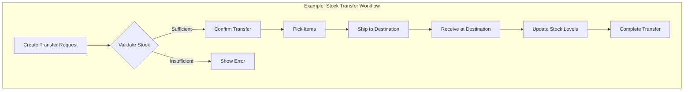
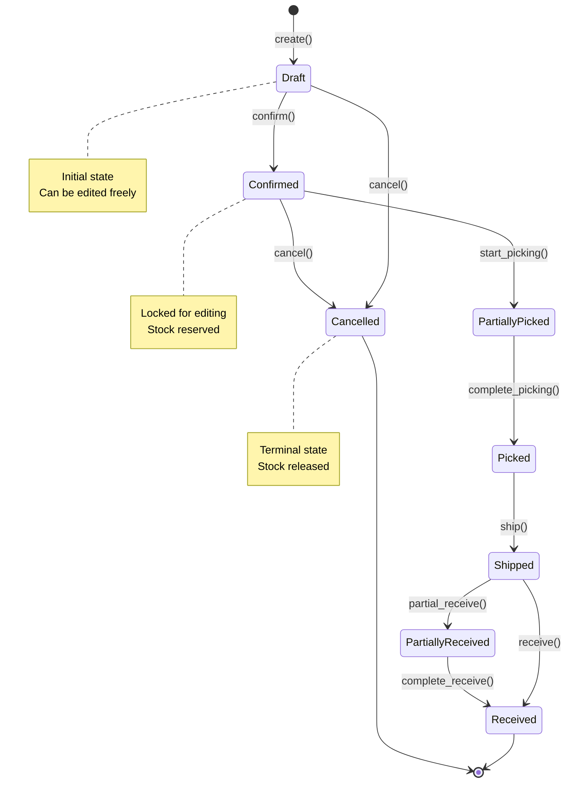
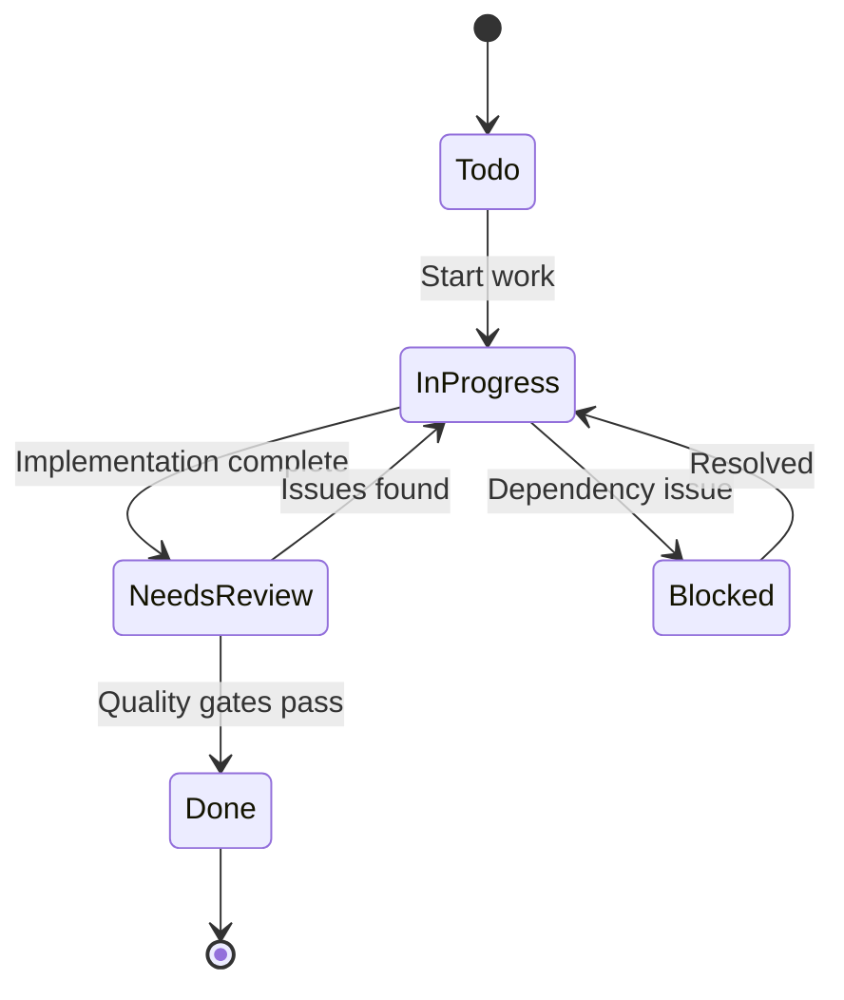
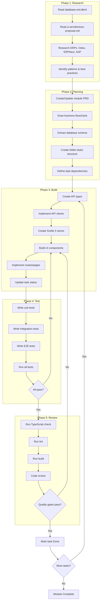

# Module Implementation Workflow

## Overview

This document defines the standardized workflow for implementing new modules in the Anthill Platform. The workflow ensures consistency, quality, and maintainability across all modules by following a structured approach from planning to deployment.

```
┌─────────────────────────────────────────────────────────────────────────────┐
│                    MODULE IMPLEMENTATION LIFECYCLE                          │
├─────────────────────────────────────────────────────────────────────────────┤
│                                                                             │
│  ┌──────────┐   ┌──────────┐   ┌──────────┐   ┌──────────┐   ┌──────────┐  │
│  │  PHASE 1 │ → │  PHASE 2 │ → │  PHASE 3 │ → │  PHASE 4 │ → │  PHASE 5 │  │
│  │ Research │   │ Planning │   │   Build  │   │   Test   │   │  Review  │  │
│  └──────────┘   └──────────┘   └──────────┘   └──────────┘   └──────────┘  │
│       ↑                                                            │        │
│       └────────────────── Iterate if broken ───────────────────────┘        │
│                                                                             │
└─────────────────────────────────────────────────────────────────────────────┘
```

---

## Phase 1: Research & Context Gathering

### 1.1 Read Core Documentation

Before starting any module, thoroughly review these foundational documents:

| Document | Path | Purpose |
|----------|------|---------|
| Database ERD | `docs/database-erd.dbml` | Understand data models, relationships, constraints |
| UI Architecture | `docs/ui-architecture-proposal.md` | Navigation, routes, page templates, module structure |
| Tech Stack | `docs/tech-stack.md` | Technologies, patterns, conventions |
| API Specs | `shared/openapi/*.yaml` | Backend API contracts |

**Checklist:**
- [ ] Identify tables/entities related to the module
- [ ] Map navigation routes from UI architecture
- [ ] Note dependencies on other modules
- [ ] Understand existing patterns from implemented modules

### 1.2 ERP Research

Study how established ERPs handle similar functionality:

```
┌─────────────────────────────────────────────────────────────────────────────┐
│                         ERP RESEARCH SOURCES                                │
├─────────────────────────────────────────────────────────────────────────────┤
│                                                                             │
│  ┌─────────────┐  ┌─────────────┐  ┌─────────────┐  ┌─────────────┐        │
│  │   Odoo 17   │  │   ERPNext   │  │  SAP Fiori  │  │   NetSuite  │        │
│  │             │  │             │  │             │  │             │        │
│  │ • Open src  │  │ • Open src  │  │ • UX Guide  │  │ • Workflows │        │
│  │ • Modules   │  │ • Doctypes  │  │ • Patterns  │  │ • Best prac │        │
│  │ • Workflows │  │ • Scripts   │  │ • Standards │  │ • Features  │        │
│  └─────────────┘  └─────────────┘  └─────────────┘  └─────────────┘        │
│                                                                             │
└─────────────────────────────────────────────────────────────────────────────┘
```

**Research Focus Areas:**
1. **Business Workflows** - How transactions flow through the system
2. **State Machines (CRITICAL for ERP)** - Document status transitions (e.g., Draft → Confirmed → Shipped → Delivered)
3. **UI/UX Patterns** - List pages, forms, dashboards, wizards
4. **Data Models** - Entity relationships, status flows, audit trails
5. **Edge Cases** - Error handling, validations, business rules
6. **Integration Points** - How module connects to others

**ERP Transaction Rules:**
- Documents cannot skip states (e.g., Invoice cannot go from "Draft" to "Paid" without "Posted")
- State transitions must be explicit and auditable
- Reversals/cancellations have their own state flows
- Multi-step approvals may be required for certain transitions

**Use Context7 MCP for Documentation:**
```
// Example: Research inventory management patterns
mcp__mcp-server-context7__resolve-library-id({
  query: "inventory management ERP system",
  libraryName: "odoo"
})
```

---

## Phase 2: Planning & PRD Creation

### 2.1 Create/Update Module PRD

Create a mini PRD (Product Requirements Document) for the module:

**File Location:** `PROJECT_TRACKING/V1_MVP/{Phase}/{Module}/README.md`
**Sub-Module Mini PRD:** `PROJECT_TRACKING/V1_MVP/{Phase}/{Module}/{Sub-Module}/README.md`

**PRD Structure:**

```markdown
# {Module Name} - Product Requirements Document

## 1. Overview
- Purpose and scope
- Business value
- Target users
- Actors and their roles

## 2. Event Storming

> **Legend:**
> - 🟧 **Domain Event** (Orange) - Something that happened (past tense)
> - 🟦 **Command** (Blue) - Action requested by user/system
> - 🟨 **Aggregate** (Yellow) - Entity that handles the command
> - 🟪 **Policy** (Purple) - Automatic reaction to an event ("When X happens, do Y")
> - 🟩 **Read Model** (Green) - Data needed for decisions
> - 🔴 **Hotspot** (Red) - Questions, concerns, or issues to resolve

### 2.1 Event Flow (Big Picture)
[ASCII diagram showing timeline of commands → aggregates → events → policies]

### 2.2 Detailed Event Map
[Detailed breakdown for each phase with Read Models and Hotspots]

### 2.3 Cross-Module Event Flow
| Source Module | Event | Target Module | Reaction (Policy) |
|---------------|-------|---------------|-------------------|
| {Module A} | `{EventName}` | {Module B} | {What happens in response} |

### 2.4 Design Decisions (Hotspots Resolved)
| Hotspot | Question | Decision | Rationale |
|---------|----------|----------|-----------|

## 3. Sequence Diagram

### 3.1 Happy Path
[Mermaid sequence diagram showing successful flow]

### 3.2 Error Scenarios
[Mermaid sequence diagrams for each error case]

## 4. State Machine (MANDATORY for ERP documents)

### 4.1 State Diagram
[Mermaid stateDiagram-v2 showing all states and transitions]

### 4.2 State Transition Table
| Current State | Action | Next State | Side Effects | Conditions |
|---------------|--------|------------|--------------|------------|

### 4.3 State Rules
- **Editable states**: {List states where document can be modified}
- **Terminal states**: {List states with no outgoing transitions}
- **Reversible transitions**: {Which transitions can be undone}

## 5. Domain Events

### 5.1 Event Definitions
[TypeScript interfaces for each domain event with metadata and payload]

### 5.2 Event Catalog
| Event Name | Emitted By | Key Payload Fields | Consumers |
|------------|------------|-------------------|-----------|

### 5.3 Event Subscriptions (Policies)
| Event | Consumer | Policy Name | Action |
|-------|----------|-------------|--------|

## 6. Business Rules

### 6.1 Validation Rules
| Rule ID | Rule Description | When Applied | Error Code | Error Message |
|---------|------------------|--------------|------------|---------------|
| BR-{M}-001 | {Description} | {Create/Update/Transition} | {ERROR_CODE} | {User-facing message} |

### 6.2 Computation Rules
| Rule ID | Description | Formula/Logic |
|---------|-------------|---------------|
| CR-{M}-001 | {What is computed} | `{formula or pseudocode}` |

### 6.3 Authorization Rules
| Action | Required Permission | Additional Conditions |
|--------|---------------------|----------------------|

## 7. Error Scenarios

### 7.1 Expected Errors (Client Errors)
| Error Code | Scenario | HTTP Status | User Message | Recovery Action |
|------------|----------|-------------|--------------|-----------------|

### 7.2 System Errors
| Error Code | Scenario | Impact | Mitigation |
|------------|----------|--------|------------|

## 8. Data Model
### 8.1 Database Schema (from ERD)
### 8.2 API Endpoints
### 8.3 Type Definitions

## 9. UI Specifications
### 9.1 Routes
### 9.2 Page Layouts
### 9.3 Components
### 9.4 User Interactions

## 10. Non-Functional Requirements
- Performance
- Security
- Accessibility

## 11. Dependencies
- Required modules
- External services

## 12. Out of Scope
- Features for future iterations

## 13. Implementation Checklist

### 13.1 Backend Tasks
- [ ] Domain entity with state machine
- [ ] Repository trait and implementation
- [ ] Domain events defined
- [ ] Event handlers (policies) implemented
- [ ] API handlers
- [ ] Casbin policies for authorization
- [ ] Database migrations
- [ ] Unit tests for state transitions
- [ ] Integration tests for event flow

### 13.2 Frontend Tasks
- [ ] TypeScript types
- [ ] API client functions
- [ ] Svelte store
- [ ] List page
- [ ] Create/Edit form
- [ ] Detail page with state actions
- [ ] Error handling UI
- [ ] Unit tests

### 13.3 Integration Tasks
- [ ] Event bus configuration
- [ ] Cross-service event handlers
- [ ] End-to-end tests
```

> **Tip:** See `docs/business-flows/` for complete examples using this structure.
> - Template: `docs/templates/business-flow-template.md`
> - Example: `docs/business-flows/product-creation-flow.md`

### 2.2 Event Storming Quick Guide

Event Storming là phương pháp mô hình hóa domain dùng để khám phá business logic và các event trong hệ thống. Đây là bước quan trọng để hiểu rõ cross-module interactions.

```
┌─────────────────────────────────────────────────────────────────────────────┐
│                       EVENT STORMING ELEMENTS                                │
├─────────────────────────────────────────────────────────────────────────────┤
│                                                                             │
│  Timeline →                                                                 │
│                                                                             │
│  👤 Actor      🟦 Command      🟨 Aggregate      🟧 Domain Event            │
│      │              │               │                   │                   │
│      │   issues     │   handled by  │    produces       │                   │
│      └──────────────┴───────────────┴───────────────────┘                   │
│                                                                             │
│  After Event is published:                                                  │
│                                                                             │
│  🟧 Domain Event ────┬────▶ 🟪 Policy 1 ────▶ 🟧 New Event                  │
│                      │                                                      │
│                      ├────▶ 🟪 Policy 2 ────▶ [Side Effect]                 │
│                      │                                                      │
│                      └────▶ 🟩 Read Model (Update projection)               │
│                                                                             │
│  🔴 Hotspot: Questions that need answers during design                     │
│                                                                             │
└─────────────────────────────────────────────────────────────────────────────┘
```

**Event Naming Convention:**
```
{bounded_context}.{aggregate}.{event_name}

Examples:
- inventory.product.created
- inventory.grn.confirmed
- inventory.stock_level.updated
- pricing.price_list.activated
- orders.sales_order.confirmed
```

**Key Questions for Event Storming:**
1. **Actors**: Ai trigger hành động này?
2. **Commands**: User/System request gì?
3. **Aggregates**: Entity nào xử lý command?
4. **Events**: Kết quả là event gì? (past tense)
5. **Policies**: Khi event xảy ra, hệ thống phản ứng thế nào?
6. **Read Models**: Cần data gì để ra quyết định?
7. **Hotspots**: Có vấn đề/câu hỏi gì cần giải quyết?

### 2.3 Create Business Workflow Flowcharts

Use Mermaid for documenting workflows. **For ERP modules, BOTH diagrams are MANDATORY:**

#### 2.3.1 Process Flowchart (Required)

Shows the step-by-step process flow:



#### 2.3.2 State Diagram (MANDATORY for ERP)

Shows valid state transitions - **Documents cannot skip states:**



**State Diagram Requirements:**
- [ ] All states clearly defined with entry/exit conditions
- [ ] Invalid transitions explicitly blocked (not just undocumented)
- [ ] Terminal states identified (states with no outgoing transitions)
- [ ] Reversal/cancellation paths documented
- [ ] Side effects documented (e.g., "Confirmed" → reserves stock)

### 2.4 Extract Database Schema

From `docs/database-erd.dbml`, extract relevant tables:

```sql
-- Example: Extract for Inventory Module
Table stock_moves {
  stock_move_id uuid [pk]
  tenant_id uuid [ref: > tenants.tenant_id]
  product_id uuid [ref: > products.product_id]
  -- ... other fields
}
```

### 2.5 Create Task Structure

Follow the folder-tasks workflow to create tasks. For complex modules, use **sub-module structure** to break down into manageable pieces.

> ⚠️ **AI AGENT MANDATORY CHECK**: Before creating ANY task files, you MUST determine the correct structure using the decision tree below. Failure to follow sub-module structure for complex modules is a BLOCKING violation.

#### 2.5.1 Module vs Sub-Module Structure

##### 🔴 MANDATORY Decision Tree (AI Agents MUST Follow)

```
START: New module to create?
    │
    ▼
┌─────────────────────────────────────────────────────────────┐
│  Count distinct features/screens in this module:            │
│  (e.g., "Inventory UI" has: Products, Variants, Warehouses, │
│   Stock Levels, Transfers, Categories = 6 features)         │
└─────────────────────────────────────────────────────────────┘
    │
    ▼
┌─────────────────────┐     ┌──────────────────────────────────┐
│ Features ≤ 3?       │────▶│ ✅ Use SIMPLE Module Structure   │
│ (AND all related)   │ YES │ - Flat tasks in module folder    │
└─────────────────────┘     │ - task_08.XX.01_name.md format   │
    │ NO                    └──────────────────────────────────┘
    ▼
┌─────────────────────┐     ┌──────────────────────────────────┐
│ Features ≥ 4?       │────▶│ ⭐ Use COMPLEX Module Structure  │
│ OR independently    │ YES │ - Create sub-module folders      │
│ testable features?  │     │ - Each sub-module has Mini PRD   │
└─────────────────────┘     │ - task_08.XX.YY.ZZ_name.md format│
                            └──────────────────────────────────┘
```

##### Examples by Module Type

| Module | Features | Structure | Reason |
|--------|----------|-----------|--------|
| `8.2_Authentication_UI` | Login, Register, Reset Password | **Simple** | 3 related features, single flow |
| `8.3_Dashboard` | Overview, Widgets, Real-time | **Simple** | All parts of one dashboard |
| `8.10_Inventory_UI` | Products, Variants, Warehouses, Transfers, Stock Levels, Categories | **Complex** | 6+ independent features |
| `8.11_Pricing_UI` | Price Lists, Rules, Calculations | **Simple** | 3 tightly coupled features |
| `8.4_Product_Management_UI` | Products, Categories, Variants, Stock | **Complex** | 4 independently testable features |

##### ⚠️ Common Mistakes (DO NOT DO)

```
❌ WRONG - Flat structure for complex module:
8.10_Inventory_UI/
├── README.md
├── task_08.10.01_create_warehouse_ui.md     # Missing sub-module!
├── task_08.10.02_create_transfer_ui.md      # Wrong task ID format!
└── task_08.10.03_create_stock_levels.md     # Should be in sub-folder!

✅ CORRECT - Sub-module structure:
8.10_Inventory_UI/
├── README.md                                 # Module index (template 2.5.4)
├── 8.10.1_Warehouse_Management/
│   ├── README.md                             # Mini PRD (template 2.5.5) ⭐
│   ├── task_08.10.01.01_warehouse_list.md
│   └── task_08.10.01.02_warehouse_form.md
├── 8.10.2_Stock_Transfers/
│   ├── README.md                             # Mini PRD ⭐
│   └── task_08.10.02.01_transfer_list.md
└── 8.10.3_Stock_Levels/
    ├── README.md                             # Mini PRD ⭐
    └── task_08.10.03.01_stock_dashboard.md
```

##### Checklist Before Creating Module Tasks

AI Agents MUST verify before proceeding:

- [ ] **Step 1**: Counted all distinct features in this module
- [ ] **Step 2**: Determined Simple vs Complex using decision tree above
- [ ] **Step 3**: If Complex → Created sub-module folders FIRST
- [ ] **Step 4**: If Complex → Created Mini PRD (README.md) in EACH sub-module
- [ ] **Step 5**: Used correct task ID format (3-part for Simple, 4-part for Complex)

**When to use Sub-Modules (detailed criteria):**
- Module has 4+ distinct features
- Each feature can be developed/tested independently  
- Features have their own CRUD operations or state machines
- Multiple AI agents or developers can work in parallel
- Features can have different dependencies

**Hierarchy:**
```
Phase (08_Frontend)
  └── Module (8.10_Inventory_UI)
        └── Sub-Module (8.10.1_Product_Management)
              └── Tasks (task_08.10.01.01_product_list.md)
```

#### 2.5.2 Directory Structure

**Simple Module (no sub-modules):**
```
PROJECT_TRACKING/V1_MVP/08_Frontend/8.X_Module_Name/
├── README.md                    # Module PRD (full template from 2.1)
├── task_08.XX.01_*.md          # Task 1
├── task_08.XX.02_*.md          # Task 2
└── ...
```

**Complex Module (with sub-modules):**
```
PROJECT_TRACKING/V1_MVP/08_Frontend/
├── 8.10_Inventory_UI/
│   ├── README.md                           # Module overview & sub-module index
│   │
│   ├── 8.10.1_Product_Management/
│   │   ├── README.md                       # Sub-Module Mini PRD ⭐
│   │   ├── task_08.10.01.01_product_list.md
│   │   ├── task_08.10.01.02_product_form.md
│   │   └── task_08.10.01.03_product_api.md
│   │
│   ├── 8.10.2_Variant_Management/
│   │   ├── README.md                       # Sub-Module Mini PRD
│   │   ├── task_08.10.02.01_variant_list.md
│   │   └── task_08.10.02.02_variant_form.md
│   │
│   ├── 8.10.3_Stock_Levels/
│   │   ├── README.md                       # Sub-Module Mini PRD
│   │   └── task_08.10.03.01_stock_dashboard.md
│   │
│   └── 8.10.4_Categories/
│       ├── README.md
│       └── task_08.10.04.01_category_tree.md
```

#### 2.5.3 Naming Convention

| Level | Format | Example |
|-------|--------|---------|
| Phase | `{NN}_{Name}` | `08_Frontend` |
| Module | `{N.NN}_{Name}` | `8.10_Inventory_UI` |
| Sub-Module | `{N.NN.N}_{Name}` | `8.10.1_Product_Management` |
| Task | `task_{NN.NN.NN.NN}_{name}.md` | `task_08.10.01.01_product_list.md` |

**Task ID breakdown:**
```
task_08.10.01.01_product_list.md
      │  │  │  │
      │  │  │  └── Task number within sub-module (01, 02, 03...)
      │  │  └───── Sub-module number (01 = 8.10.1)
      │  └──────── Module number (10 = 8.10)
      └─────────── Phase number (08 = Frontend)
```

#### 2.5.4 Module Overview README Template

For modules with sub-modules, the parent `README.md` should be an index:

```markdown
# {Module Name}

## Overview
Brief description of the module scope.

## Reference Documents
- PRD: `docs/prd/...`
- Database ERD: `docs/database-erd.dbml`
- UI Architecture: `docs/ui-architecture-proposal.md`

## Sub-Modules

| # | Sub-Module | Description | Status | Dependencies |
|---|------------|-------------|--------|--------------|
| 8.10.1 | Product Management | CRUD products | 🟢 Done | - |
| 8.10.2 | Variant Management | Product variants | 🟡 In Progress | 8.10.1 |
| 8.10.3 | Stock Levels | Stock tracking | ⚪ Todo | 8.10.1, 8.10.2 |
| 8.10.4 | Categories | Category tree | ⚪ Todo | - |

## Implementation Order
1. 8.10.1 Product Management (foundation)
2. 8.10.4 Categories (independent)
3. 8.10.2 Variant Management (depends on Products)
4. 8.10.3 Stock Levels (depends on Products + Variants)

## Cross-Module Events
| Event | Source | Consumers |
|-------|--------|-----------|
| `inventory.product.created` | 8.10.1 | 8.10.3 (init stock) |
| `inventory.variant.created` | 8.10.2 | 8.10.3 (init stock) |
```

#### 2.5.5 Sub-Module Mini PRD Template

Each sub-module `README.md` follows the **same structure as Section 2.1** but focused on that specific feature:

```markdown
# {Sub-Module Name} - Mini PRD

**Module:** {Parent Module}
**Sub-Module ID:** {N.NN.N}
**Status:** {Todo|In Progress|Done}
**Last Updated:** {YYYY-MM-DD}

## 1. Overview
- Purpose and scope (focused on this sub-module)
- Business value
- Actors and their roles

## 2. Event Storming
[Same structure as Section 2.1, but only for this sub-module]

### 2.1 Event Flow
### 2.2 Cross-Module Events

## 3. Sequence Diagram
### 3.1 Happy Path
### 3.2 Error Scenarios

## 4. State Machine
[If applicable - not all sub-modules need state machines]

## 5. Domain Events
### 5.1 Events Emitted
### 5.2 Events Consumed

## 6. Business Rules
### 6.1 Validation Rules
### 6.2 Computation Rules

## 7. Error Scenarios

## 8. Data Model
- Tables involved (from ERD)
- API Endpoints
- TypeScript types

## 9. UI Specifications
- Routes
- Pages/Components
- User interactions

## 10. Dependencies
- Required sub-modules
- External services

## 11. Tasks Summary

| Task ID | Name | Status | Assignee |
|---------|------|--------|----------|
| 08.10.01.01 | Product List Page | ✅ Done | - |
| 08.10.01.02 | Product Form | 🔄 In Progress | - |
| 08.10.01.03 | Product API Integration | ⬜ Todo | - |

## 12. Implementation Checklist
- [ ] Backend API ready
- [ ] Types defined
- [ ] Store implemented
- [ ] List page
- [ ] Create/Edit form
- [ ] Tests passing
```

> **Tip:** Use the full PRD template from Section 2.1 as reference. Simplify sections that don't apply to your sub-module.

#### 2.5.6 Task File Template (folder-tasks format)

> **IMPORTANT:** Task files must follow the [folder-tasks](https://github.com/tymon3568/folder-tasks) standard format.
> Use Context7 to fetch latest docs: `/tymon3568/folder-tasks`

```markdown
# Task: {Task Name}

**Task ID:** `V1_MVP/{Phase}/{Module}/{Sub-Module}/task_{NN.NN.NN.NN}_{description}.md`
**Version:** V1_MVP
**Phase:** {NN_Phase_Name}
**Module:** {N.NN_Module_Name}
**Sub-Module:** {N.NN.N_Sub_Module_Name}
**Priority:** High
**Status:** Todo
**Assignee:**
**Created Date:** {YYYY-MM-DD}
**Last Updated:** {YYYY-MM-DD}
**Dependencies:**
- `V1_MVP/{path}/task_{XX.XX.XX.XX}_{name}.md`
- None

## 1. Detailed Description

{Clear description of what needs to be built:
- Purpose and context
- What problem this solves
- How it fits into the sub-module}

## 2. Implementation Steps (Specific Sub-tasks)

- [ ] 1. {First actionable sub-task}
- [ ] 2. {Second actionable sub-task}
- [ ] 3. {Third actionable sub-task}
- [ ] 4. {Write tests}

## 3. Completion Criteria

- [ ] {Specific, measurable criterion 1}
- [ ] {Specific, measurable criterion 2}
- [ ] Code compiles/builds without errors
- [ ] Tests pass
- [ ] Git commits reference task ID

## Related Documents

- Mini PRD: `./README.md`
- ERD: `docs/database-erd.dbml`
- API Spec: `shared/openapi/{service}.yaml`

## AI Agent Log:

* {YYYY-MM-DD HH:MM}: {Action description}
    - {Details about what was done}
    - {Dependencies verified or concerns noted}
```

**Valid Status Values (STRICT):**

| Status | Meaning |
|--------|---------|
| `Todo` | Ready to be claimed |
| `InProgress_By_[AgentName]` | Claimed and actively being worked |
| `Blocked_By_[Reason]` | Cannot proceed; must include reason |
| `NeedsReview` | Work complete; awaiting review |
| `Done` | Reviewed and approved |
| `Cancelled` | Intentionally stopped (with reason) |

❌ **NEVER use:** `InProgress`, `In Progress`, `Completed`, `Pending`, `Review`

#### 2.5.7 AI Agent Coordination

When multiple AI agents work on the same module:

1. **Claim tasks explicitly** - Update status to `InProgress_By_[AgentName]`
2. **Check dependencies first** - Verify all dependencies are `Done`
3. **Update logs frequently** - Add entries to "AI Agent Log" section
4. **Quality gates before completion** - Run typecheck/lint/tests
5. **Mark NeedsReview immediately** - Don't batch status updates

**AI Agent Workflow:**
```
1. Find Todo task → 2. Check dependencies (all Done?)
       ↓                      ↓ No
3. Update Status:     → Blocked_By_Dependency_[TaskID]
   InProgress_By_[Agent]
       ↓
4. Work sub-tasks (mark [x] as done)
       ↓
5. Quality gates (typecheck, lint, test)
       ↓
6. Status: NeedsReview → Reviewer: Done or back to InProgress
```

**AI Agent Log format (folder-tasks standard):**
```markdown
## AI Agent Log:

* 2026-01-27 10:00: Backend_Agent_01 - Task claimed
    - Verified dependencies: task_08.10.00.01 is Done ✓
    - Starting work on sub-task 1

* 2026-01-27 12:30: Backend_Agent_01 - Sub-tasks 1-3 completed
    - Files created: ProductList.svelte, products.test.ts
    - Encountered: Type mismatch in API response
    - Resolution: Updated ProductDto interface

* 2026-01-27 14:00: Backend_Agent_01 - All work completed
    - Quality gates: typecheck ✓, lint ✓, tests ✓ (8 tests, 250ms)
    - Status changed to NeedsReview

* 2026-01-27 15:00: Reviewer_Agent - Reviewed and approved
    - Status changed to Done
```

---

## Phase 3: Implementation (Build)

### 3.0 Service Architecture Reference

> **IMPORTANT**: Always refer to this section when starting/testing services.

#### Service Port Convention (MANDATORY)

| Service | Port | Endpoint Example |
|---------|------|------------------|
| User Service | 8000 | `http://localhost:8000/api/v1/users` |
| Inventory Service | 8001 | `http://localhost:8001/api/v1/inventory/*` |
| Order Service | 8002 | `http://localhost:8002/api/v1/orders` |
| Payment Service | 8003 | `http://localhost:8003/api/v1/payments` |
| Integration Service | 8004 | `http://localhost:8004/api/v1/integrations` |
| Frontend (Dev) | 5173 | `http://localhost:5173` |
| Frontend (Preview) | 4173 | `http://localhost:4173` |
| PostgreSQL | 5432 | `postgres://localhost:5432/inventory_saas` |
| KeyDB (Redis) | 6379 | `redis://localhost:6379` |
| NATS | 4222 | `nats://localhost:4222` |
| RustFS (S3) | 9000 | `http://localhost:9000` |

**Starting Services:**
```bash
# Start infrastructure
cd infra/docker_compose && docker compose up -d

# Start user service (Terminal 1)
cd services/user_service/api && PORT=8000 cargo run

# Start inventory service (Terminal 2)
cd services/inventory_service/api && PORT=8001 cargo run

# Start frontend (Terminal 3)
cd frontend && bun run dev
```

#### Backend Code Change Checklist

> ⚠️ **CRITICAL**: After making backend code changes, you MUST:

```
┌─────────────────────────────────────────────────────────────────────────────┐
│               AFTER BACKEND CODE CHANGES - MANDATORY STEPS                  │
├─────────────────────────────────────────────────────────────────────────────┤
│                                                                             │
│  1. ☐ Build the service                                                     │
│       cargo build -p {service}_api                                          │
│                                                                             │
│  2. ☐ Run unit tests                                                        │
│       cargo test -p {service}_core                                          │
│                                                                             │
│  3. ☐ Create Casbin policy migration (if new endpoint)                      │
│       See section 3.3.1b for template                                       │
│                                                                             │
│  4. ☐ Run database migrations                                               │
│       sqlx migrate run                                                      │
│                                                                             │
│  5. ☐ RESTART the backend service                                           │
│       - Kill the old process: kill $(pgrep {service})                       │
│       - Start new: PORT={port} cargo run                                    │
│                                                                             │
│  6. ☐ Verify with curl or browser DevTools                                  │
│       curl http://localhost:{port}/health                                   │
│       curl http://localhost:{port}/api/v1/{endpoint}                        │
│                                                                             │
└─────────────────────────────────────────────────────────────────────────────┘
```

**Common Mistake**: E2E tests pass with mocked data, but real browser testing 
fails because the backend wasn't restarted. Always restart after code changes!

### 3.1 Implementation Order

Follow dependency order from README.md task summary:

```
┌─────────────────────────────────────────────────────────────────────────────┐
│                      IMPLEMENTATION PRIORITY ORDER                          │
├─────────────────────────────────────────────────────────────────────────────┤
│                                                                             │
│  1. API Client Integration (Critical)                                       │
│     └─→ Types, API clients, stores                                          │
│                                                                             │
│  2. Core UI Pages (High)                                                    │
│     └─→ List page, detail page, forms                                       │
│                                                                             │
│  3. Business Logic (High)                                                   │
│     └─→ Workflows, validations, state management                            │
│                                                                             │
│  4. Advanced Features (Medium)                                              │
│     └─→ Reports, exports, integrations                                      │
│                                                                             │
│  5. Polish & Optimization (Low)                                             │
│     └─→ Performance, UX improvements, edge cases                            │
│                                                                             │
└─────────────────────────────────────────────────────────────────────────────┘
```

### 3.2 File Structure Convention

**Backend (Rust):**
```
services/{service_name}/
├── domain/src/
│   ├── entities/       # Domain entities
│   ├── repositories/   # Repository traits
│   └── services/       # Domain services
├── infra/src/
│   ├── repositories/   # Repository implementations
│   └── services/       # Service implementations
└── api/src/
    ├── handlers/       # HTTP handlers
    └── routes/         # Route definitions
```

**Frontend (SvelteKit):**
```
frontend/src/
├── lib/
│   ├── api/{module}/           # API clients
│   ├── types/{module}.ts       # TypeScript types
│   ├── stores/{module}.svelte.ts  # Svelte 5 stores
│   └── components/{module}/    # Module components
└── routes/(protected)/{module}/
    ├── +page.svelte            # List page
    ├── new/+page.svelte        # Create page
    └── [id]/
        ├── +page.svelte        # Detail page
        └── edit/+page.svelte   # Edit page
```

### 3.3 Backend Coding Standards (Rust)

#### 3.3.1 Database Migrations (MANDATORY)

**Every schema change MUST have a migration file:**

```bash
# Create a new migration
sqlx migrate add {migration_name}

# Example: Adding a new table
sqlx migrate add create_stock_transfers_table
```

**Migration File Structure:**
```
migrations/
├── 20260101000001_create_products_table.sql
├── 20260101000002_create_stock_moves_table.sql
└── 20260127000001_add_transfer_priority_column.sql
```

**Migration Rules:**
- [ ] One migration per schema change (atomic changes)
- [ ] Migration names are descriptive: `{action}_{table}_{detail}`
- [ ] Include both UP and DOWN migrations when possible
- [ ] Test migrations on a fresh database before committing
- [ ] Never modify existing migrations after deployment

**Example Migration:**
```sql
-- migrations/20260127000001_create_stock_transfers_table.sql

-- UP
CREATE TABLE stock_transfers (
    transfer_id UUID PRIMARY KEY DEFAULT gen_random_uuid(),
    tenant_id UUID NOT NULL REFERENCES tenants(tenant_id),
    transfer_number VARCHAR(50) NOT NULL,
    status VARCHAR(20) NOT NULL DEFAULT 'draft',
    source_warehouse_id UUID NOT NULL REFERENCES warehouses(warehouse_id),
    destination_warehouse_id UUID NOT NULL REFERENCES warehouses(warehouse_id),
    priority VARCHAR(20) NOT NULL DEFAULT 'normal',
    created_at TIMESTAMPTZ NOT NULL DEFAULT NOW(),
    updated_at TIMESTAMPTZ NOT NULL DEFAULT NOW(),
    
    CONSTRAINT uq_transfer_number_tenant UNIQUE (tenant_id, transfer_number),
    CONSTRAINT chk_transfer_status CHECK (status IN ('draft', 'confirmed', 'picked', 'shipped', 'received', 'cancelled')),
    CONSTRAINT chk_different_warehouses CHECK (source_warehouse_id != destination_warehouse_id)
);

CREATE INDEX idx_transfers_tenant_status ON stock_transfers(tenant_id, status);
CREATE INDEX idx_transfers_source_wh ON stock_transfers(source_warehouse_id);
CREATE INDEX idx_transfers_dest_wh ON stock_transfers(destination_warehouse_id);

-- Trigger for updated_at
CREATE TRIGGER set_updated_at
    BEFORE UPDATE ON stock_transfers
    FOR EACH ROW
    EXECUTE FUNCTION trigger_set_updated_at();
```

**Migration Rollback (DOWN) - CRITICAL:**

> ⚠️ **Luôn viết script DOWN cho migration** - Trong quá trình dev, việc cần rollback là thường xuyên.

```sql
-- DOWN (rollback) - Đặt cuối file hoặc file riêng với suffix _down.sql
-- Thứ tự ngược lại với UP

DROP TRIGGER IF EXISTS set_updated_at ON stock_transfers;
DROP INDEX IF EXISTS idx_transfers_dest_wh;
DROP INDEX IF EXISTS idx_transfers_source_wh;
DROP INDEX IF EXISTS idx_transfers_tenant_status;
DROP TABLE IF EXISTS stock_transfers;
```

**Rollback Commands:**
```bash
# Rollback migration gần nhất
sqlx migrate revert

# Rollback tất cả (CẢNH BÁO: Xóa toàn bộ schema!)
sqlx migrate revert --target-version 0

# Kiểm tra migration status
sqlx migrate info
```

**Xử lý khi Migration Fail giữa chừng:**

| Tình huống | Giải pháp |
|------------|-----------|
| Fail trên local dev | `sqlx migrate revert` → Fix SQL → `sqlx migrate run` |
| Fail trên staging/prod | KHÔNG sửa migration cũ. Tạo migration MỚI để fix |
| Partial failure (một số table đã tạo) | Manual cleanup với psql, sau đó retry |

```bash
# Kiểm tra table đã tạo chưa
psql -d inventory_saas -c "\dt stock_transfers"

# Manual cleanup nếu cần
psql -d inventory_saas -c "DROP TABLE IF EXISTS stock_transfers CASCADE;"

# Xóa record trong _sqlx_migrations nếu migration bị stuck
psql -d inventory_saas -c "DELETE FROM _sqlx_migrations WHERE version = 20260127000001;"
```

#### 3.3.1b Casbin Policy Migration (MANDATORY for new endpoints)

> ⚠️ **CRITICAL**: Every new API endpoint MUST have Casbin policies. Without policies, 
> the endpoint will return **403 Forbidden** even with valid authentication.

**When to create Casbin policy migration:**
- Adding a new API endpoint (e.g., `/api/v1/inventory/variants`)
- Adding a new resource type
- Changing URL patterns for existing endpoints

**Migration File Naming:**
```
migrations/{YYYYMMDD}000001_add_{module}_policies.sql
```

**Policy Migration Template:**
```sql
-- migrations/20260127000001_add_inventory_variants_policies.sql
-- Description: Adds authorization policies for product variant management endpoints

-- ============================================================================
-- OWNER ROLE: Full access
-- ============================================================================
INSERT INTO casbin_rule (ptype, v0, v1, v2, v3) VALUES
('p', 'owner', 'default_tenant', '/api/v1/inventory/variants', 'GET'),
('p', 'owner', 'default_tenant', '/api/v1/inventory/variants', 'POST'),
('p', 'owner', 'default_tenant', '/api/v1/inventory/variants/*', 'GET'),
('p', 'owner', 'default_tenant', '/api/v1/inventory/variants/*', 'PUT'),
('p', 'owner', 'default_tenant', '/api/v1/inventory/variants/*', 'DELETE'),
('p', 'owner', 'default_tenant', '/api/v1/inventory/variants/bulk/*', 'POST')
ON CONFLICT DO NOTHING;

-- ============================================================================
-- ADMIN ROLE: Full access (same as owner)
-- ============================================================================
INSERT INTO casbin_rule (ptype, v0, v1, v2, v3) VALUES
('p', 'admin', 'default_tenant', '/api/v1/inventory/variants', 'GET'),
('p', 'admin', 'default_tenant', '/api/v1/inventory/variants', 'POST'),
('p', 'admin', 'default_tenant', '/api/v1/inventory/variants/*', 'GET'),
('p', 'admin', 'default_tenant', '/api/v1/inventory/variants/*', 'PUT'),
('p', 'admin', 'default_tenant', '/api/v1/inventory/variants/*', 'DELETE'),
('p', 'admin', 'default_tenant', '/api/v1/inventory/variants/bulk/*', 'POST')
ON CONFLICT DO NOTHING;

-- ============================================================================
-- MANAGER ROLE: Read + Write, no delete
-- ============================================================================
INSERT INTO casbin_rule (ptype, v0, v1, v2, v3) VALUES
('p', 'manager', 'default_tenant', '/api/v1/inventory/variants', 'GET'),
('p', 'manager', 'default_tenant', '/api/v1/inventory/variants', 'POST'),
('p', 'manager', 'default_tenant', '/api/v1/inventory/variants/*', 'GET'),
('p', 'manager', 'default_tenant', '/api/v1/inventory/variants/*', 'PUT')
ON CONFLICT DO NOTHING;

-- ============================================================================
-- USER ROLE: Read-only
-- ============================================================================
INSERT INTO casbin_rule (ptype, v0, v1, v2, v3) VALUES
('p', 'user', 'default_tenant', '/api/v1/inventory/variants', 'GET'),
('p', 'user', 'default_tenant', '/api/v1/inventory/variants/*', 'GET')
ON CONFLICT DO NOTHING;

-- ============================================================================
-- Copy policies to all existing tenants
-- ============================================================================
INSERT INTO casbin_rule (ptype, v0, v1, v2, v3)
SELECT DISTINCT 'p', r.v0, t.tenant_id::text, p.v2, p.v3
FROM casbin_rule r
CROSS JOIN tenants t
CROSS JOIN (
    SELECT v2, v3 FROM casbin_rule
    WHERE ptype = 'p' AND v1 = 'default_tenant'
    AND v2 LIKE '/api/v1/inventory/variants%'
) p
WHERE r.ptype = 'g' AND r.v2 = t.tenant_id::text
AND t.tenant_id::text != 'default_tenant'
ON CONFLICT DO NOTHING;
```

**Policy Pattern Rules:**
| URL Pattern | Use Case |
|-------------|----------|
| `/api/v1/{module}` | List (GET) and Create (POST) |
| `/api/v1/{module}/*` | Single resource CRUD (GET/PUT/DELETE) |
| `/api/v1/{module}/by-{field}/*` | Lookup by field (GET only) |
| `/api/v1/{module}/bulk/*` | Bulk operations (POST) |

**Casbin Policy Checklist:**
- [ ] Create migration file with policies for all 4 roles (owner, admin, manager, user)
- [ ] Include policies for list, create, read, update, delete operations
- [ ] Include policies for bulk operations if applicable
- [ ] Include copy-to-existing-tenants query
- [ ] Run `sqlx migrate run` after creating migration
- [ ] **Restart backend service** to reload Casbin policies
- [ ] Test with browser DevTools to verify no 403 errors

#### 3.3.2 Error Handling (MANDATORY)

**Use `thiserror` for domain/library errors and `anyhow` for application code:**

```rust
// domain/src/errors.rs
use thiserror::Error;

#[derive(Error, Debug)]
pub enum DomainError {
    #[error("Entity not found: {entity_type} with id {id}")]
    NotFound { entity_type: &'static str, id: String },
    
    #[error("Invalid state transition: cannot move from {from} to {to}")]
    InvalidStateTransition { from: String, to: String },
    
    #[error("Insufficient stock: required {required}, available {available}")]
    InsufficientStock { required: i32, available: i32 },
    
    #[error("Validation error: {0}")]
    Validation(String),
    
    #[error("Duplicate entry: {0}")]
    Duplicate(String),
}

// api/src/errors.rs
use axum::{
    http::StatusCode,
    response::{IntoResponse, Response},
    Json,
};
use serde::Serialize;

#[derive(Serialize)]
pub struct ErrorResponse {
    pub code: String,
    pub message: String,
    #[serde(skip_serializing_if = "Option::is_none")]
    pub details: Option<serde_json::Value>,
}

pub struct AppError(anyhow::Error);

impl IntoResponse for AppError {
    fn into_response(self) -> Response {
        // Log the full error chain for debugging
        tracing::error!("Application error: {:?}", self.0);
        
        // Return safe error to client
        let (status, code, message) = match self.0.downcast_ref::<DomainError>() {
            Some(DomainError::NotFound { .. }) => {
                (StatusCode::NOT_FOUND, "NOT_FOUND", self.0.to_string())
            }
            Some(DomainError::InvalidStateTransition { .. }) => {
                (StatusCode::CONFLICT, "INVALID_STATE", self.0.to_string())
            }
            Some(DomainError::InsufficientStock { .. }) => {
                (StatusCode::UNPROCESSABLE_ENTITY, "INSUFFICIENT_STOCK", self.0.to_string())
            }
            Some(DomainError::Validation(_)) => {
                (StatusCode::BAD_REQUEST, "VALIDATION_ERROR", self.0.to_string())
            }
            Some(DomainError::Duplicate(_)) => {
                (StatusCode::CONFLICT, "DUPLICATE", self.0.to_string())
            }
            None => {
                (StatusCode::INTERNAL_SERVER_ERROR, "INTERNAL_ERROR", "An internal error occurred".to_string())
            }
        };
        
        (status, Json(ErrorResponse { code: code.to_string(), message, details: None })).into_response()
    }
}

// All handlers must return Result<impl IntoResponse, AppError>
pub async fn create_transfer(
    State(state): State<AppState>,
    Json(payload): Json<CreateTransferRequest>,
) -> Result<impl IntoResponse, AppError> {
    let transfer = state.transfer_service
        .create(payload)
        .await
        .map_err(AppError)?;
    
    Ok((StatusCode::CREATED, Json(transfer)))
}
```

#### 3.3.3 Type Sync: Rust → TypeScript (RECOMMENDED)

**Use `ts-rs` to auto-generate TypeScript types from Rust structs:**

```rust
// Cargo.toml
[dependencies]
ts-rs = { version = "7", features = ["serde-compat"] }

// api/src/dtos/transfer.rs
use serde::{Deserialize, Serialize};
use ts_rs::TS;
use uuid::Uuid;

#[derive(Debug, Serialize, Deserialize, TS)]
#[ts(export, export_to = "frontend/src/lib/types/generated/")]
pub struct TransferResponse {
    pub transfer_id: Uuid,
    pub transfer_number: String,
    pub status: TransferStatus,
    pub source_warehouse_id: Uuid,
    pub destination_warehouse_id: Uuid,
    pub priority: TransferPriority,
    pub created_at: chrono::DateTime<chrono::Utc>,
    pub updated_at: chrono::DateTime<chrono::Utc>,
}

#[derive(Debug, Serialize, Deserialize, TS)]
#[ts(export, export_to = "frontend/src/lib/types/generated/")]
pub struct CreateTransferRequest {
    pub source_warehouse_id: Uuid,
    pub destination_warehouse_id: Uuid,
    pub priority: Option<TransferPriority>,
    pub items: Vec<TransferItemRequest>,
}

#[derive(Debug, Serialize, Deserialize, TS)]
#[ts(export, export_to = "frontend/src/lib/types/generated/")]
pub enum TransferStatus {
    Draft,
    Confirmed,
    PartiallyPicked,
    Picked,
    Shipped,
    PartiallyReceived,
    Received,
    Cancelled,
}
```

**Generate TypeScript types:**
```bash
# Add to Makefile or build script
cargo test export_bindings --features ts-rs

# This generates:
# frontend/src/lib/types/generated/TransferResponse.ts
# frontend/src/lib/types/generated/CreateTransferRequest.ts
# frontend/src/lib/types/generated/TransferStatus.ts
```

**Frontend usage:**
```typescript
// frontend/src/lib/types/transfers.ts
// Re-export generated types with any additional frontend-specific types
export * from './generated/TransferResponse';
export * from './generated/CreateTransferRequest';
export * from './generated/TransferStatus';

// Add frontend-only types
export interface TransferListParams {
  page?: number;
  pageSize?: number;
  status?: TransferStatus;
  sourceWarehouseId?: string;
}
```

#### 3.3.4 State Machine Implementation (MANDATORY for ERP)

```rust
// domain/src/entities/transfer_state.rs
use crate::errors::DomainError;

#[derive(Debug, Clone, PartialEq, Eq)]
pub enum TransferStatus {
    Draft,
    Confirmed,
    PartiallyPicked,
    Picked,
    Shipped,
    PartiallyReceived,
    Received,
    Cancelled,
}

impl TransferStatus {
    /// Returns valid next states from current state
    pub fn valid_transitions(&self) -> Vec<TransferStatus> {
        match self {
            Self::Draft => vec![Self::Confirmed, Self::Cancelled],
            Self::Confirmed => vec![Self::PartiallyPicked, Self::Cancelled],
            Self::PartiallyPicked => vec![Self::Picked],
            Self::Picked => vec![Self::Shipped],
            Self::Shipped => vec![Self::PartiallyReceived, Self::Received],
            Self::PartiallyReceived => vec![Self::Received],
            Self::Received => vec![], // Terminal state
            Self::Cancelled => vec![], // Terminal state
        }
    }
    
    /// Validate and perform state transition
    pub fn transition_to(&self, target: TransferStatus) -> Result<TransferStatus, DomainError> {
        if self.valid_transitions().contains(&target) {
            Ok(target)
        } else {
            Err(DomainError::InvalidStateTransition {
                from: format!("{:?}", self),
                to: format!("{:?}", target),
            })
        }
    }
    
    /// Check if current state is terminal (no outgoing transitions)
    pub fn is_terminal(&self) -> bool {
        self.valid_transitions().is_empty()
    }
    
    /// Check if document can be edited in current state
    pub fn is_editable(&self) -> bool {
        matches!(self, Self::Draft)
    }
}

#[cfg(test)]
mod tests {
    use super::*;
    
    #[test]
    fn test_valid_transition() {
        let status = TransferStatus::Draft;
        assert!(status.transition_to(TransferStatus::Confirmed).is_ok());
    }
    
    #[test]
    fn test_invalid_transition() {
        let status = TransferStatus::Draft;
        // Cannot skip from Draft to Shipped
        assert!(status.transition_to(TransferStatus::Shipped).is_err());
    }
    
    #[test]
    fn test_terminal_state() {
        assert!(TransferStatus::Received.is_terminal());
        assert!(TransferStatus::Cancelled.is_terminal());
        assert!(!TransferStatus::Draft.is_terminal());
    }
}
```

### 3.4 Frontend Coding Standards

#### Svelte 5 Runes (MANDATORY)

**Core Principles:**
- Use `$state` for local component state
- Use `$derived` / `$derived.by` for computed values
- Use `$effect` ONLY for side effects (analytics, imperative DOM). Never use `$effect` to synchronize state
- Use `$props()` to read props (NOT `export let`)
- Use `$bindable()` only when two-way binding is explicitly required
- Prefer snippets and `{@render ...}` for composition (NOT `<slot />`)

**Anti-patterns to AVOID:**
```typescript
// ❌ WRONG - Legacy patterns
export let item;           // Use $props() instead
$: doubled = count * 2;    // Use $derived instead
<slot />                   // Use {@render ...} instead

// ❌ WRONG - Using $effect for state sync
$effect(() => {
  filteredItems = items.filter(i => i.active);  // Should use $derived
});

// ❌ WRONG - Module-level mutable state (SSR risk)
let sharedState = [];  // Shared across all server requests!
```

**Correct Patterns:**

```typescript
// ✅ CORRECT - Props with $props()
// Component.svelte
<script lang="ts">
  import type { Item } from '$lib/types';
  
  interface Props {
    item: Item;
    onSave?: (item: Item) => void;
    children?: import('svelte').Snippet;
  }
  
  let { item, onSave, children }: Props = $props();
</script>

{#if children}
  {@render children()}
{/if}
```

```typescript
// ✅ CORRECT - State and derived
<script lang="ts">
  let count = $state(0);
  let items = $state<Item[]>([]);
  
  // Derived values (auto-updates when dependencies change)
  let doubled = $derived(count * 2);
  let activeItems = $derived(items.filter(i => i.isActive));
  
  // Complex derived with $derived.by
  let stats = $derived.by(() => {
    const active = items.filter(i => i.isActive);
    return {
      total: items.length,
      active: active.length,
      inactive: items.length - active.length
    };
  });
</script>
```

```typescript
// ✅ CORRECT - Effects for side effects only
<script lang="ts">
  let searchQuery = $state('');
  
  // Side effect: analytics tracking
  $effect(() => {
    if (searchQuery.length > 2) {
      analytics.track('search', { query: searchQuery });
    }
  });
  
  // Side effect: imperative DOM integration
  $effect(() => {
    const chart = new Chart(canvasElement, chartConfig);
    return () => chart.destroy();  // Cleanup
  });
</script>
```

**Store Pattern (Module-level state):**

```typescript
// stores/{module}.svelte.ts
import type { Item, ListParams, PaginationInfo } from '$lib/types/{module}';
import { moduleApi } from '$lib/api/{module}';

// ============================================================================
// State Definition
// ============================================================================

interface ModuleState {
  items: Item[];
  selected: Item | null;
  pagination: PaginationInfo | null;
  isLoading: boolean;
  error: string | null;
}

// Module-level state using $state rune
export const moduleState = $state<ModuleState>({
  items: [],
  selected: null,
  pagination: null,
  isLoading: false,
  error: null
});

// ============================================================================
// Store Actions
// ============================================================================

export const moduleStore = {
  /**
   * Load items with optional filtering/pagination
   */
  async load(params?: ListParams): Promise<void> {
    moduleState.isLoading = true;
    moduleState.error = null;
    
    try {
      const result = await moduleApi.list(params);
      if (result.success && result.data) {
        moduleState.items = result.data.items;
        moduleState.pagination = result.data.pagination ?? null;
      } else {
        moduleState.error = result.error?.message ?? 'Failed to load items';
      }
    } catch (e) {
      moduleState.error = e instanceof Error ? e.message : 'An unexpected error occurred';
    } finally {
      moduleState.isLoading = false;
    }
  },

  /**
   * Get single item by ID
   */
  async get(id: string): Promise<Item | null> {
    moduleState.isLoading = true;
    moduleState.error = null;
    
    try {
      const result = await moduleApi.get(id);
      if (result.success && result.data) {
        moduleState.selected = result.data;
        return result.data;
      }
      moduleState.error = result.error?.message ?? 'Item not found';
      return null;
    } catch (e) {
      moduleState.error = e instanceof Error ? e.message : 'Failed to load item';
      return null;
    } finally {
      moduleState.isLoading = false;
    }
  },

  /**
   * Create new item
   */
  async create(data: CreateItemRequest): Promise<Item | null> {
    moduleState.isLoading = true;
    moduleState.error = null;
    
    try {
      const result = await moduleApi.create(data);
      if (result.success && result.data) {
        // Add to local state for optimistic UI
        moduleState.items = [result.data, ...moduleState.items];
        return result.data;
      }
      moduleState.error = result.error?.message ?? 'Failed to create item';
      return null;
    } catch (e) {
      moduleState.error = e instanceof Error ? e.message : 'Failed to create item';
      return null;
    } finally {
      moduleState.isLoading = false;
    }
  },

  /**
   * Update existing item
   */
  async update(id: string, data: UpdateItemRequest): Promise<Item | null> {
    moduleState.isLoading = true;
    moduleState.error = null;
    
    try {
      const result = await moduleApi.update(id, data);
      if (result.success && result.data) {
        // Update in local state
        moduleState.items = moduleState.items.map(item =>
          item.id === id ? result.data! : item
        );
        if (moduleState.selected?.id === id) {
          moduleState.selected = result.data;
        }
        return result.data;
      }
      moduleState.error = result.error?.message ?? 'Failed to update item';
      return null;
    } catch (e) {
      moduleState.error = e instanceof Error ? e.message : 'Failed to update item';
      return null;
    } finally {
      moduleState.isLoading = false;
    }
  },

  /**
   * Delete item
   */
  async delete(id: string): Promise<boolean> {
    moduleState.isLoading = true;
    moduleState.error = null;
    
    try {
      const result = await moduleApi.delete(id);
      if (result.success) {
        // Remove from local state
        moduleState.items = moduleState.items.filter(item => item.id !== id);
        if (moduleState.selected?.id === id) {
          moduleState.selected = null;
        }
        return true;
      }
      moduleState.error = result.error?.message ?? 'Failed to delete item';
      return false;
    } catch (e) {
      moduleState.error = e instanceof Error ? e.message : 'Failed to delete item';
      return false;
    } finally {
      moduleState.isLoading = false;
    }
  },

  /**
   * Select an item
   */
  select(item: Item | null): void {
    moduleState.selected = item;
  },

  /**
   * Clear all state
   */
  clear(): void {
    moduleState.items = [];
    moduleState.selected = null;
    moduleState.pagination = null;
    moduleState.error = null;
  }
};
```

> **SSR Safety Warning:** The module-level `$state` pattern above shares state across all users
> during SSR. This is acceptable for **client-only state** (state that's only modified after
> hydration). For state that must be isolated per-request during SSR, use the Context Pattern below.

**SSR-Safe Store Pattern (Context-based):**

Use this pattern when state must be isolated per-user during server-side rendering to prevent
data leaks between concurrent requests.

```typescript
// stores/{module}.svelte.ts
import { getContext, setContext } from 'svelte';
import type { Item, ListParams, PaginationInfo } from '$lib/types/{module}';
import { moduleApi } from '$lib/api/{module}';

// ============================================================================
// Store Class (Instance per request)
// ============================================================================

class ModuleStore {
  // Reactive state - each instance has its own state
  items = $state<Item[]>([]);
  selected = $state<Item | null>(null);
  pagination = $state<PaginationInfo | null>(null);
  isLoading = $state(false);
  error = $state<string | null>(null);

  // Derived values
  hasItems = $derived(this.items.length > 0);
  itemCount = $derived(this.items.length);

  // Actions
  async load(params?: ListParams): Promise<void> {
    this.isLoading = true;
    this.error = null;
    
    try {
      const result = await moduleApi.list(params);
      if (result.success && result.data) {
        this.items = result.data.items;
        this.pagination = result.data.pagination ?? null;
      } else {
        this.error = result.error?.message ?? 'Failed to load items';
      }
    } catch (e) {
      this.error = e instanceof Error ? e.message : 'An unexpected error occurred';
    } finally {
      this.isLoading = false;
    }
  }

  async get(id: string): Promise<Item | null> {
    this.isLoading = true;
    this.error = null;
    
    try {
      const result = await moduleApi.get(id);
      if (result.success && result.data) {
        this.selected = result.data;
        return result.data;
      }
      this.error = result.error?.message ?? 'Item not found';
      return null;
    } catch (e) {
      this.error = e instanceof Error ? e.message : 'Failed to load item';
      return null;
    } finally {
      this.isLoading = false;
    }
  }

  async create(data: CreateItemRequest): Promise<Item | null> {
    this.isLoading = true;
    this.error = null;
    
    try {
      const result = await moduleApi.create(data);
      if (result.success && result.data) {
        this.items = [result.data, ...this.items];
        return result.data;
      }
      this.error = result.error?.message ?? 'Failed to create item';
      return null;
    } catch (e) {
      this.error = e instanceof Error ? e.message : 'Failed to create item';
      return null;
    } finally {
      this.isLoading = false;
    }
  }

  async update(id: string, data: UpdateItemRequest): Promise<Item | null> {
    this.isLoading = true;
    this.error = null;
    
    try {
      const result = await moduleApi.update(id, data);
      if (result.success && result.data) {
        this.items = this.items.map(item => item.id === id ? result.data! : item);
        if (this.selected?.id === id) {
          this.selected = result.data;
        }
        return result.data;
      }
      this.error = result.error?.message ?? 'Failed to update item';
      return null;
    } catch (e) {
      this.error = e instanceof Error ? e.message : 'Failed to update item';
      return null;
    } finally {
      this.isLoading = false;
    }
  }

  async delete(id: string): Promise<boolean> {
    this.isLoading = true;
    this.error = null;
    
    try {
      const result = await moduleApi.delete(id);
      if (result.success) {
        this.items = this.items.filter(item => item.id !== id);
        if (this.selected?.id === id) {
          this.selected = null;
        }
        return true;
      }
      this.error = result.error?.message ?? 'Failed to delete item';
      return false;
    } catch (e) {
      this.error = e instanceof Error ? e.message : 'Failed to delete item';
      return false;
    } finally {
      this.isLoading = false;
    }
  }

  select(item: Item | null): void {
    this.selected = item;
  }

  clear(): void {
    this.items = [];
    this.selected = null;
    this.pagination = null;
    this.error = null;
  }
}

// ============================================================================
// Context Setup (SSR-safe)
// ============================================================================

const MODULE_STORE_KEY = Symbol('MODULE_STORE');

/**
 * Initialize store in layout - call in +layout.svelte
 * Creates a new store instance for each request during SSR
 */
export function setModuleStore(): ModuleStore {
  const store = new ModuleStore();
  setContext(MODULE_STORE_KEY, store);
  return store;
}

/**
 * Get store in child components - call in any component under the layout
 */
export function getModuleStore(): ModuleStore {
  const store = getContext<ModuleStore>(MODULE_STORE_KEY);
  if (!store) {
    throw new Error('ModuleStore not found. Did you forget to call setModuleStore() in +layout.svelte?');
  }
  return store;
}
```

**Using Context-based Store in Layout:**

```svelte
<!-- routes/(protected)/{module}/+layout.svelte -->
<script lang="ts">
  import { setModuleStore } from '$lib/stores/{module}.svelte';
  import type { Snippet } from 'svelte';
  
  interface Props {
    children: Snippet;
  }
  
  let { children }: Props = $props();
  
  // Initialize store for this layout subtree
  // Each SSR request gets a fresh instance
  const store = setModuleStore();
</script>

{@render children()}
```

**Using Context-based Store in Components:**

```svelte
<!-- routes/(protected)/{module}/+page.svelte -->
<script lang="ts">
  import { getModuleStore } from '$lib/stores/{module}.svelte';
  import type { PageProps } from './$types';
  
  let { data }: PageProps = $props();
  
  // Get the store instance from context
  const store = getModuleStore();
  
  // Initialize with server data
  $effect(() => {
    if (data.items) {
      store.items = data.items;
      store.pagination = data.pagination;
    }
  });
</script>

{#if store.isLoading}
  <p>Loading...</p>
{:else if store.error}
  <p class="text-red-500">{store.error}</p>
{:else}
  {#each store.items as item (item.id)}
    <ItemCard {item} />
  {/each}
{/if}
```

> **When to use which pattern:**
> - **Module-level `$state`**: Simple cases, client-only state, or when SSR isolation isn't needed
> - **Context Pattern**: When state contains user-specific data that must not leak between requests

**Component with Props and Snippets:**

```svelte
<!-- components/{module}/ItemCard.svelte -->
<script lang="ts">
  import type { Item } from '$lib/types/{module}';
  import type { Snippet } from 'svelte';
  import { Card, CardContent, CardHeader, CardTitle } from '$lib/components/ui/card';
  import { Badge } from '$lib/components/ui/badge';

  interface Props {
    item: Item;
    variant?: 'default' | 'compact';
    onclick?: (item: Item) => void;
    actions?: Snippet;
  }

  let { item, variant = 'default', onclick, actions }: Props = $props();

  // Derived state
  let statusColor = $derived(
    item.isActive ? 'bg-green-500' : 'bg-gray-400'
  );
</script>

<Card 
  class="cursor-pointer hover:shadow-md transition-shadow"
  onclick={() => onclick?.(item)}
  onkeydown={(e) => e.key === 'Enter' && onclick?.(item)}
  role="button"
  tabindex="0"
>
  <CardHeader class="pb-2">
    <div class="flex items-center justify-between">
      <CardTitle class="text-lg">{item.name}</CardTitle>
      <Badge class={statusColor}>
        {item.isActive ? 'Active' : 'Inactive'}
      </Badge>
    </div>
  </CardHeader>
  
  {#if variant === 'default'}
    <CardContent>
      <p class="text-sm text-muted-foreground">{item.description}</p>
      
      {#if actions}
        <div class="mt-4 flex gap-2">
          {@render actions()}
        </div>
      {/if}
    </CardContent>
  {/if}
</Card>
```

**Page with Server-First Data Loading:**

```svelte
<!-- routes/(protected)/{module}/+page.svelte -->
<script lang="ts">
  import type { PageProps } from './$types';
  import { moduleStore, moduleState } from '$lib/stores/{module}.svelte';
  import { ItemCard } from '$lib/components/{module}';
  import { Button } from '$lib/components/ui/button';
  import { Input } from '$lib/components/ui/input';
  import { Plus, Search } from 'lucide-svelte';

  let { data }: PageProps = $props();

  // Local UI state
  let searchQuery = $state('');
  
  // Derived filtered items
  let filteredItems = $derived(
    moduleState.items.filter(item =>
      item.name.toLowerCase().includes(searchQuery.toLowerCase())
    )
  );

  // Initialize store with server data
  $effect(() => {
    if (data.items) {
      moduleState.items = data.items;
      moduleState.pagination = data.pagination;
    }
  });
</script>

<div class="flex flex-col gap-6">
  <!-- Header -->
  <div class="flex items-center justify-between">
    <div>
      <h1 class="text-2xl font-bold">{module} Management</h1>
      <p class="text-muted-foreground">
        Manage your {module.toLowerCase()} items
      </p>
    </div>
    <Button href="/{module}/new">
      <Plus class="mr-2 h-4 w-4" />
      Create New
    </Button>
  </div>

  <!-- Filters -->
  <div class="flex items-center gap-4">
    <div class="relative flex-1 max-w-sm">
      <Search class="absolute left-3 top-1/2 h-4 w-4 -translate-y-1/2 text-muted-foreground" />
      <Input
        type="search"
        placeholder="Search..."
        class="pl-10"
        bind:value={searchQuery}
      />
    </div>
  </div>

  <!-- Content -->
  {#if moduleState.isLoading}
    <div class="flex items-center justify-center py-12">
      <span class="loading loading-spinner loading-lg"></span>
    </div>
  {:else if moduleState.error}
    <div class="rounded-lg border border-destructive bg-destructive/10 p-4">
      <p class="text-destructive">{moduleState.error}</p>
      <Button variant="outline" onclick={() => moduleStore.load()}>
        Retry
      </Button>
    </div>
  {:else if filteredItems.length === 0}
    <div class="flex flex-col items-center justify-center py-12 text-center">
      <p class="text-muted-foreground">No items found</p>
      {#if searchQuery}
        <Button variant="link" onclick={() => searchQuery = ''}>
          Clear search
        </Button>
      {/if}
    </div>
  {:else}
    <div class="grid gap-4 md:grid-cols-2 lg:grid-cols-3">
      {#each filteredItems as item (item.id)}
        <ItemCard 
          {item} 
          onclick={(i) => goto(`/{module}/${i.id}`)}
        >
          {#snippet actions()}
            <Button variant="outline" size="sm" href="/{module}/{item.id}/edit">
              Edit
            </Button>
          {/snippet}
        </ItemCard>
      {/each}
    </div>
  {/if}
</div>
```

**Server Load Function:**

```typescript
// routes/(protected)/{module}/+page.server.ts
import type { PageServerLoad } from './$types';
import { error } from '@sveltejs/kit';
import { moduleService } from '$lib/server/services/{module}';

export const load: PageServerLoad = async ({ locals, url }) => {
  // Auth check (assuming locals.user is set in hooks.server.ts)
  if (!locals.user) {
    error(401, 'Unauthorized');
  }

  const page = parseInt(url.searchParams.get('page') ?? '1');
  const pageSize = parseInt(url.searchParams.get('pageSize') ?? '20');

  try {
    const result = await moduleService.list({
      tenantId: locals.user.tenantId,
      page,
      pageSize
    });

    return {
      items: result.items,
      pagination: result.pagination
    };
  } catch (e) {
    console.error('Failed to load items:', e);
    error(500, 'Failed to load items');
  }
};
```

**API Client Pattern:**

```typescript
// api/{module}/index.ts
import { apiClient, type ApiResponse } from '$lib/api/client';
import type { 
  Item, 
  CreateItemRequest, 
  UpdateItemRequest,
  ListParams,
  ListResponse 
} from '$lib/types/{module}';
import { buildQueryString } from './utils';

export const moduleApi = {
  /**
   * List items with optional filtering and pagination
   */
  async list(params?: ListParams): Promise<ApiResponse<ListResponse>> {
    const query = buildQueryString(params);
    return apiClient.get(`/api/v1/{module}${query}`);
  },

  /**
   * Get single item by ID
   */
  async get(id: string): Promise<ApiResponse<Item>> {
    return apiClient.get(`/api/v1/{module}/${id}`);
  },

  /**
   * Create new item
   */
  async create(data: CreateItemRequest): Promise<ApiResponse<Item>> {
    return apiClient.post('/api/v1/{module}', data);
  },

  /**
   * Update existing item
   */
  async update(id: string, data: UpdateItemRequest): Promise<ApiResponse<Item>> {
    return apiClient.put(`/api/v1/{module}/${id}`, data);
  },

  /**
   * Delete item
   */
  async delete(id: string): Promise<ApiResponse<void>> {
    return apiClient.delete(`/api/v1/{module}/${id}`);
  },

  /**
   * Bulk delete items
   */
  async bulkDelete(ids: string[]): Promise<ApiResponse<{ deleted: number }>> {
    return apiClient.post('/api/v1/{module}/bulk-delete', { ids });
  }
};
```

#### Quality Gates (MANDATORY)

Before setting any task to `NeedsReview`, you MUST run:

```bash
# 1. TypeScript check
bun run check

# 2. Lint check
bun run lint

# 3. Unit tests
bun run test:unit

# All must pass before proceeding
```

### 3.5 New API Endpoint Implementation Checklist

> Use this checklist when implementing a new backend API endpoint.

```
┌─────────────────────────────────────────────────────────────────────────────┐
│              NEW API ENDPOINT - COMPLETE IMPLEMENTATION CHECKLIST           │
├─────────────────────────────────────────────────────────────────────────────┤
│                                                                             │
│  PHASE A: Core Implementation                                               │
│  ───────────────────────────────────────────────────────────────────────    │
│  ☐ 1. Domain Entity (core/src/domains/{module}/{entity}.rs)                 │
│       - Struct with all fields                                              │
│       - Business logic methods                                              │
│       - Unit tests for entity                                               │
│                                                                             │
│  ☐ 2. DTOs (core/src/dto/{entity}.rs)                                       │
│       - CreateRequest, UpdateRequest                                        │
│       - Response, ListResponse                                              │
│       - Query params struct                                                 │
│                                                                             │
│  ☐ 3. Repository Trait (core/src/repositories/{entity}.rs)                  │
│       - CRUD method signatures                                              │
│       - Bulk operations if needed                                           │
│                                                                             │
│  ☐ 4. Service Trait (core/src/services/{entity}.rs)                         │
│       - Business logic method signatures                                    │
│                                                                             │
│  ☐ 5. Repository Impl (infra/src/repositories/{entity}.rs)                  │
│       - PostgreSQL implementation                                           │
│       - sqlx queries                                                        │
│                                                                             │
│  ☐ 6. Service Impl (infra/src/services/{entity}.rs)                         │
│       - Business logic implementation                                       │
│       - Validation, uniqueness checks                                       │
│                                                                             │
│  ☐ 7. API Handlers (api/src/handlers/{entity}.rs)                           │
│       - Axum handlers with OpenAPI annotations                              │
│       - All CRUD endpoints                                                  │
│                                                                             │
│  ☐ 8. Route Registration (api/src/routes/mod.rs)                            │
│       - Import handler module                                               │
│       - Create route function                                               │
│       - Wire to router with .nest()                                         │
│                                                                             │
│  ☐ 9. State Registration (api/src/state.rs)                                 │
│       - Add service to AppState                                             │
│       - Initialize in routes/mod.rs                                         │
│                                                                             │
│  PHASE B: Authorization & Database                                          │
│  ───────────────────────────────────────────────────────────────────────    │
│  ☐ 10. Database Migration (if new table)                                    │
│        migrations/{date}_create_{table}.sql                                 │
│                                                                             │
│  ☐ 11. Casbin Policy Migration (CRITICAL!)                                  │
│        migrations/{date}_add_{module}_policies.sql                          │
│        - Policies for owner, admin, manager, user roles                     │
│        - Copy to existing tenants                                           │
│                                                                             │
│  ☐ 12. Run Migrations                                                       │
│        sqlx migrate run                                                     │
│                                                                             │
│  PHASE B2: Event-Driven Implementation (if applicable)                      │
│  ───────────────────────────────────────────────────────────────────────    │
│  ☐ 13. Publish Domain Events (if defined in Event Storming)                 │
│        - Define event struct in core/src/events/{entity}.rs                 │
│        - Publish event after successful state change                        │
│        - Use Transactional Outbox Pattern (see below)                       │
│                                                                             │
│  ☐ 14. Implement Event Handlers (Policies)                                  │
│        - Subscribe to events from other modules                             │
│        - Handle idempotency (same event may be delivered twice)             │
│                                                                             │
│  PHASE C: Verification                                                      │
│  ───────────────────────────────────────────────────────────────────────    │
│  ☐ 15. Build & Test                                                         │
│        cargo build -p {service}_api                                         │
│        cargo test -p {service}_core                                         │
│                                                                             │
│  ☐ 16. RESTART Backend Service                                              │
│        kill $(pgrep {service})                                              │
│        PORT={port} cargo run                                                │
│                                                                             │
│  ☐ 17. Verify with curl                                                     │
│        curl http://localhost:{port}/api/v1/{endpoint}                       │
│        - Should NOT return 403 (check Casbin policies)                      │
│        - Should NOT return 404 (check route registration)                   │
│                                                                             │
│  ☐ 18. Verify with Browser DevTools                                         │
│        - Navigate to UI page                                                │
│        - Check Network tab for 200/201 responses                            │
│        - No "Permission denied" errors                                      │
│                                                                             │
└─────────────────────────────────────────────────────────────────────────────┘
```

### 3.6 Transactional Outbox Pattern (Event Publishing)

> ⚠️ **CRITICAL**: Khi publish Domain Events, phải đảm bảo DB save và event publish **thành công hoặc thất bại cùng nhau**. Nếu không, có thể xảy ra tình huống:
> - DB save thành công nhưng event publish thất bại → các module khác không nhận được event
> - Event publish thành công nhưng DB save thất bại → event "ma" (phantom event)

**Giải pháp: Transactional Outbox Pattern**

```
┌─────────────────────────────────────────────────────────────────────────────┐
│                    TRANSACTIONAL OUTBOX PATTERN                             │
├─────────────────────────────────────────────────────────────────────────────┤
│                                                                             │
│  1. TRONG CÙNG MỘT TRANSACTION:                                             │
│     ┌─────────────────────────────────────────────────────────┐             │
│     │  BEGIN TRANSACTION;                                     │             │
│     │  -- 1. Save entity                                      │             │
│     │  INSERT INTO products (...) VALUES (...);               │             │
│     │  -- 2. Save event to outbox table                       │             │
│     │  INSERT INTO outbox_events (event_type, payload, ...)   │             │
│     │  VALUES ('product.created', '{"id": "..."}', ...);      │             │
│     │  COMMIT;                                                │             │
│     └─────────────────────────────────────────────────────────┘             │
│                                                                             │
│  2. BACKGROUND WORKER (riêng biệt):                                         │
│     ┌─────────────────────────────────────────────────────────┐             │
│     │  Loop:                                                  │             │
│     │    - SELECT * FROM outbox_events WHERE published = false│             │
│     │    - Publish to NATS                                    │             │
│     │    - UPDATE outbox_events SET published = true          │             │
│     └─────────────────────────────────────────────────────────┘             │
│                                                                             │
└─────────────────────────────────────────────────────────────────────────────┘
```

**Outbox Table Schema:**
```sql
CREATE TABLE outbox_events (
    event_id UUID PRIMARY KEY DEFAULT gen_random_uuid(),
    tenant_id UUID NOT NULL,
    event_type VARCHAR(100) NOT NULL,      -- e.g., 'inventory.product.created'
    aggregate_id UUID NOT NULL,             -- e.g., product_id
    aggregate_type VARCHAR(50) NOT NULL,   -- e.g., 'Product'
    payload JSONB NOT NULL,                 -- Event data
    metadata JSONB,                         -- Correlation ID, causation ID, etc.
    created_at TIMESTAMPTZ NOT NULL DEFAULT NOW(),
    published_at TIMESTAMPTZ,
    published BOOLEAN NOT NULL DEFAULT FALSE,
    retry_count INT NOT NULL DEFAULT 0,
    last_error TEXT
);

CREATE INDEX idx_outbox_unpublished ON outbox_events (published, created_at)
    WHERE published = FALSE;
```

**Rust Implementation:**
```rust
// core/src/events/outbox.rs
use uuid::Uuid;
use chrono::{DateTime, Utc};
use serde::{Serialize, Deserialize};

#[derive(Debug, Clone, Serialize, Deserialize)]
pub struct OutboxEvent {
    pub event_id: Uuid,
    pub tenant_id: Uuid,
    pub event_type: String,
    pub aggregate_id: Uuid,
    pub aggregate_type: String,
    pub payload: serde_json::Value,
    pub metadata: Option<serde_json::Value>,
    pub created_at: DateTime<Utc>,
}

// In service implementation
pub async fn create_product(
    &self,
    tx: &mut Transaction<'_, Postgres>,  // Use transaction
    input: CreateProductInput,
) -> Result<Product, DomainError> {
    // 1. Create product
    let product = Product::new(input)?;
    self.product_repo.save(tx, &product).await?;
    
    // 2. Save event to outbox (SAME TRANSACTION)
    let event = OutboxEvent {
        event_id: Uuid::new_v4(),
        tenant_id: product.tenant_id,
        event_type: "inventory.product.created".to_string(),
        aggregate_id: product.product_id,
        aggregate_type: "Product".to_string(),
        payload: serde_json::to_value(&ProductCreatedEvent::from(&product))?,
        metadata: None,
        created_at: Utc::now(),
    };
    self.outbox_repo.save(tx, &event).await?;
    
    // Transaction commits both or neither
    Ok(product)
}
```

**Alternative: Simpler Approach (for non-critical events)**

Nếu event không critical (có thể mất một vài event), có thể dùng approach đơn giản hơn:

```rust
// Publish after successful DB commit
pub async fn create_product(&self, input: CreateProductInput) -> Result<Product, DomainError> {
    let product = self.product_repo.create(input).await?;
    
    // Best-effort publish (may fail silently)
    if let Err(e) = self.event_publisher.publish(ProductCreatedEvent::from(&product)).await {
        tracing::warn!("Failed to publish event: {:?}", e);
        // Don't fail the request, event will be missed
    }
    
    Ok(product)
}
```

> ⚠️ **Recommendation**: Dùng Transactional Outbox cho các event quan trọng (stock updates, order confirmations), simple approach cho events không critical (analytics, notifications).

### 3.7 Update Task Status During Implementation

As work progresses, update task files:

```markdown
**Status:** In Progress
**Assignee:** {Agent Name}

## AI Agent Log
---
[{DATE} {TIME}] {Agent}: Started implementation
  - Created API client at `path/to/file.ts`
  - Implemented methods: list, get, create, update, delete
  - Next: Create store with Svelte 5 runes
```

---

## Checkpoint: AI Context Refresh (Between Build & Test)

> **Purpose**: Large module implementations may exceed AI context limits. Before proceeding
> to testing phase, AI agents should refresh their context to ensure accurate error analysis.

### When to Take This Checkpoint

- After completing Phase 3 (Build) for a complex module
- When the conversation has exceeded ~50 messages
- When you notice the AI making mistakes about previously discussed code
- Before diving into debugging test failures

### Checkpoint Procedure

```
┌─────────────────────────────────────────────────────────────────────────────┐
│                         AI CONTEXT REFRESH                                  │
├─────────────────────────────────────────────────────────────────────────────┤
│                                                                             │
│  1. SAVE STATE                                                              │
│     └─ Update all task files with current status                           │
│     └─ Commit work-in-progress if appropriate                              │
│     └─ Record any known issues in task file                                │
│                                                                             │
│  2. SUMMARIZE PROGRESS                                                      │
│     └─ What was built?                                                     │
│     └─ What files were created/modified?                                   │
│     └─ What patterns were used?                                            │
│                                                                             │
│  3. START FRESH SESSION (if needed)                                         │
│     └─ Reference: Module PRD, task files, README                           │
│     └─ Re-read key files before continuing                                 │
│     └─ Continue from Phase 4                                               │
│                                                                             │
└─────────────────────────────────────────────────────────────────────────────┘
```

### Context Refresh Checklist

Before continuing to Phase 4 (Testing), ensure:

- [ ] All task files updated with AI Agent Log entries
- [ ] README.md reflects current implementation status
- [ ] Key decisions documented in PRD or task files
- [ ] Any blockers or issues noted for the next session

---

## Phase 4: Testing

### 4.1 Test Types & Coverage

```
┌─────────────────────────────────────────────────────────────────────────────┐
│                           TESTING PYRAMID                                   │
├─────────────────────────────────────────────────────────────────────────────┤
│                                                                             │
│                          ┌─────────┐                                        │
│                         /   E2E    \         ← Few, slow, high confidence   │
│                        /  (Playwright) \                                     │
│                       ├───────────────┤                                     │
│                      /   Integration   \     ← Moderate, API + DB tests     │
│                     /    (Vitest + DB)   \                                   │
│                    ├─────────────────────┤                                  │
│                   /       Unit Tests       \  ← Many, fast, isolated        │
│                  /        (Vitest)           \                               │
│                 └─────────────────────────────┘                             │
│                                                                             │
└─────────────────────────────────────────────────────────────────────────────┘
```

### 4.2 Unit Tests

**Location:** `{file}.test.ts` alongside the source file

**API Client Tests:**
```typescript
// api/{module}.test.ts
import { describe, it, expect, vi, beforeEach } from 'vitest';
import { moduleApi } from './{module}';
import { apiClient } from '$lib/api/client';

vi.mock('$lib/api/client');

describe('moduleApi', () => {
  beforeEach(() => {
    vi.clearAllMocks();
  });

  describe('list', () => {
    it('should fetch items with default params', async () => {
      const mockResponse = { success: true, data: { items: [], total: 0 } };
      vi.mocked(apiClient.get).mockResolvedValue(mockResponse);

      const result = await moduleApi.list();

      expect(apiClient.get).toHaveBeenCalledWith('/api/v1/{module}');
      expect(result).toEqual(mockResponse);
    });

    it('should include query params when provided', async () => {
      await moduleApi.list({ page: 2, pageSize: 20 });

      expect(apiClient.get).toHaveBeenCalledWith(
        '/api/v1/{module}?page=2&pageSize=20'
      );
    });
  });

  // ... more tests
});
```

**Store Tests:**
```typescript
// stores/{module}.test.ts
import { describe, it, expect, vi, beforeEach } from 'vitest';
import { moduleState, moduleStore } from './{module}.svelte';
import { moduleApi } from '$lib/api/{module}';

vi.mock('$lib/api/{module}');

describe('moduleStore', () => {
  beforeEach(() => {
    // Reset state
    moduleState.items = [];
    moduleState.isLoading = false;
    moduleState.error = null;
    vi.clearAllMocks();
  });

  describe('load', () => {
    it('should set loading state during fetch', async () => {
      vi.mocked(moduleApi.list).mockImplementation(
        () => new Promise(resolve => setTimeout(resolve, 100))
      );

      const loadPromise = moduleStore.load();
      expect(moduleState.isLoading).toBe(true);

      await loadPromise;
      expect(moduleState.isLoading).toBe(false);
    });
  });
});
```

### 4.3 Integration Tests

**Backend API Tests (Rust):**
```rust
#[cfg(test)]
mod tests {
    use super::*;
    use axum::http::StatusCode;

    #[tokio::test]
    async fn test_create_item() {
        let app = create_test_app().await;
        let client = TestClient::new(app);

        let response = client
            .post("/api/v1/module")
            .json(&CreateRequest { name: "Test".into() })
            .send()
            .await;

        assert_eq!(response.status(), StatusCode::CREATED);
    }
}
```

### 4.4 E2E Tests (Playwright) - REAL DATA ONLY

> ⚠️ **MANDATORY**: E2E tests MUST run against real infrastructure with real data. 
> **NEVER use mocked API responses** (`page.route()` to intercept requests).

**Why Real Data?**
- Mocked tests pass but real browser testing fails (false positives)
- Casbin policies, database constraints, and API behaviors are not tested with mocks
- Real E2E tests catch integration issues between frontend ↔ backend ↔ database

**Location:** `frontend/tests/{module}/`

#### 4.4.1 Test Infrastructure Setup (MANDATORY)

Before running E2E tests, ensure all services are running:

```bash
# 1. Start infrastructure (PostgreSQL, KeyDB, NATS, RustFS)
cd infra/docker_compose && docker compose up -d

# 2. Run database migrations
sqlx migrate run

# 3. Start backend services
# Terminal 1: User service (port 8000)
cd services/user_service/api && PORT=8000 cargo run

# Terminal 2: Inventory service (port 8001)
cd services/inventory_service/api && PORT=8001 cargo run

# 4. Start frontend dev server
cd frontend && bun run dev
```

#### 4.4.2 Test Data Seeding

Create test fixtures that seed real data before tests:

```typescript
// tests/fixtures/auth.ts
import { test as base, expect } from '@playwright/test';

// Extend base test with authenticated context
export const test = base.extend<{ authenticatedPage: Page }>({
  authenticatedPage: async ({ page }, use) => {
    // Login with real credentials
    await page.goto('/login');
    await page.fill('[name="email"]', process.env.TEST_USER_EMAIL!);
    await page.fill('[name="password"]', process.env.TEST_USER_PASSWORD!);
    await page.click('button[type="submit"]');
    
    // Wait for redirect to dashboard
    await page.waitForURL('/dashboard');
    
    await use(page);
  },
});

// tests/fixtures/seed.ts
import { apiClient } from './api-client';

export async function seedTestData() {
  // Create test data via API (with admin token)
  await apiClient.post('/api/v1/products', {
    name: 'E2E Test Product',
    sku: `TEST-${Date.now()}`,
    // ...
  });
}

export async function cleanupTestData() {
  // Delete test data after tests
  await apiClient.delete('/api/v1/products?prefix=E2E-Test');
}
```

#### 4.4.3 Robust Test Data Cleanup Strategies

> ⚠️ **PROBLEM**: `cleanupTestData()` trong `afterAll` có thể **KHÔNG CHẠY** nếu:
> - Test bị crash/timeout
> - CI/CD bị cancel
> - Developer Ctrl+C đang chạy test
> 
> **KẾT QUẢ**: Test data bị tích tụ → test flaky → false positives/negatives

**STRATEGY 1: Clean Before, Not Just After (Recommended)**

```typescript
// tests/fixtures/seed.ts
export async function cleanupTestData() {
  // Delete ALL test data (từ các lần chạy trước)
  await apiClient.delete('/api/v1/products?prefix=E2E-');
  await apiClient.delete('/api/v1/categories?prefix=E2E-');
  // ... cleanup other entities
}

export async function seedTestData() {
  // ✅ ALWAYS cleanup FIRST - xóa data từ lần chạy trước bị crash
  await cleanupTestData();
  
  // Then seed fresh data
  await apiClient.post('/api/v1/products', {
    name: 'E2E Test Product',
    sku: `E2E-${Date.now()}`,
  });
}

// In test file
test.describe('{Module} CRUD', () => {
  test.beforeAll(async () => {
    // ✅ Cleanup runs FIRST, even if previous run crashed
    await seedTestData(); // internally calls cleanupTestData() first
  });

  // afterAll is now optional - cleanup happens at START of next run
  test.afterAll(async () => {
    await cleanupTestData(); // Best effort cleanup
  });
});
```

**STRATEGY 2: Isolated Tenant Per Test Run**

```typescript
// tests/fixtures/tenant.ts
import { v4 as uuid } from 'uuid';

// Generate unique tenant for THIS test run
export const TEST_RUN_ID = uuid();
export const TEST_TENANT_SLUG = `e2e-${TEST_RUN_ID.slice(0, 8)}`;

export async function createTestTenant() {
  // Create isolated tenant for this test run
  const tenant = await apiClient.post('/api/v1/tenants', {
    name: `E2E Test Tenant ${TEST_RUN_ID}`,
    slug: TEST_TENANT_SLUG,
  });
  return tenant;
}

export async function deleteTestTenant() {
  // Delete entire tenant (cascades all data)
  await apiClient.delete(`/api/v1/tenants/${TEST_TENANT_SLUG}`);
}

// In playwright.config.ts - use globalSetup/globalTeardown
export default defineConfig({
  globalSetup: require.resolve('./tests/global-setup.ts'),
  globalTeardown: require.resolve('./tests/global-teardown.ts'),
});

// tests/global-setup.ts
export default async function globalSetup() {
  await createTestTenant();
  // Store tenant ID for tests to use
  process.env.TEST_TENANT_ID = tenant.id;
}

// tests/global-teardown.ts
export default async function globalTeardown() {
  await deleteTestTenant();
}
```

**STRATEGY 3: Database Transaction Rollback (For Fast Isolated Tests)**

> Dùng cho API Integration tests, không phải E2E browser tests

```typescript
// tests/fixtures/db.ts
import { Pool, PoolClient } from 'pg';

let pool: Pool;
let client: PoolClient;

export async function setupTestTransaction() {
  pool = new Pool({ connectionString: process.env.DATABASE_URL });
  client = await pool.connect();
  
  // Start transaction - will be rolled back
  await client.query('BEGIN');
  
  // Set this connection for the test
  return client;
}

export async function rollbackTestTransaction() {
  // ✅ ALWAYS rolls back - no cleanup needed!
  await client.query('ROLLBACK');
  client.release();
  await pool.end();
}

// Usage in API integration tests (not E2E)
describe('ProductService', () => {
  beforeEach(async () => {
    await setupTestTransaction();
  });

  afterEach(async () => {
    await rollbackTestTransaction(); // Always runs, even on test failure
  });

  it('should create product', async () => {
    // This data is automatically rolled back!
    const product = await productService.create({ name: 'Test' });
    expect(product.id).toBeDefined();
  });
});
```

**STRATEGY 4: Scheduled Cleanup Job (CI/CD)**

```yaml
# .github/workflows/e2e-cleanup.yml
name: E2E Test Data Cleanup
on:
  schedule:
    - cron: '0 */6 * * *'  # Every 6 hours
  workflow_dispatch:  # Manual trigger

jobs:
  cleanup:
    runs-on: ubuntu-latest
    steps:
      - name: Cleanup stale E2E test data
        run: |
          curl -X DELETE "$API_URL/api/v1/admin/cleanup-test-data" \
            -H "Authorization: Bearer $ADMIN_TOKEN" \
            -d '{"prefix": "E2E-", "older_than_hours": 24}'
```

**Cleanup Strategy Decision Matrix:**

| Strategy | Use Case | Pros | Cons |
|----------|----------|------|------|
| Clean Before | E2E tests | Simple, handles crashes | Stale data until next run |
| Isolated Tenant | Multi-tenant E2E | Complete isolation | Tenant setup overhead |
| Transaction Rollback | API/Unit tests | Instant cleanup, no residue | Not for browser tests |
| Scheduled Cleanup | CI/CD | Catches all stale data | Delayed cleanup |

**Recommended Approach:**
1. **Always use "Clean Before"** - Primary strategy
2. **Add Scheduled Cleanup** - Safety net for CI/CD
3. **Use Transaction Rollback** for backend integration tests

#### 4.4.4 E2E Test Example (Real Data)

```typescript
// tests/{module}/crud.spec.ts
import { test, expect } from '../fixtures/auth';
import { seedTestData, cleanupTestData } from '../fixtures/seed';

test.describe('{Module} CRUD Operations', () => {
  // Seed data before all tests in this describe block
  test.beforeAll(async () => {
    await seedTestData();
  });

  // Cleanup after all tests
  test.afterAll(async () => {
    await cleanupTestData();
  });

  test.beforeEach(async ({ authenticatedPage: page }) => {
    await page.goto('/{module}');
    // Wait for real API response
    await page.waitForResponse(
      (response) => response.url().includes('/api/v1/{module}') && response.ok()
    );
  });

  test('should display list of items from real API', async ({ authenticatedPage: page }) => {
    await expect(page.getByRole('heading', { name: '{Module}' })).toBeVisible();
    
    // Verify data came from real API (not mocked)
    const response = await page.waitForResponse('/api/v1/{module}*');
    expect(response.status()).toBe(200);
    
    const data = await response.json();
    expect(data.items).toBeDefined();
  });

  test('should create new item via real API', async ({ authenticatedPage: page }) => {
    const uniqueName = `Test Item ${Date.now()}`;
    
    await page.click('text=Create New');
    await page.fill('[name="name"]', uniqueName);
    await page.click('text=Save');

    // Wait for POST request to complete
    const response = await page.waitForResponse(
      (res) => res.url().includes('/api/v1/{module}') && res.request().method() === 'POST'
    );
    expect(response.status()).toBe(201);

    // Verify item appears in list
    await expect(page.getByText(uniqueName)).toBeVisible();
  });

  test('should edit existing item via real API', async ({ authenticatedPage: page }) => {
    // Click first real item from database
    await page.click('[data-testid="item-row"]:first-child');
    await page.click('text=Edit');
    
    const updatedName = `Updated ${Date.now()}`;
    await page.fill('[name="name"]', updatedName);
    await page.click('text=Save');

    // Wait for PUT request
    const response = await page.waitForResponse(
      (res) => res.request().method() === 'PUT' && res.ok()
    );
    expect(response.status()).toBe(200);

    await expect(page.getByText(updatedName)).toBeVisible();
  });

  test('should delete item via real API with confirmation', async ({ authenticatedPage: page }) => {
    await page.click('[data-testid="item-row"]:first-child');
    await page.click('text=Delete');
    await page.click('text=Confirm');

    // Wait for DELETE request
    const response = await page.waitForResponse(
      (res) => res.request().method() === 'DELETE'
    );
    expect(response.status()).toBe(200);

    await expect(page.getByText('Item deleted')).toBeVisible();
  });
});
```

#### 4.4.5 Environment Configuration

```bash
# frontend/.env.test
PUBLIC_API_BASE_URL=http://localhost:5173/api

# Test user credentials (seeded in database)
TEST_USER_EMAIL=e2e-test@example.com
TEST_USER_PASSWORD=TestPassword123!
TEST_TENANT_ID=test-tenant-uuid
```

#### 4.4.6 Playwright Configuration for Real API

```typescript
// playwright.config.ts
import { defineConfig } from '@playwright/test';

export default defineConfig({
  testDir: './tests',
  
  // Increase timeout for real API calls
  timeout: 30000,
  expect: { timeout: 10000 },
  
  // Run tests serially to avoid race conditions with shared data
  workers: 1,
  fullyParallel: false,
  
  use: {
    baseURL: 'http://localhost:5173',
    trace: 'on-first-retry',
    
    // Capture API responses for debugging
    extraHTTPHeaders: {
      'Accept': 'application/json',
    },
  },
  
  // Ensure backend is running before tests
  webServer: [
    {
      command: 'bun run dev',
      url: 'http://localhost:5173',
      reuseExistingServer: true,
    },
  ],
  
  // Global setup: verify infrastructure is running
  globalSetup: './tests/global-setup.ts',
  globalTeardown: './tests/global-teardown.ts',
});
```

```typescript
// tests/global-setup.ts
import { chromium } from '@playwright/test';

async function globalSetup() {
  // Verify backend services are running
  const services = [
    { name: 'User Service', url: 'http://localhost:8000/health' },
    { name: 'Inventory Service', url: 'http://localhost:8001/health' },
  ];
  
  for (const service of services) {
    try {
      const response = await fetch(service.url);
      if (!response.ok) {
        throw new Error(`${service.name} health check failed`);
      }
      console.log(`✓ ${service.name} is running`);
    } catch (error) {
      console.error(`✗ ${service.name} is not running at ${service.url}`);
      console.error('Please start all backend services before running E2E tests.');
      process.exit(1);
    }
  }
  
  // Seed initial test data if needed
  console.log('✓ All services are running. Starting E2E tests...');
}

export default globalSetup;
```

### 4.5 Running Tests

```bash
# ============================================
# UNIT TESTS (can run standalone, uses mocks)
# ============================================
cd frontend && bun run test:unit

# Specific module tests
bun run test:unit -- src/lib/api/{module}

# Coverage report
bun run test:coverage

# ============================================
# E2E TESTS (REQUIRES REAL INFRASTRUCTURE)
# ============================================

# Step 1: Start infrastructure
cd infra/docker_compose && docker compose up -d

# Step 2: Verify services are healthy
docker compose ps  # All should be "healthy"

# Step 3: Run migrations
sqlx migrate run

# Step 4: Start backend services (in separate terminals)
# Terminal 1:
cd services/user_service/api && PORT=8000 cargo run
# Terminal 2:
cd services/inventory_service/api && PORT=8001 cargo run

# Step 5: Start frontend (in another terminal)
cd frontend && bun run dev

# Step 6: Run E2E tests
cd frontend && bun run test:e2e

# Run specific module E2E tests
bun run test:e2e -- tests/{module}/

# Run with UI for debugging
bun run test:e2e -- --ui

# Run with headed browser (visible)
bun run test:e2e -- --headed
```

#### Quick E2E Test Commands

```bash
# All-in-one script (if available)
./scripts/run-e2e-tests.sh

# Or using make
make e2e-test

# Verify infrastructure before running tests
curl -f http://localhost:8000/health && echo "User Service OK"
curl -f http://localhost:8001/health && echo "Inventory Service OK"
```

#### Troubleshooting E2E Tests

| Problem | Solution |
|---------|----------|
| 403 Permission Denied | Check Casbin policies are migrated, restart backend |
| Connection refused | Ensure backend services are running on correct ports |
| Timeout errors | Increase timeout in playwright.config.ts |
| Stale data | Run cleanup fixtures before tests |

---

## Phase 5: Quality Gates & Review

### 5.1 Quality Gate Checklist

Before marking a task as complete, verify:

```
┌─────────────────────────────────────────────────────────────────────────────┐
│                         QUALITY GATE CHECKLIST                              │
├─────────────────────────────────────────────────────────────────────────────┤
│                                                                             │
│  ☐ TypeScript Check                                                         │
│    └─ bun run check (no errors in module files)                            │
│                                                                             │
│  ☐ Lint Check                                                               │
│    └─ bun run lint (no errors, warnings acceptable)                        │
│                                                                             │
│  ☐ Unit Tests                                                               │
│    └─ bun run test:unit -- {module} (all pass)                             │
│                                                                             │
│  ☐ E2E Tests (MANDATORY - REAL DATA)                                        │
│    └─ Start infrastructure: docker compose up -d                           │
│    └─ Start backend services on correct ports (8000, 8001)                 │
│    └─ bun run test:e2e -- tests/{module}/ (all pass)                       │
│    └─ ⚠️ NO MOCKED API RESPONSES - must test against real backend          │
│                                                                             │
│  ☐ Build Check                                                              │
│    └─ bun run build (no errors)                                            │
│                                                                             │
│  ☐ Accessibility                                                            │
│    └─ No a11y warnings in svelte-check                                     │
│                                                                             │
│  ☐ Manual Browser Testing                                                   │
│    └─ Open browser DevTools → Network tab                                  │
│    └─ Navigate to module pages, verify real API calls succeed (200/201)    │
│    └─ Check no 403/401/500 errors in console                               │
│                                                                             │
│  ☐ Code Review                                                              │
│    └─ Follows coding standards                                             │
│    └─ No security vulnerabilities                                          │
│    └─ Proper error handling                                                │
│                                                                             │
└─────────────────────────────────────────────────────────────────────────────┘
```

### 5.2 Task Status Flow



### 5.3 Update Task File on Completion

```markdown
**Status:** Done
**Updated:** {YYYY-MM-DD}

## Sub-tasks
- [x] 1. Sub-task 1
- [x] 2. Sub-task 2

## Acceptance Criteria
- [x] Criterion 1
- [x] Criterion 2

## AI Agent Log
---
[{DATE} {TIME}] {Agent}: Task completed
  - All sub-tasks implemented
  - Quality gates passed:
    - TypeScript: No errors
    - Lint: No errors
    - Tests: X tests PASS
  - Files created/modified: [list]
```

### 5.4 Iteration on Failures

If quality gates fail:

```
┌─────────────────────────────────────────────────────────────────────────────┐
│                         FAILURE RECOVERY FLOW                               │
├─────────────────────────────────────────────────────────────────────────────┤
│                                                                             │
│  1. STOP & READ ERROR OUTPUT                                                │
│     └─ DO NOT attempt to fix immediately                                   │
│     └─ Read the COMPLETE error message/stack trace                         │
│     └─ Identify: file, line number, error type                             │
│                                                                             │
│  2. ANALYZE ROOT CAUSE                                                      │
│     └─ What is the actual error? (not symptoms)                            │
│     └─ Why did this error occur?                                           │
│     └─ Read the relevant source code                                       │
│     └─ Check if change broke other modules                                 │
│                                                                             │
│  3. PLAN THE FIX                                                            │
│     └─ Identify the minimal change needed                                  │
│     └─ Consider side effects                                               │
│     └─ Don't introduce new features                                        │
│                                                                             │
│  4. APPLY FIX                                                               │
│     └─ Make the targeted fix                                               │
│     └─ One fix at a time (don't batch unrelated fixes)                    │
│                                                                             │
│  5. VERIFY                                                                  │
│     └─ Re-run the specific failing test/check                             │
│     └─ Then re-run full quality gates                                      │
│     └─ Check related modules                                               │
│                                                                             │
│  6. DOCUMENT                                                                │
│     └─ Log issue and fix in task file (Failure Analysis section)          │
│     └─ Update tests if needed                                              │
│                                                                             │
└─────────────────────────────────────────────────────────────────────────────┘
```

> **CRITICAL FOR AI AGENTS**: Do not attempt blind fixes based on guessing. The error log
> contains the truth. Read it carefully, understand it, THEN fix. Guessing leads to:
> - Wasted iterations
> - New bugs introduced
> - Cascading failures across modules

---

## Workflow Summary Diagram



---

## Quick Reference Commands

```bash
# TypeScript check
cd frontend && bun run check

# Lint
cd frontend && bun run lint

# Format
cd frontend && bun run format

# Unit tests (all)
cd frontend && bun run test:unit

# Unit tests (specific module)
cd frontend && bun run test:unit -- src/lib/api/{module}

# E2E tests
cd frontend && bun run test:e2e

# Build
cd frontend && bun run build

# Dev server
cd frontend && bun run dev
```

---

## Appendix A: Module PRD Template

See: `docs/templates/module-prd-template.md`

## Appendix B: Task File Template

See: `docs/templates/task-template.md`

## Appendix C: Coding Standards

See: `docs/coding-standards.md`

## Appendix D: Common Pitfalls & Lessons Learned

> This section documents real issues encountered during implementation to prevent future mistakes.

### D.1 E2E Tests Pass But Browser Testing Fails

**Symptom**: Playwright E2E tests all pass, but when testing manually in browser, you get 403 Permission Denied or other errors.

**Root Cause**: E2E tests used `page.route()` to mock API responses, so they never actually hit the real backend.

**Solution**:
- **NEVER use `page.route()` to mock API responses in E2E tests**
- E2E tests must run against real infrastructure
- Always verify with browser DevTools after E2E tests pass

**Prevention**: See section 4.4 for real-data E2E testing requirements.

### D.2 New API Endpoint Returns 403 Forbidden

**Symptom**: New endpoint returns 403 even though user is authenticated.

**Root Cause**: Missing Casbin policy migration for the new endpoint.

**Solution**:
1. Create migration: `migrations/{date}_add_{module}_policies.sql`
2. Add policies for all 4 roles (owner, admin, manager, user)
3. Run `sqlx migrate run`
4. **Restart backend service** (policies are loaded at startup)

**Prevention**: See section 3.3.1b for Casbin policy template.

### D.3 Backend Code Changes Not Taking Effect

**Symptom**: After modifying Rust code, the behavior doesn't change when testing.

**Root Cause**: Backend service is still running old binary. Cargo doesn't auto-restart.

**Solution**:
```bash
# Find and kill old process
ps aux | grep {service} | grep -v grep
kill {PID}

# Rebuild and restart
cargo build -p {service}_api
PORT={port} cargo run
```

**Prevention**: Always restart backend after code changes. Consider using `cargo watch` for development.

### D.4 Wrong Service Port

**Symptom**: Frontend gets connection refused or connects to wrong service.

**Root Cause**: Services started on wrong ports or port conflicts.

**Solution**: Always refer to section 3.0 Service Port Convention:
- User Service: 8000
- Inventory Service: 8001
- Order Service: 8002
- etc.

### D.5 Frontend Proxy Not Forwarding to Correct Backend

**Symptom**: API calls from frontend get 404 or wrong responses.

**Root Cause**: SvelteKit vite.config.ts proxy not configured for new endpoints.

**Solution**: Check `frontend/vite.config.ts` proxy rules:
```typescript
proxy: {
  '/api/v1/inventory': 'http://localhost:8001',
  '/api/v1/users': 'http://localhost:8000',
}
```

### D.6 Database Migration Fails

**Symptom**: `sqlx migrate run` fails with constraint or syntax errors.

**Root Causes**:
- Migration references table that doesn't exist yet
- Wrong column type or constraint
- Migration already partially applied

**Solution**:
1. Check migration order (timestamp in filename)
2. Test migration on fresh database first
3. If stuck, may need to manually fix `_sqlx_migrations` table

### D.7 API Pagination Limit Exceeded

**Symptom**: Dropdown or list remains empty even though data exists. Network tab shows 400 Bad Request.

**Root Cause**: Frontend requests `pageSize` exceeding backend validation limit.

**Example**: `categoryApi.list({ pageSize: 1000 })` fails because backend limits `pageSize` to max 100.

**Solution**:
1. Check backend API constraints before implementing frontend calls
2. For dropdowns that need all items, use non-paginated endpoints (e.g., `getTree()` instead of `list()`)
3. If paginated endpoint is required, implement proper pagination or infinite scroll

**Prevention**:
- Always check API documentation or backend validation rules
- Test with Network tab open to catch validation errors early
- Use appropriate API endpoints for different use cases

**Reference**: See `docs/BUGS_FIXED.md` Bug #1

### D.8 Calling Non-Existent API Endpoints

**Symptom**: UI shows "Loading..." forever or displays incorrect data. Console may show 404 errors.

**Root Cause**: Frontend calls API endpoint that backend hasn't implemented yet.

**Example**: Frontend calls `/inventory/uom` but backend has no UOM endpoint route.

**Solution**:
1. **Before implementing frontend**: Verify backend endpoint exists by:
   - Checking `services/{service}/api/src/routes/mod.rs` for route registration
   - Testing endpoint with `curl` or API client
2. **If endpoint doesn't exist**: Use static/mock data temporarily with clear TODO comments
3. **Ensure consistency**: If one page uses static data, all related pages should use the same approach

**Prevention**:
- Cross-reference backend routes before writing frontend API calls
- Use shared static data constants when API is not ready
- Add TODO comments indicating temporary solutions

**Reference**: See `docs/BUGS_FIXED.md` Bug #2

### D.9 Inconsistent Implementation Across Pages

**Symptom**: Same feature works on one page but not another.

**Root Cause**: Different pages implement same feature differently (one uses API, another uses static data).

**Solution**:
1. Audit all pages that use the same feature
2. Implement consistent approach across all pages
3. Extract shared logic into utility functions or stores

**Prevention**:
- Use shared stores and utilities for common features
- Document which features have API support vs static data
- Review related pages when fixing bugs

---

**Document Version:** 1.1
**Last Updated:** 2026-01-27
**Author:** Claude (AI Agent)
