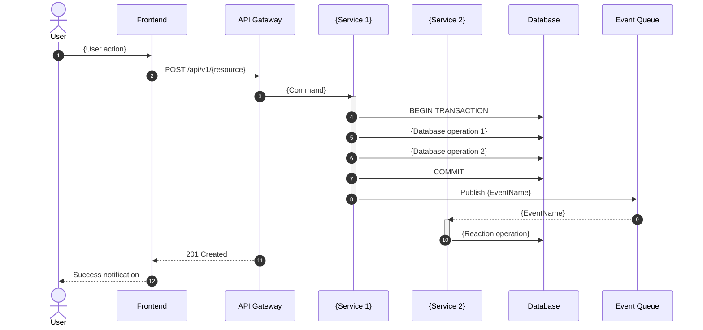
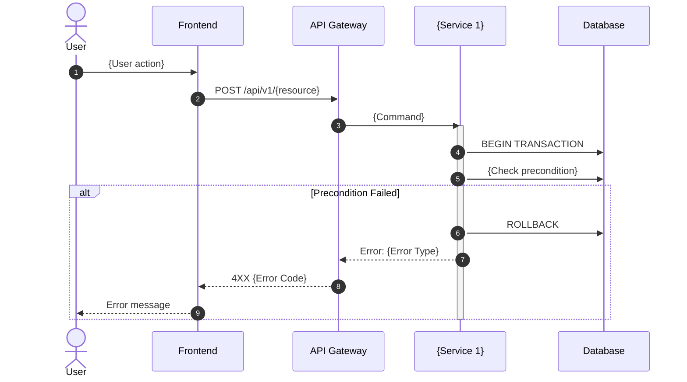

# Business Flow Template: {Flow Name}

> **Document Version:** 1.0  
> **Created:** {YYYY-MM-DD}  
> **Status:** Draft | Review | Approved  
> **Primary Module:** {module_name}  
> **Related Modules:** {module1, module2, ...}

## Table of Contents

1. [Overview](#1-overview)
2. [Event Storming](#2-event-storming)
3. [Sequence Diagram](#3-sequence-diagram)
4. [State Machine](#4-state-machine)
5. [Domain Events](#5-domain-events)
6. [Business Rules](#6-business-rules)
7. [Error Scenarios](#7-error-scenarios)
8. [Implementation Checklist](#8-implementation-checklist)

---

## 1. Overview

### 1.1 Purpose

{Brief description of what this flow accomplishes and its business value}

### 1.2 Actors

| Actor | Role | Actions |
|-------|------|---------|
| {Actor 1} | {Role description} | {What they do in this flow} |
| {Actor 2} | {Role description} | {What they do in this flow} |

### 1.3 Trigger

{What initiates this flow - user action, system event, scheduled job, etc.}

### 1.4 Preconditions

- {Condition 1 that must be true before flow starts}
- {Condition 2}

### 1.5 Postconditions (Success)

- {State 1 after successful completion}
- {State 2}

---

## 2. Event Storming

> **Legend:**
> - 🟧 **Domain Event** (Orange) - Something that happened (past tense)
> - 🟦 **Command** (Blue) - Action requested by user/system
> - 🟨 **Aggregate** (Yellow) - Entity that handles the command
> - 🟪 **Policy** (Purple) - Automatic reaction to an event ("When X happens, do Y")
> - 🟩 **Read Model** (Green) - Data needed for decisions
> - 🔴 **Hotspot** (Red) - Questions, concerns, or issues to resolve
> - 👤 **Actor** - User or external system

### 2.1 Event Flow (Big Picture)

```
┌─────────────────────────────────────────────────────────────────────────────┐
│                         {FLOW NAME} - EVENT STORMING                        │
├─────────────────────────────────────────────────────────────────────────────┤
│                                                                             │
│  Timeline →                                                                 │
│                                                                             │
│  ┌─────────┐     ┌─────────────┐     ┌─────────────────┐                   │
│  │   👤    │     │  🟦 Command │     │  🟧 Domain      │                   │
│  │  Actor  │────▶│             │────▶│     Event       │                   │
│  └─────────┘     │ {Command    │     │                 │                   │
│                  │  Name}      │     │ {EventName}     │                   │
│                  └─────────────┘     └────────┬────────┘                   │
│                                               │                             │
│                        ┌──────────────────────┘                             │
│                        ▼                                                    │
│              ┌─────────────────┐     ┌─────────────────┐                   │
│              │  🟪 Policy      │────▶│  🟧 Domain      │                   │
│              │                 │     │     Event       │                   │
│              │ When {Event},   │     │                 │                   │
│              │ then {Action}   │     │ {NextEvent}     │                   │
│              └─────────────────┘     └─────────────────┘                   │
│                                                                             │
└─────────────────────────────────────────────────────────────────────────────┘
```

### 2.2 Detailed Event Map

```
┌─────────────────────────────────────────────────────────────────────────────┐
│  PHASE 1: {Phase Name}                                                      │
├─────────────────────────────────────────────────────────────────────────────┤
│                                                                             │
│  👤 {Actor}                                                                 │
│       │                                                                     │
│       ▼                                                                     │
│  ┌─────────────────┐                                                       │
│  │  🟦 Command     │  ┌─────────────┐                                      │
│  │  {CommandName}  │─▶│ 🟨 {Agg}   │                                      │
│  └─────────────────┘  └──────┬──────┘                                      │
│                              │                                              │
│                              ▼                                              │
│  ┌─────────────────────────────────────────────────────────────────────┐   │
│  │  🟩 Read Model: {What data is needed to process this command}       │   │
│  │  - {Data point 1}                                                   │   │
│  │  - {Data point 2}                                                   │   │
│  └─────────────────────────────────────────────────────────────────────┘   │
│                              │                                              │
│                              ▼                                              │
│                    ┌─────────────────┐                                     │
│                    │  🟧 Event       │                                     │
│                    │  {EventEmitted} │                                     │
│                    └────────┬────────┘                                     │
│                             │                                               │
│  ┌──────────────────────────┼──────────────────────────┐                   │
│  │                          │                          │                    │
│  ▼                          ▼                          ▼                    │
│  ┌──────────────┐   ┌──────────────┐   ┌──────────────┐                    │
│  │ 🟪 Policy 1  │   │ 🟪 Policy 2  │   │ 🟪 Policy 3  │                    │
│  │ {Reaction}   │   │ {Reaction}   │   │ {Reaction}   │                    │
│  └──────────────┘   └──────────────┘   └──────────────┘                    │
│                                                                             │
│  🔴 Hotspot: {Any unresolved questions or concerns for this phase}         │
│                                                                             │
└─────────────────────────────────────────────────────────────────────────────┘
```

### 2.3 Cross-Module Event Flow

| Source Module | Event | Target Module | Reaction (Policy) |
|---------------|-------|---------------|-------------------|
| {Module A} | `{EventName}` | {Module B} | {What happens in response} |
| {Module A} | `{EventName}` | {Module C} | {What happens in response} |

---

## 3. Sequence Diagram

### 3.1 Happy Path



### 3.2 Error Scenarios



---

## 4. State Machine

> **MANDATORY for ERP document types.** Shows valid state transitions.

### 4.1 State Diagram

```mermaid
stateDiagram-v2
    [*] --> {InitialState}: create()
    
    {InitialState} --> {State2}: {action}()
    {InitialState} --> Cancelled: cancel()
    
    {State2} --> {State3}: {action}()
    {State2} --> Cancelled: cancel()
    
    {State3} --> {FinalState}: {action}()
    
    {FinalState} --> [*]
    Cancelled --> [*]
    
    note right of {InitialState}
        - Document can be edited
        - No stock impact
    end note
    
    note right of {State2}
        - Locked for editing
        - Stock reserved
    end note
```

### 4.2 State Transition Table

| Current State | Action | Next State | Side Effects | Reversible? |
|---------------|--------|------------|--------------|-------------|
| {State 1} | `{action}()` | {State 2} | {What happens} | Yes/No |
| {State 2} | `{action}()` | {State 3} | {What happens} | Yes/No |
| Any | `cancel()` | Cancelled | {Cleanup actions} | No |

### 4.3 State Rules

- **{State Name}**: {Description of what this state means, what operations are allowed}
- **Editable states**: {List states where document can be modified}
- **Terminal states**: {List states with no outgoing transitions}

---

## 5. Domain Events

### 5.1 Event Definitions

```typescript
// Event: {EventName}
interface {EventName} {
  // Metadata
  eventId: string;
  eventType: '{bounded_context}.{aggregate}.{event_name}';
  occurredAt: DateTime;
  correlationId: string;
  causationId?: string;
  
  // Payload
  aggregateId: string;
  tenantId: string;
  {field1}: {type};
  {field2}: {type};
}

// Example:
interface ProductCreated {
  eventId: string;
  eventType: 'inventory.product.created';
  occurredAt: DateTime;
  correlationId: string;
  
  productId: string;
  tenantId: string;
  sku: string;
  name: string;
  categoryId: string;
  costPrice: number;
  salePrice: number;
}
```

### 5.2 Event Catalog

| Event Name | Emitted By | Payload (Key Fields) | Consumers |
|------------|------------|----------------------|-----------|
| `{EventName}` | {Service/Aggregate} | `{field1}, {field2}` | {List of consumers} |

### 5.3 Event Subscriptions (Policies)

| Event | Consumer | Policy Name | Action |
|-------|----------|-------------|--------|
| `ProductCreated` | StockService | InitializeStock | Create stock_level record |
| `ProductCreated` | ValuationService | SetDefaultValuation | Apply category valuation method |
| `ProductCreated` | AuditService | LogCreation | Record audit trail |

---

## 6. Business Rules

### 6.1 Validation Rules

| Rule ID | Rule Description | When Applied | Error Message |
|---------|------------------|--------------|---------------|
| BR-001 | {Rule description} | {On create/update/transition} | {User-facing error} |
| BR-002 | {Rule description} | {On create/update/transition} | {User-facing error} |

### 6.2 Computation Rules

| Rule ID | Description | Formula/Logic |
|---------|-------------|---------------|
| CR-001 | {What is computed} | `{formula or pseudocode}` |

### 6.3 Authorization Rules

| Action | Required Role | Additional Conditions |
|--------|---------------|----------------------|
| Create | {role} | {Any additional conditions} |
| Update | {role} | {e.g., Only in Draft status} |
| Delete | {role} | {e.g., Only if no related transactions} |
| {State Transition} | {role} | {Conditions} |

---

## 7. Error Scenarios

### 7.1 Expected Errors

| Error Code | Scenario | HTTP Status | User Message | Recovery Action |
|------------|----------|-------------|--------------|-----------------|
| `E_{CODE}_001` | {Scenario} | {4XX} | {Message} | {What user should do} |

### 7.2 System Errors

| Error Code | Scenario | Impact | Mitigation |
|------------|----------|--------|------------|
| `SYS_001` | Database unavailable | {Impact} | {Retry, circuit breaker, etc.} |

---

## 8. Implementation Checklist

### 8.1 Backend Tasks

- [ ] Domain entity with state machine
- [ ] Repository trait and implementation
- [ ] Domain events defined
- [ ] Event handlers (policies) implemented
- [ ] API handlers
- [ ] Casbin policies for authorization
- [ ] Database migrations
- [ ] Unit tests for state transitions
- [ ] Integration tests for event flow

### 8.2 Frontend Tasks

- [ ] TypeScript types
- [ ] API client functions
- [ ] Svelte store
- [ ] List page
- [ ] Create/Edit form
- [ ] Detail page with state actions
- [ ] Error handling UI
- [ ] Unit tests

### 8.3 Integration Tasks

- [ ] Event bus configuration
- [ ] Cross-service event handlers
- [ ] End-to-end tests

---

## Appendix A: Glossary

| Term | Definition |
|------|------------|
| {Term} | {Definition} |

## Appendix B: Related Documents

- [{Related Doc 1}](./path-to-doc.md)
- [{Related Doc 2}](./path-to-doc.md)
