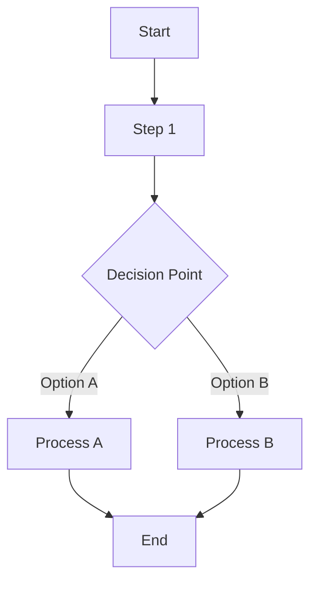
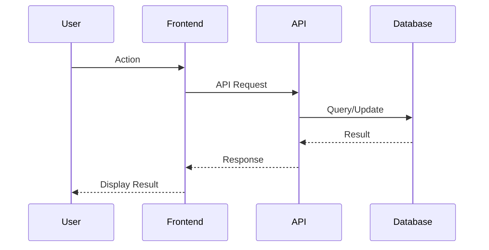
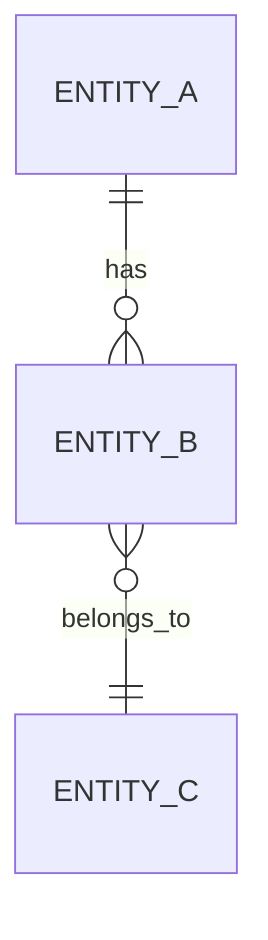
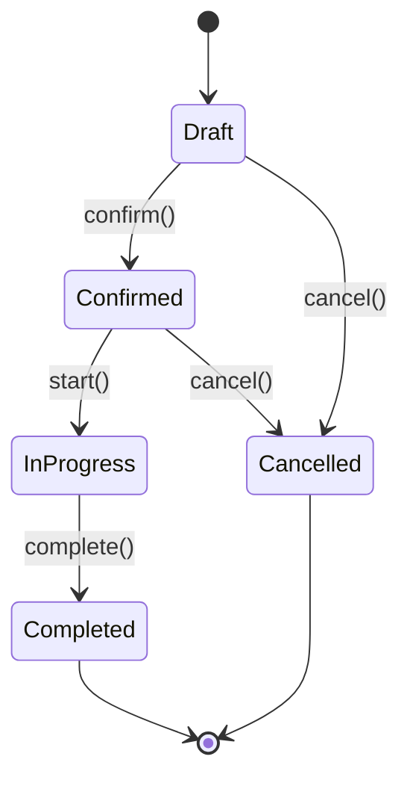

# {Module Name} - Product Requirements Document

**Document Version:** 1.0
**Created Date:** {YYYY-MM-DD}
**Last Updated:** {YYYY-MM-DD}
**Status:** Draft | Review | Approved
**Author:** {Author Name}

---

## 1. Executive Summary

### 1.1 Purpose
{Brief description of what this module does and why it's needed}

### 1.2 Scope
{What is included and what is explicitly excluded}

### 1.3 Target Users
| User Role | Primary Use Cases |
|-----------|-------------------|
| {Role 1} | {Use cases} |
| {Role 2} | {Use cases} |

### 1.4 Business Value
- {Value proposition 1}
- {Value proposition 2}

---

## 2. Business Workflow

### 2.1 High-Level Process Flow



### 2.2 Detailed Workflows

#### 2.2.1 {Workflow Name 1}



**Steps:**
1. {Step 1 description}
2. {Step 2 description}
3. {Step 3 description}

**Business Rules:**
- {Rule 1}
- {Rule 2}

#### 2.2.2 {Workflow Name 2}
{Repeat structure as needed}

---

## 3. Functional Requirements

### 3.1 Core Features

#### FR-001: {Feature Name}
- **Priority:** Critical | High | Medium | Low
- **Description:** {Detailed description}
- **User Story:** As a {role}, I want to {action} so that {benefit}
- **Acceptance Criteria:**
  - [ ] {Criterion 1}
  - [ ] {Criterion 2}

#### FR-002: {Feature Name}
{Repeat structure}

### 3.2 Business Rules

| Rule ID | Rule Description | Enforcement |
|---------|------------------|-------------|
| BR-001 | {Rule description} | {Where/how enforced} |
| BR-002 | {Rule description} | {Where/how enforced} |

### 3.3 Validation Rules

| Field | Validation | Error Message |
|-------|------------|---------------|
| {field_name} | Required, max 100 chars | "Field is required" |
| {field_name} | Positive number | "Must be greater than 0" |

---

## 4. Data Model

### 4.1 Database Schema

*Extracted from `docs/database-erd.dbml`*

```sql
Table {table_name} {
  {column_name} {type} [pk]
  tenant_id uuid [ref: > tenants.tenant_id]
  {column_name} {type} [not null]
  {column_name} {type} [null]
  created_at timestamptz [default: `now()`]
  updated_at timestamptz [default: `now()`]

  indexes {
    (tenant_id, {column}) [name: 'idx_{table}_{column}']
  }
}
```

### 4.2 Entity Relationships



### 4.3 Status Flow



### 4.4 API Endpoints

| Method | Endpoint | Description | Request | Response |
|--------|----------|-------------|---------|----------|
| GET | `/api/v1/{module}` | List items | `?page&pageSize` | `{ items, pagination }` |
| GET | `/api/v1/{module}/{id}` | Get item | - | `{ item }` |
| POST | `/api/v1/{module}` | Create item | `CreateRequest` | `{ item }` |
| PUT | `/api/v1/{module}/{id}` | Update item | `UpdateRequest` | `{ item }` |
| DELETE | `/api/v1/{module}/{id}` | Delete item | - | `204 No Content` |

### 4.5 TypeScript Types

```typescript
export interface {Entity} {
  id: string;
  tenantId: string;
  // ... fields
  createdAt: string;
  updatedAt: string;
}

export interface Create{Entity}Request {
  // required fields
}

export interface Update{Entity}Request {
  // optional fields
}

export interface {Entity}ListParams {
  page?: number;
  pageSize?: number;
  sortBy?: string;
  sortDir?: 'asc' | 'desc';
  // filters
}
```

---

## 5. UI Specifications

### 5.1 Navigation & Routes

*From `docs/ui-architecture-proposal.md`*

```
/{module}
├── /                      # List Page
├── /new                   # Create Page
├── /[id]                  # Detail Page
│   └── /edit              # Edit Page
└── /{sub-module}          # Sub-module routes
```

### 5.2 Page Layouts

#### 5.2.1 List Page

```
+--------------------------------------------------+
|  {Module Title}               [+ Create New]     |
+--------------------------------------------------+
|  [Search] [Filter 1 ▼] [Filter 2 ▼] [Clear]     |
+--------------------------------------------------+
|  ┌──────────────────────────────────────────┐   |
|  │ Column 1 │ Column 2 │ Column 3 │ Actions │   |
|  ├──────────────────────────────────────────┤   |
|  │ Data     │ Data     │ Data     │ ⋮       │   |
|  │ Data     │ Data     │ Data     │ ⋮       │   |
|  └──────────────────────────────────────────┘   |
|  Showing 1-10 of 100          [◀] [1] [2] [▶]   |
+--------------------------------------------------+
```

**Components:**
- Page header with title and primary action
- Filter bar with search and dropdowns
- Data table with sortable columns
- Pagination controls

#### 5.2.2 Detail Page

```
+--------------------------------------------------+
|  [← Back] {Item Title}              [Edit] [⋮]  |
|  Status: [Badge]  Created: {date}               |
+--------------------------------------------------+
|  [Tab 1] [Tab 2] [Tab 3] [Tab 4]                |
+--------------------------------------------------+
|  Tab Content Area                                |
|  ┌─────────────────────┐ ┌─────────────────────┐|
|  │ Card 1              │ │ Card 2              │|
|  │ • Field: Value      │ │ • Field: Value      │|
|  │ • Field: Value      │ │ • Field: Value      │|
|  └─────────────────────┘ └─────────────────────┘|
+--------------------------------------------------+
```

#### 5.2.3 Form Page

```
+--------------------------------------------------+
|  [← Back] Create/Edit {Entity}                   |
+--------------------------------------------------+
|  ┌──────────────────────────────────────────┐   |
|  │ Section 1                                 │   |
|  │ ┌─────────────┐ ┌─────────────┐          │   |
|  │ │ Field 1 *   │ │ Field 2     │          │   |
|  │ └─────────────┘ └─────────────┘          │   |
|  │ ┌─────────────────────────────┐          │   |
|  │ │ Field 3 (full width)        │          │   |
|  │ └─────────────────────────────┘          │   |
|  └──────────────────────────────────────────┘   |
|                                                  |
|  ┌──────────────────────────────────────────┐   |
|  │ Section 2                                 │   |
|  │ ...                                       │   |
|  └──────────────────────────────────────────┘   |
|                                                  |
|                    [Cancel] [Save {Entity}]      |
+--------------------------------------------------+
```

### 5.3 Components

| Component | Description | Props |
|-----------|-------------|-------|
| `{Entity}Card.svelte` | Display card for list/grid view | `item: Entity` |
| `{Entity}Form.svelte` | Create/Edit form | `item?: Entity, onSave, onCancel` |
| `{Entity}Table.svelte` | Data table | `items: Entity[], onSelect` |
| `{Entity}Filters.svelte` | Filter controls | `filters, onChange` |

### 5.4 User Interactions

| Action | Trigger | Behavior |
|--------|---------|----------|
| View list | Navigate to `/{module}` | Load and display paginated list |
| Search | Type in search box | Debounced filter (300ms) |
| Create | Click "Create New" | Navigate to form page |
| Edit | Click item row | Navigate to detail page |
| Delete | Click delete button | Show confirmation dialog |

---

## 6. Non-Functional Requirements

### 6.1 Performance

| Metric | Target | Measurement |
|--------|--------|-------------|
| Page load time | < 2s | First Contentful Paint |
| API response time | < 500ms | P95 latency |
| List pagination | < 300ms | Time to render new page |

### 6.2 Security

- [ ] All API endpoints require authentication
- [ ] Data filtered by tenant_id (multi-tenant isolation)
- [ ] Input validation on all user inputs
- [ ] CSRF protection on forms
- [ ] Rate limiting on API endpoints

### 6.3 Accessibility

- [ ] WCAG 2.1 AA compliance
- [ ] Keyboard navigation support
- [ ] Screen reader compatible
- [ ] Color contrast ratios meet standards
- [ ] Focus indicators visible

### 6.4 Responsive Design

| Breakpoint | Layout Changes |
|------------|----------------|
| Mobile (< 640px) | Single column, stacked cards |
| Tablet (640-1024px) | 2-column grid |
| Desktop (> 1024px) | Full layout with sidebar |

---

## 7. Dependencies

### 7.1 Module Dependencies

| Dependency | Type | Description |
|------------|------|-------------|
| Auth Module | Required | User authentication and permissions |
| {Module X} | Required | {Description} |
| {Module Y} | Optional | {Description} |

### 7.2 External Services

| Service | Purpose | Required |
|---------|---------|----------|
| {Service} | {Purpose} | Yes/No |

### 7.3 Technical Dependencies

- Backend API endpoints must be implemented first
- Database migrations must be applied
- OpenAPI spec must be updated

---

## 8. Out of Scope

The following features are explicitly **NOT** included in this version:

| Feature | Reason | Future Version |
|---------|--------|----------------|
| {Feature 1} | {Reason} | v2.0 |
| {Feature 2} | {Reason} | v2.0 |

---

## 9. Success Metrics

| Metric | Target | How to Measure |
|--------|--------|----------------|
| User adoption | 80% of users use feature within 1 week | Analytics |
| Error rate | < 1% of operations fail | Error tracking |
| Task completion time | < 30s for common tasks | User testing |

---

## 10. Risks & Mitigations

| Risk | Probability | Impact | Mitigation |
|------|-------------|--------|------------|
| {Risk 1} | High/Medium/Low | High/Medium/Low | {Mitigation strategy} |
| {Risk 2} | High/Medium/Low | High/Medium/Low | {Mitigation strategy} |

---

## Appendix A: Glossary

| Term | Definition |
|------|------------|
| {Term} | {Definition} |

## Appendix B: References

- [UI Architecture Proposal](../ui-architecture-proposal.md)
- [Database ERD](../database-erd.dbml)
- [OpenAPI Spec](../../shared/openapi/{module}.yaml)

---

## Document History

| Version | Date | Author | Changes |
|---------|------|--------|---------|
| 1.0 | {Date} | {Author} | Initial version |
